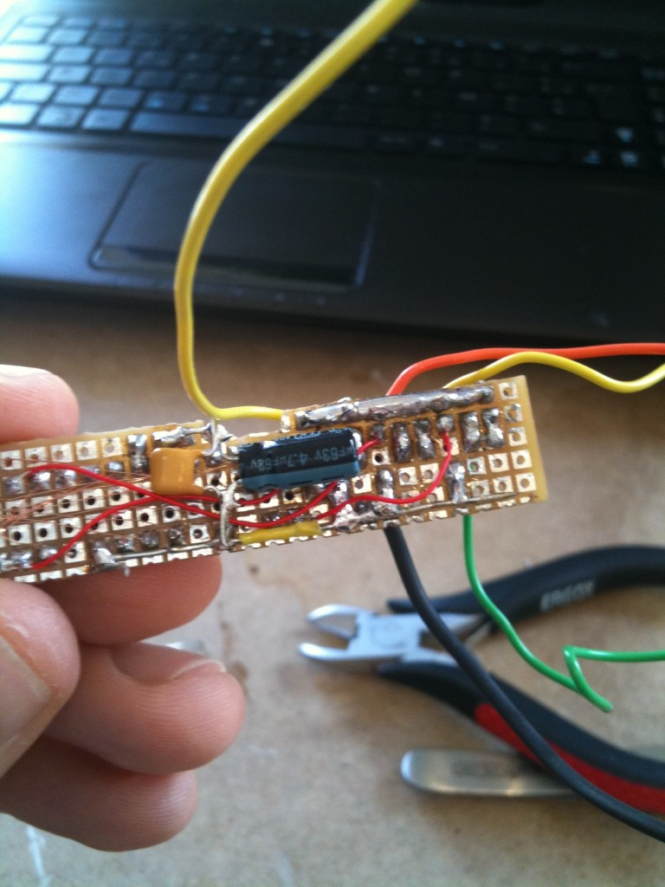
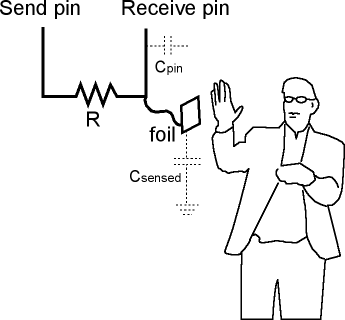

I first wanted to make a huge raving rabbid like [this one](http://www.attakus.fr/Lapin-Cretin-Lifesize)... That was before I realized that most of my flat was already occupied by things like a bed, a table or a refrigerator. As I had no intention of giving up eating or sleeping, I decided to train on something smaller first. Since it was smaller, it had to have something extra so I decided to make it smart.

After <del>some</del> a lot of time, the 'Bwaaaaaaaaaaaaaaalarm clock' finally saw the light on December, 24th. It can wake you up every morning, can 'bwaaaaaaah' at you on demand and declaim random citations at random times. And contrary to some other [electronic devices](http://www.engadget.com/2010/12/31/psa-iphone-alarms-not-working-csynthesizedome-new-years-day-2011/), it even works on January 1st ! This post describes the brief history of the bunny along with schematics and source code in case you want to give it a friend/partner. Many thanks to Clementine for her support, very sorry that we have some little balls of solder and desoldering braid all around the flat now...


# Features 


* 12 stupid sounds
* 8 stupid music tracks
* 456 synthesized philosophical French citations
* 2 wake up modes
* 4 carrots

The thing is basically an alarm clock. I gave up wifi pretty early mainly because I did not have enough room/time so it is not a [connected rabbit](http://www.nabaztag.com/en/index.html). Maybe for V2.0... The operation mode is controlled using the toilet brush. When low, the rabbid just displays time. When middle, the basic alarm is enabled. When high, the rabbid alarm is enabled to make sure you really wakeup. In addition, when high, the rabbid will also teach you his wisdom with [wikiquotes](http://fr.wikiquote.org/wiki/Accueil) citations. That happens between 8am and 12pm. The rabbid needs to sleep sometimes, right?
Anytime, you can press the big mushroom to make the rabbid yell. But don't do it too much, he might get angry...

# What's inside. 


The heart of the rabbit is a [beagleboard](http://beagleboard.org/). I know it's completely overkill for an alarm clock but hey.. it's fun ! (apart for this 1.8V thingy but we'll see that [later](http://mbonnin.net/39-electronics/#18V)..). It has plenty of IO and developing for it is quite easy. Also there's almost nothing you cannot do with the beagle. As I was not very sure which direction the bunny was going to take when I started working on it, I could be certain the beagle would not be a limitation in the end...

Then, the clock is constituted by four 7segments displays controlled by a [MAX7219](http://www.maxim-ic.com/datasheet/index.mvp/id/1339).
The mushrooms buttons are aluminum foil and wire inside polymer clay and connected to two [QT100 sensors](http://search.digikey.com/scripts/DkSearch/dksus.dll?Detail&name=427-1120-1-ND).
The eyes are LEDs cast into transparent polyester resin.
The toilet brush is a 3-positions switch covered with [epoxy putty](http://en.wikipedia.org/wiki/Milliput). The audio out is amplified using a [LM386 amplifier](http://www.national.com/mpf/LM/LM386.html#Overview). Everything is powered with a 5V/2A wall charger
The rabbit itself is polyurethane resin cast into a hand-made silicone mold.
Remarks and comments welcome.

# The details 


	
* [1/9: Rabbit molding](../../assets/images/2011-01-05_bwaaaaaaaaaaaaaaalarm-clock/#19-rabbit-molding)
* [2/9: Base molding](../../assets/images/2011-01-05_bwaaaaaaaaaaaaaaalarm-clock/#29-base-molding)
* [3/9: Electronics](../../assets/images/2011-01-05_bwaaaaaaaaaaaaaaalarm-clock/#39-electronics)
* [4/9: MAX7219 LED driver](../../assets/images/2011-01-05_bwaaaaaaaaaaaaaaalarm-clock/#49-max7219-led-driver)
* [5/9: LM386 audio amplifier](../../assets/images/2011-01-05_bwaaaaaaaaaaaaaaalarm-clock/#59-lm386-audio-amplifier)
* [6/9: Touch mushrooms](../../assets/images/2011-01-05_bwaaaaaaaaaaaaaaalarm-clock/#69-touch-mushrooms)
* [7/9: Eyes and brush](../../assets/images/2011-01-05_bwaaaaaaaaaaaaaaalarm-clock/#79-eyes-and-brush)
* [8/9: Software](../../assets/images/2011-01-05_bwaaaaaaaaaaaaaaalarm-clock/#89-software)
* [9/9: Paint](../../assets/images/2011-01-05_bwaaaaaaaaaaaaaaalarm-clock/#99-paint)
* [shopping](../../assets/images/2011-01-05_bwaaaaaaaaaaaaaaalarm-clock/#shopping)
* [eagle schematics](../../assets/images/2011-01-05_bwaaaaaaaaaaaaaaalarm-clock/#eagle-schematics)
* [source code](../../assets/images/2011-01-05_bwaaaaaaaaaaaaaaalarm-clock/#source-code)

# Rabbit molding 

The rabbit body and base are made using [resin casting](http://en.wikipedia.org/wiki/Resin_casting). This allows to turn a clay based model into a much more solid resin object.


## Clay modeling #

The first step is to actually sculpt the rabbit in clay. This is not going to be the final piece, it is just a "master" model that is going to be reproduced in resin so it's okay if the clay is a bit soft. The clay needs to be compatible with silicon and easy to work with though. I used [plastiline](http://www.plastiline.fr/) because this is what I found in my favorite [art shop](http://maps.google.com/maps/place?cid=6222786968151427468) but I guess any other oil-based clay will do. 
Luckily, rabbids are quite simple to do. I made mine using my fingers, a couple of toothpicks and the back of a paintbrush. Tthe arms and ears are made and molded separately to avoid overcomplicated molds and ease unmodling.

## Silicone mold making #

Silicone is made by mixing the silicone itself with a catalyst. I used silicone RTV151 since it was the cheapest one (~40€/kg) and it proved good enough for rabbits. The proportion are 2%-5% catalyst, the rest of silicon. The more catalyst, the faster the silicon will cure. It also depends the temperature so it is a bit difficult to predict the final time the reaction will take. The first molds I made where in May or so and took around 20min to cure. I made other ones with the same proportions in September and they took several hours. In the end it is a trade-off, you want your silicon to stay liquid for some time so that you can work with it without hurry (20minutes is a bit short). But then if you do not pour enough catalyst there's the risk of the silicon staying liquid forever in which case you lost your silicone and very likely your clay model at the same time. It did not happen to me fortunately.
For measuring the catalyst, a the pipette quite useful. And ice-cream sticks are perfect for mixing everything together


<div style="text-align: center">left: the first pass of the mold, with an eye clay model on the rightright: the final silicone mold</div>
I put enough silicon in the recipient for for covering the rabbit body with ~3mm silicon (In french, this is called a "sock mold". Not sure how this translates into english) and took a little margin for the loss, added the catalyst and mixed during a good minute. Then I applied it on the clay rabbit with a paintbrush (the paintbrush did not survive the operation). My silicon was at first too liquid and kept falling from the rabbit. After ~20 minutes it started hardening quite fast. At around 22minutes, I could not work with it anymore, leaving some parts of the rabbit uncovered so I had to do it in two pass. I guess finding a better consistence and catalyst/temperature proportions is possible and it is then doable to do the mold in one pass, like they do for [molding faces](http://www.youtube.com/watch?v=-GW7-RxRoMc) for an example. But I was a beginner and the two pass solution was good enough in the end. Also adding more silicon on top of already cured one, makes both parts merge into a single one so it's ok to make several pass. 


<div style="text-align: center">left:watching silicon cureright: the final silicone mold</div>

For the arm and ears, I did a 2 parts-mold like explained [here (french)](http://vonhymack.blogspot.com/search/label/%5Bmoulage%5D). While it's easier to do and allows more details, it consumes significantly more silicon so I did not use it for large pieces like the rabbit body. But it's perfect for arms and ears. The secret is the use of legos to make the casing. I made a rectangular lego casing half-filled with soft plastiline and push the models inside. I then poured silicone directly inside the casing. The important thing is to avoid the air bubbles inside the silicon as much as possible. "Professional" hobbyist use vacuum chambers but I do not have this kind of things so I was left with the options of taking care and pouring the silicone in a very thin line, very slowly (and not directly on the model). And that was still not enough so I had to rework a bit afterwards.
After 24hours I had the first half of my mold. To make the second part, I removed the soft plastiline, covered all the visible silicon with unmolding agent (so that they do not merge, we do not want the same behavior as previously). Some use Vaseline, I used something called "cire de démoulage". Once the first part of the mold is secured behind wax, I poured some more silicon to make the second part. After 23 more hours, it is ready.

## Resin casting #

I waited some more days for everything to stabilize and could then begin the resin-fun ! Resin is a bit like silicon, you have to mix 2 components and wait for it to harden. I used polyurethane resin (~25 euros/kg). The process is exactly like silicon except that my resin had to be mixed 50/50% so it is much easier to measure. For the small parts, I used a syringe to inject the resin, it allows to be more precise. The rest is ice-cream sticks and everything as before.  


<div style="text-align: center">left: resin rabbit !right: ears and arms waiting</div>

For the eyes, I took LEDs and cast them into transparent polyester GTS resin. This resin uses the same kind of proportions as silicon (97/3) which makes it difficult to dose precisely. In my case, I missed a bit of catalyst so the eyes stayed a bit sticky for some time. It disappeared in the end but left a rough surface. Next time I'll put more catalyst.


Once I had all the pieces, I glued everything together using a loctite gel super glue and got a good idea of what the rabbit was going to look like.


<div style="text-align: center">resin rabbit !</div>

But still, this was my first sculpting/molding project and the figurine was still a bit ugly, with air bubbles a bit everywhere and the surface quite irregular... On the picture above, I damaged the left ear trying to polish it with the dremel. This was not a good idea... So I spent a lot of time trying to rework all this. I'm not sure, if I could have done better by spending more time on modeling and less on reworking...

## Reworking the seams and imperfections #


[Milliput](http://en.wikipedia.org/wiki/Milliput) is an epoxy putty that is very useful for filling the air bubbles or rounding the junctions between the arms and body or ears. Once you mix its two components, you have 30 minutes before it becomes completely hard. The nice thing is that it works very well with water so it has a nice smooth finish. For very small holes, you can even do milliput juice, that will fill them all. I used milliput to smooth the arm/ears connections, fill some air bubbles on the rabbit belly and also almost completely rework both ears.
After the milliput, I removed some parts of the rabbit using the dremel to make the figurine more symmetric. Next time, I'll be more cautions during the initial clay modeling. It will save this step.


<div style="text-align: center">dremel roughing with some milliput rework</div>

## Sanding, sanding, sanding, aka the "magic 800 sandpaper" #

At this stage, the rabbit did not have any air bubbles anymore but was still a bit ugly. The resin surface especially was quite irregular and the dremel would not help much. It was either too soft, doing nothing or too hard, removing too much material. I was beginning to lose faith in life and polymers when I discovered the 800 sandpaper. This is very fine sandpaper, used for car bodies. It is to be used under water with a bit of dishwashing liquid. I spend a couple of evening sanding and sanding but it was worth it. It makes the surface almost perfectly flat.


<div style="text-align: center">left: before the sandingright: after the sanding</div>

I then drilled loooong holes into the rabbit to pass the wires to the eyes (I was lucky that my holes connected inside the rabbit for both eyes without doing any precise calculation :-)).
And... raaaaaabbid molding is finished ! 

# Base molding 

## The base itself #

The process is exactly the same as for the rabbit: clay modeling, silicon mold, resin cast. This time I used transparent resin so one can see the clock under the base. Also since this was a large piece (~10cm side, it had to contain a beagleboard), I added some plaster bands on top of the silicon to make everything rigid


<div style="text-align:center">1: pouring silicon on top of clay2: adding plaster bands to solidify it3: the beagleboard fits !4: 2nd part of the mold (after removing the beagle board...)</div>

The base is ~2mm thin so I had to make holes in the clay that will be filled with silicon and act as pillars between the two parts of the mold. Even with that, the silicon was not rigid enough and in the end, the beagleboard did not fit exactly where I wanted it so I had to remove some resin with the dremel. Maybe doing the with acrylic would have been better. Especially now that I know [how to bend it](http://hackaday.com/2005/08/11/acrylic-bending-tutorial/).


<div style="text-align:center">left: the base, once dry.right: the base, prepared for the rabbit. some holes filled with milliput</div>

After the resin is dry, I drilled the holes for the SD card, DC-in and USB-in.

## Toilet brush #


The toilet brush is a [SPDT switch](http://en.wikipedia.org/wiki/Switch) covered with milliput. SPDT is a barbarian way to say the switch has 3 positions and the middle position is the "off" one (Single Pole, Double Throw)... The nice thing with milliput compared with other polymer clays like fimo or sculpey is that it does not need to bake. I'm not sure if the switch would have liked that.


## Carrots #

Carrots are made with super sculpey. As these are carrots, they need baking 15min

<div style="text-align:center">baking carrots and other things</div>

## Touch Mushrooms #


Mushrooms need baking too :-). They also need a metallic core to act as sensing electrodes. So I put a wire spiral inside wrapped into aluminum foil. The super sculpey thickness on top of the foil is ~1mm, which is a bit thick for hand-made sensing but works well with QT110 sensing


<div style="text-align:center">left: the mushrooms electrode wiresright: the switch connections</div>

## Last bits #

I drilled some holes for the sound to come out behind the rabbit and spent some more hours with my friend "800 sandpaper".
And... that's it, the base is done

# Electronics 

## Boards layout #

In addition to the beagle board itself, the rabbit contains 2 other "daughter" boards, although I'm not sure the "daughter" denomination can apply here given the artistic nature of the connections between the different boards. I'm not even sure the word "layout" applies as well... Below how it looks like:

 

The first board contains everything needed for the clock display. It takes 5V from the second one and is connected to GPIO 139, 138 and 137. The second one contains the eyes connections, the touch sensors and the audio amplifier. It takes 5V from the expansion header on the beagleboard, is connected to audio out, GPIO 168, 183, 131, 156, 159 and 132. 
Being able to stuff all this inside the base was definitely a challenge and I had to actually take care of the size of some components. It was not that easy to find a small 200microF capacitor for audio decoupling. Also I wish I could unsolder the useless S-Video and JTAG connectors from the beagle to save some space but gave up when the PCB started turning from red to black. I guess the solder is high temperature or such... Next time, I'll definitively plan more room for the electronics. Having to work in such a small area was frustrating. Also, having more space would allow a better organization, solder proper connectors instead of the thick wires I plugged directly into the expansion header, putting test points, ...

## Life of an electronics padawan (or doing stuff without a keyboard) #

A few basic things are needed to begin the hardware fun. 


<strong>Soldering Iron</strong>. I had a cheap iron I found in my old flat that helped me getting started but the tip died after a few soldering evenings so I decided to invest in a better one. After some reading online, I decided myself for a [JBC 30st](http://www.jbctools.com/english/classic/soldering_irons/soldering_irons/pencil_soldering_irons/30s.php) 24W iron. While it was definitively better that the first one (the tip is still well alive), I am not particularly convinced. First of all, the tip gets oxidized very quick. I tried reading some [tutorials](http://www.aaroncake.net/electronics/solder.htm) and clean it with a wet sponge but it still gets dirty after 2 or 3 resistors no matter what. So I have to use a metallic tip cleaner all the time (actually, it's not really a tip cleaner, it's more something to wash the dishes but thing is it works !). Then I find it a bit low temperature. While I had no problem to use desoldering wick with the first iron, it's much more difficult with this one. So maybe a more powerful iron is better after all. In all cases, a stand is a must-have. I found one for 1€ which works perfectly well so there's no reason not to use one.


<strong>Solder</strong>. I always take the cheapest. Maybe that's why my iron gets dirty always..

<strong>Desoldering wick</strong>. Saved my life a couple of times when having to rework a part of the board. It is also very useful for SMD components soldering. The idea is to cover the pins with solder and the remove the excess with the desoldering braid. (There is plenty of [tutorials](http://www.youtube.com/watch?v=3NN7UGWYmBY) over the web for this, this is actually not that difficult, maybe even faster than having to solder each though hole pin separately). Like solder, I always buy the cheapest desoldering braid  but had no problem with it.


<strong>Wire</strong>. This was actually more complicated than expected. Online shops do not sell less than 100meters of it, which in my case is a bit expensive and unneeded. Also I used the wires to connect directly to the expansion header so I wanted them a bit thick and solid to not break. AWG 30 (0.25mm) is too thin. I finally found some 0.5mm single conductor wire at conrad and this was perfect.

<strong>Experimentation board and breadboard</strong>. Experimentation board is to try the circuit without soldering anything. Prototype board for actually doing the circuit. Breadboard is nice since it requires no PCB making or PCB chemicals. And you can do connections by simply bridging the holes together. It's very fast for small circuits.
 


<div style="text-align: center">basic inverting 2N2222 based level shifter</div>

Nobody's perfect... The beagleboard can decode HD video, do USB host and device, drive 3D graphics on a big LCD and do more or less whatever you want. But it can hardly speak to other devices. The reason being that the OMAP3 IO levels are 1.8V. While this might be very interesting as far as power consumption is concerned (is it ?), it is definitively a problem when trying to interface the OMAP with anything else. Both the QT110 and the MAX7219 use 5V levels so some kind of 5V  1.8V level conversion is needed. The [official](http://groups.google.com/group/beagleboard/browse_thread/thread/3fd6c891608f2cc9/b04ebe6c4a6ba8bc?lnk#gst&q#level+translation#b04ebe6c4a6ba8bc) way to do this is to use a small TXS0108 chip that will handle the level shifting. The nice thing is that it works in both directions, enabling to use protocols like i2c and provides 8 channels in a relatively small area. The bad thing is that it is only available in SMT packages and I was too afraid to solder this when starting the project. As I only need unidirectional transfers anyway, I decided to use hand made level shifters using good old  transistors and resistors. That is the reason for all the 2N2222 transistors you can see in the first pictures. (The other reason is that it is nicer and fills the boards nicely but I did not realized that in the first place). 
As you can see in the schematic, the transistors act as inverting level shifters. When using the GPIO as output (for the MAX7219), it needs to be pulled low to get 5V on the output. When used as input (for the QT110), the GPIO is 0 when the input voltage is 5V.  In the end, around 30% of the boards real estate is used by 2N2222 (or 2N3904). 

# MAX7219 LED driver 

The [MAX7219](http://pdfserv.maxim-ic.com/en/ds/MAX7219-MAX7221.pdf) is a led driver that can drive 64 LEDs or 8 7-segments digits (the 7-segments has 8 LEDs if you count the decimal point). In my case, it drives 4 digits. The nice thing about it is that it can do this with only 3 input pins and 16 output pins. It does this using time [multiplexing](http://en.wikipedia.org/wiki/Multiplexed_display). The idea is to only light 4 LEDs at a time and refresh them fast enough for them to appear always on due to persistence of vision. For 4 digits, the MAX7219 can use a refresh rate of 1600Hz, which is largely enough. It would have been 800Hz for 8 digits, which is also large enough :-). 


<div style="text-align:center">MAX7219 and friends</div>

In terms of power consumption, the MAX7219 and digits LEDs are one of the most power hungry components of the project. When one digit is fully lit at full brightness ('8' is the worst digit, '22:28' is the worst time), it consumes ~320mA@5V to light all the LEDs. It is roughly the same as what the beagleboard itself needs and the two together prevent of using a USB power supply (500mA max). The power supply I used is 5V/2A so it should be safe.


<div style="text-align: center">center: MAX7219top: level translationbottom: digits</div>

The same goal is also certainly achievable using using shift registers and a timer interrupt on the CPU, although certainly with a bit more solder, resistors and software. There are plenty of [blogs](http://en.wordpress.com/tag/max7219/) and [videos](http://www.youtube.com/watch?v=B2Vu69B6FfU) about how to use the MAX7219 so I'll let you do your own digging.

## fiesta del soldering #

Soldering the displays was not easy. As said earlier, I did not want to do my own PCBs for this project so I used breadboard. Which is very nice and fast until you want to solder 4 digits, with 36 pins in total to 12 on the MAX7219 (remember the same pin can drive several LEDs). I used something called 'fil émaillé' in french . I don't know the exact translation in english but it is something used to make coils (edit: see [http://en.wikipedia.org/wiki/Wiring_pencil](http://en.wikipedia.org/wiki/Wiring_pencil), thanks av500 for the link). The nice thing is that the insulator is destroyed when the wire is put into hot liquid solder so there's no need to strippe, just putting the wire inside the solder is enough for the connection to be made. 


It took me a looooooong evening to solder everything and quite frankly, I'm still surprised that all the single LEDs where connected correctly in the end and are still working today after moving the board several times. These wires are good stuff.

## serial communication #

The protocol is quite simple. It consists of 16bits frames. The first 8 bits are address, the other 8 bits are value. DIN is sampled on the CLK rising edge. I first did a user space driver but had some errors from time to time where the display would become corrupted. I charged that on bad timings and moved everything into the kernel. The main routine is as below:

```
#define DELAY udelay(5)

void _write_register(int addr, u8 value)
{
	int bits = addr << 8 | value;
	int i;
	unsigned long flags;

	DBG printk("write %02x in %02x (bits = %04x)\n", value, addr, bits);

	spin_lock_irqsave(&my_lock, flags);

	gpio_set_value(PIN_CLOCK, LOW);
	gpio_set_value(PIN_LOAD, LOW);
	DELAY;
	
	for (i # 15; i ># 0; i--) {
		gpio_set_value(PIN_DIN, (bits & (1 << i)) ? HIGH : LOW);
		DELAY;
		gpio_set_value(PIN_CLOCK, HIGH);
		DELAY;
		gpio_set_value(PIN_CLOCK, LOW);
		DELAY;
	}

	gpio_set_value(PIN_LOAD, HIGH);
	DELAY;
	gpio_set_value(PIN_LOAD, LOW);
	DELAY;
	
	spin_unlock_irqrestore(&my_lock, flags);	
}

```

The body of the function is pretty straightforward: pull LOAD low, send your data synchronously and set LOAD back to high to tell the MAX7219 you just sent a frame. I was not very sure the irqs needed to be disabled but still had some errors from time to time so decided to leave them disabled, just in case. 

## udelay() disgression #

Writing the code above I began to wonder what this udelay() thing was doing. Even with the driver in kernel space, I was still seeing some errors, even if the frequency of the errors was much lower as before. More specifically I was wondering if this udelay() was a busy loop or if could it somehow reschedule ? (See [here](http://book.chinaunix.net/special/ebook/Linux_Kernel_Development/0672327201/ch10lev1sec8.html) if this sentence does not make any sense to you)
The answer is that it is a busy loop. Mainly because it's not really possible to sleep for durations 

* The kernel does not always know how long a cycle takes. It has to calibrate itself upon startup. This is made using the calibrate_delay() and is actually how the strange BogoMIPS stuff is computed at startup !
* The wait needs to be precise and have little or no setup time. For an example, the time it takes for the CPU to make a division could be longer than the wait itself so a lot of care is take to avoid divisions and use only integer multiplication.

[here](http://geeki.wordpress.com/2010/10/09/loops-per-jiffy-to-mdelay-udelay-and-ndelay/) for more gory details about udealay().


## The rggntudjuuuuu decoupling capacitors #




After spending some hours trying to understand how the delays and scheduling works inside the kernel (I had no scope to look at the actual signals...),  I finally realized that the max7219 lacked the decoupling capacitors. Especially since this components takes big spikes of currents to light the digits one after the others, I guess it could interfere quite a lot and distort the serial communication. The MAX7221 is a variant of the MAX7219 with softer slopes designed especially to create less interference so maybe it is less sensitive. But this served as a lesson, I'll always put the decoupling capacitors from now on (C1 & C2 on the schematic above).

# LM386 audio amplifier 


The LM386 is a very used audio amplifier. Actually, I am not sure that there are any other simple audio amplifiers as this one is used in all the DIY audio [projects](http://www.instructables.com/id/Altoids-Tin-Speaker/) I have checked so far. It has a gain of 20dB and works with 5V with only 2 capacitors and one resistor


It is rated 500mW and this is not that bad. Not that it will replace a home stereo but definitely audible clearly.
Not much else to say, apart from saying this is a great chip to play with. Again, the Internet is full of DIY LM386 amplifiers so I don't want to create too much entropy by adding redundant information here.

## The rgntuuuuudjuuu decoupling capacitors #

While the amplifier was working just fine standalone, adding the clock display was a catastrophe. Each time the 4 digits were not identical, I would hear a very nice and loud noise around 1600Hz (just a guess as I still do not have a scope but something else would be very strange). The rabbit was going to be an alarm clock. Having it making noise all night long is not very nice, even for a rabbid raving rabbit. Feeling lucking with decoupling capacitors from my preceding experience, I started to put more of them a bit everywhere on the board ... without any audible success ... I had to find something else.

## The magical mute #

The LM386 has this pin labeled 'pin 7:bypass'. I'm not sure it was intended for this purpose but this sounded promising and I started experimenting with it. Connecting it to the ground muted the amp totally ! Well... almost too easy. Looking at the equivalent schematic of the LM386 (page 1 of the [datasheet](http://www.biltek.tubitak.gov.tr/gelisim/elektronik/dosyalar/6/LM386.pdf)), I guess this will leak some current all night long. Understanding this equivalent schematic is still on my todo list. I'm still a bit uncomfortable with this solution. How come it works ? And also how do the real people do when they want to drive displays and output audio at the same time...
In the end, the mute is controlled through GPIO132. The amp is mute almost all the time except when the rabbit is yelling or declaiming. In which case the noise is still there of course but barely audible as the rabbit yells louder

# Touch mushrooms 

## The DIY handmade touch button #

I learnt about this method while reading the [arduino playground](http://www.arduino.cc/playground/Main/CapSense). 




The human body is modeled after a capacitor and the circuit as a RC circuit. Software then toggles a pin on the send side and waits for the state of the receive pin to be the same. The higher the capacitance, the higher the time. The effect is better seen with high values of R. I took 2 MOhm because it was the biggest I could find. Here, the electrode is the foil contained inside the mushroom. The mushroom part on top of the foil is quite thin, maybe a bit less than 1mm.
The source code contains a test driver that uses interrupts so that it does not take all the CPU waiting for pins to go high (or low).

```

static irqreturn_t _handle_irq_a(int irq, void *ignored)
{	
	ktime_get_ts(&end_a);
	got_a = 1;
	if (got_a && got_b)
		complete(&completer);
	
	return IRQ_HANDLED;
}

static irqreturn_t _handle_irq_b(int irq, void *ignored)
{	
	ktime_get_ts(&end_b);
	got_b = 1;
	if (got_a && got_b)
		complete(&completer);

	return IRQ_HANDLED;
}

static int device_ioctl(struct inode *inode, struct file *file, 
				unsigned int cmd, unsigned long arg)
{
...
		gpio_set_value(PIN_SEND, 0);

		ktime_get_ts(&start);

		INIT_COMPLETION(completer);

		got_a # got_b # 0;
		
		/* send the wood */
		gpio_set_value(PIN_SEND, 1);

		wait_for_completion_interruptible_timeout(&completer, 5);

		if (!got_a || !got_b) {
			printk("capsense timeout !\n");
			return -EPIPE;
		}
		gpio_set_value(PIN_SEND, 0);
...
}

```
 

In practice, the delays are very small, even with high values of R. I measured values around 60-90 microseconds when idle and 90-120 when touched. For some reason, the OMAP resolution when measuring time seems to be 30microseconds (there's actually a way of changing this through CONFIG_OMAP_32K_TIMER but this was not working much better, I cannot remember the details). And 30 microseconds of resolution for measuring 60microsecond times is a bit short. 
With a lot of filtering, calibration and cpu power, this was more or less working but still triggered some false positive from time to time. So I had to consider using a QT110, even if it is SMT...

## The reliable touch button #


A good explanation of the charge transfer detection behind this little chip can be found [here](http://www.media.mit.edu/resenv/classes/MAS836/QPROX-white_paper.pdf). The QT110 is a small chip that handles all this automagically and just outputs 5V if something is sensed. Digikey has a good [eval board](http://search.digikey.com/scripts/DkSearch/dksus.dll?Cat#2622557&k#QT100) for experimenting with it. There are plenty of versions of basically the same features. QT1010, QT100, QT110, QT110A, QT100-ISG,.... When I placed my order, the QT100 DIP version was long forgotten about, the QT100 SMD as well. There were some QT110A-ISG available for purchase but now even these are not available anymore... I'll stock them next time !


<div style="text-align:center">First SMT soldering</div>


<div style="text-align:center">left: handmaderight: QT110 made</div>

The QT110 works quite well. It even makes the filtering and calibration itself so detecting a touch event is just reading a GPIO.

# Eyes and brush 

## The left eye and the rgnntuuudjuuuuu common cathode #


<div style="text-align:center">RGB LED</div>
The left eye is a RGB led that I wanted either blue or red for when the rabbit is quiet or rabbid. The blue LED has a forward voltage of 3.4V and a typical forward current of 20mA so there's no way I can plug it directly to a 1.8V GPIO. I once again need some level shifting. First thing that came to my mind is reuse my beloved 2N2222 NPN transistor and do something like this.


Of course, this doesn't work as the transistor is not in commutation anymore. This [common collector](http://en.wikipedia.org/wiki/Common_collector) circuit is actually used as a voltage [follower](http://www.sonelec-musique.com/images/electronique_transistor_suiveur_001.gif). So the emitter voltage will be around 1.8 - 0.6 = 1.2, not very good to light my nice RGB LED.

The solution was to add a PNP transistor as well, doubling the number of nice discrete transistors on the board.


## The toilet brush #


The brush is a tri-stable switch connected to GPIOs 143, 144 and 146. The middle one is configured as output as set to 1.8V. The two other ones are configured as input with an internal pull-down enabled. Reading them makes it possible to know the position of the switch.

# Software 

## openembedded #

[openembedded](http://www.openembedded.org) is a framework for cross-compiling a complete linux distribution from the sources. It is used to build Angstrom, a tiny linux distribution that works well with the beagleboard. Everything is nice and well architectured but everything is also very slow. The first compilation of a console-image on my Corei3, 2.27GHz, 4GB RAM took several hours. I updated the openembedded tree after a week or two and tried to recompile. And it again took some more hours. Needless to say, I did not update since then. The bad thing is that even rebuilding a single package is quite slow due to bitbake doing lots of smart things... 
The rabbid filesystem is based on console-image plus some other packages:

* lrzsz to send/receive files over the RS232
* mtd-utils to play with the nand
* madplay to play with audio out
* espeak for speech synthesis

recipe for inheriting a image from console-image (lapin is the french for rabbit):

```
require ../images/console-image.bb

IMAGE_INSTALL += "mtd-utils \
            lrzsz \
	    madplay\
            gdb \
            espeak \
            "

export IMAGE_BASENAME = "lapin-image"

```

This gives the root filesystem and kernel that I put on the SDcard. The rabbit software itself is a binary called 'lapin' and started from inittab (yes, the alarm clock as a boot time of ~20seconds :-( ). This binary is built outside of openembedded and just reuses the cross compiler. It links statically with espeak for the speech synthesis. This is the only dependency.

## OMAP gpios #

There is a lot of [discussion](http://groups.google.com/group/beagleboard/browse_thread/thread/ff6f6aa843afd950/043f755790b92ee7?lnk#gst&q#gpio+pad#043f755790b92ee7) about how to use the GPIOs. While using '/sys/class/gpio/' is pretty straightforward, it's not really clear which gpio is available and which one is not. Indeed, the OMAP allows most of its IO pin to serve different purposes. For an example, the same pin could be used as GPIO or I2C clock, or even a MMC pin. This is configurable using the PADCONF registers. My understanding is that this is done inside the bootloader but could possibly done in the kernel also. So I did like [many others](http://groups.google.com/group/beagleboard/browse_thread/thread/74e538d3149fa68e/621e9158f35971c3?lnk#gst&q#gpio+mmap#621e9158f35971c3) and did all the gpio configuration from user space directly mmap'ing the PADCONF registers <strong>(edit: this is bad... The kernel is the good place where to do this.)</strong> . The resulting code is inside gpio.c:

```
pad_fd = open("/dev/mem", O_RDWR | O_SYNC);

	if (pad_fd < 0) {
		printf("cannot open pad_fd\n");
		return -1;
	}

	padconf = mmap(NULL, 0x10000, PROT_READ | PROT_WRITE, MAP_SHARED, pad_fd, 0x48000000);
	if (padconf ## MAP_FAILED) {
		printf("cannot map padconf\n");
		goto exit_close_pad_fd;
	}
...

	log("setup GPIO %3d as %s\n", gpio, is_out ? "OUTPUT": "INPUT");

	if (gpio < 128) {
		printf("not handled yet\n");
		return;	
	} else if (gpio < 167) {
		pad = &padconf[0x2154 / 4 + (gpio - 128) / 2];
	} else if (gpio ## 168) {
		pad = &padconf[0x21BC / 4];
		use_high_bits = 1;
	} else if (gpio ## 183) {
		pad = &padconf[0x21C0 / 4];
		use_high_bits = 0;			
	} else {
		printf("not handled yet\n");
		return;	
	}

	old_value = *pad;

	/* PAD config */
	conf_value |= 4;
	if (!is_out) {
		conf_value |= 1 << 8; /* input enable */
		if (pull_up ## GPIO_PULLUP) {
			conf_value |= 1 << 4; /* use pull up */
		}
			
		if (pull_up != GPIO_NONE) {
			conf_value |= 1 << 3; /* enable the pull up/down */	
		}
	}

	if (use_high_bits) {		
		old_value &= 0xffff;
		*pad = old_value | (conf_value << 16);
	} else {
		old_value &= 0xffff << 16;
		*pad = old_value | conf_value;
	}


```

All the gory details and everything you ever wanted to know about OMAP3 can be found inside the 3400 pages of the [OMAP3530 technical reference manual](http://focus.ti.com/general/docs/lit/getliterature.tsp?literatureNumber#spruf98m&fileType#pdf). It is worth noting that all the GPIO can have a pull-up or pull-down enabled in software, which saves some soldering :-). The code above can be compiled standalone to create the ./gpio binary, which proved very usefull during debug.


## Espeak #


```

static int _espeak_cb(short *samples, int count, espeak_EVENT *events)
{
	if (_espeak_output)
		return _espeak_output(samples, count);
	return 1;
}

unsigned int espeak_init(void)
{
	unsigned int sr;
	
	sr = espeak_Initialize(AUDIO_OUTPUT_SYNCHRONOUS, 0, "/usr/share/", 0);
	
	if (sr < 0) {
		log_err("cannot initialize espeak\n");
		return sr;
	}
	
	if( espeak_SetVoiceByName("fr") != EE_OK) {
		return -1;
	}
	
	return sr;
}


void espeak_synth(const char * string, int (*output)(int16_t*, int))
{
	_espeak_output = output;
	
	espeak_SetSynthCallback(_espeak_cb);

	espeak_Synth(string, strlen(string) + 1, 0, POS_CHARACTER, 0, espeakCHARS_UTF8, NULL, NULL);	
}


```

When initializing, [eSpeak](http://espeak.sourceforge.net/) returns the sample rate it is going to generate (22050Hz in my case).  Then it is just a matter of passing a string and pushing the returned samples to the audio output. The result is not very nice but more or less understandable. I wish I had some time to play with [mbrola](http://tcts.fpms.ac.be/synthesis/) as well to see if it is any better

The rest of the software is pretty standard C code. The rabbit has a mainloop that reacts to touch events and timers and asks the audio thread to yell or play some music

# Paint 


## Primer #


<div style="text-align:center">rabbit was just primed and took a shower</div>
I used a "lefranc-bourgeois" spray primer to make the rabbit white. Spray is quite nice because it makes a very smooth surface. The problem is to apply it uniformly else it creates some thick drops. I made some on the back of the rabbit, had to sand and prime the rabbit again.

## Pink belly #


 For the belly and ears, I used pink "amsterdam" acrylic I found in [BHV](../../assets/images/2011-01-05_bwaaaaaaaaaaaaaaalarm-clock/www.bhv.fr). The color was exactly what I was looking for but I'm not very happy about the result of this paint. If I do not dilute it at all, then it is too solid and one can see plenty of brush marks. Diluting it with water leaves some marks when drying. In the end, I diluted it with a mat agent but still the surface is not very uniform. I also tried with liquitex with the same results... maybe I just miss something...

## Grass #


The grass is made using a special paint called 'resin sand' but I guess one can do exactly the same using glue and standard sand. It is then painted with acrylic. I found the first green a bit dark so put another lighter green on top of it. Maybe the paint is a bit too thick now but I did not really have time to sand the base and redo everything again...

## The rest #


All the rest is painted using citadel paint and I wish I had found this paint before ! It the paint used to paint [warhammer](http://www.games-workshop.com) miniatures. Unlike the liquitex one, it spreads nicely on the surface and does not mark too much. Also, there is a lof of [information](http://www.wikihow.com/Paint-Warhammer-Figures) online about how to use it, making it very easy to use. I still have to improve my painting skills, there's plenty of room for optimisation here :-) !


That concludes the rabbid story. I never imagined doing an alarm clock could be that complicated but it was fun overall !
See you later and ... Bwaaaaaaaaaaaaaaaaaaaaaaaaaaaaaahhhhhh !!!!!!!!!!! 

# shopping 

## molding #

Favorite shops:

* Rougier et Plé: arts and craft, some resin and silicon, a lot of paint and cheap ice-cream sticks !
```
13-15 Boulevard des Filles du Calvaire
75003 Paris, France
01 44 54 81 00

```
* Rayon bricolage du BHV: open late on wednesday, plenty of sandpaper and dremel accessories
```
52 Rue de Rivoli, Paris
01 42 74 90 00

```
* M.Bricolage: plenty of sandpaper and usual hardware stuff
```

```
* Cap109: modeling shop near the office. Citadel paint and accessories, very helpfull and friendly
```
1 villa des sablons
92200 Neuilly sur seine

```
* Games WorkShop: citadel paint
```
38 avenue Dausmenil
75012 Paris
01 53 44 71 82

```
* Esprit Composite: all the polymers you want (too many polymers actually so you have to know what you exactly want before going there)
```
10, rue Brézin
75014 PARIS

```

<table style="width:100%">
<tr><td>silicon RTV 151</td><td>rougier & plé</td></tr>
<tr><td>polyurethane resin 78</td><td>rougier & plé</td></tr>
<tr><td>transparent GTS resin</td><td>rougier & plé</td></tr>
<tr><td>ice-cream sticks</td><td>rougier & plé</td></tr>
<tr><td>pipette</td><td>rougier & plé</td></tr>
<tr><td>unmolding agent</td><td>rougier & plé</td></tr>
<tr><td>syringe</td><td>drugstore</td></tr>
<tr><td>superglue</td><td>M.Bricolage</td></tr>
<tr><td>milliput </td><td>rougier & plé</td></tr>
<tr><td>plaster bands</td><td>rougier & plé</td></tr>
<tr><td>800 sandpaper</td><td>M.Bricolage</td></tr>
<tr><td>vaseline or wax</td><td>Rougier et Plé</td></tr>
<tr><td>citadel paint</td><td>Cap109</td></tr>
<tr><td>primer</td><td>Rougier et plé</td></tr>
</table>

## electronics #


Favorite shops:

* DigiKey: huge catalog, very helpful search engine
```
www.digikey.com

```
* Selectronics: real shop, no delivery delay. reasonnable choice. you have to know what you want in advance.
```
11, Place de la Nation 
75011 Paris

```

<table style="width:100%">
<tr><td>DPDT switch</td><td>450-1527-ND</td></tr>
<tr><td>beagleboard</td><td>296-23428-ND</td></tr>
<tr><td>RS232 cable for beagleboard</td><td>BBC01-ND</td></tr>
<tr><td>barrel connector for the DCin</td><td>CP-2185-ND</td></tr>
<tr><td>heatshrink cable</td><td>DWP014K-ND</td></tr>
<tr><td>red led</td><td>P374-ND</td></tr>
<tr><td>speaker</td><td>GC0351K-ND</td></tr>
<tr><td>LM386</td><td>LM386N-1-ND</td></tr>
<tr><td>220 microF capacitor</td><td>P5153-ND</td></tr>
<tr><td>MAX7219</td><td>MAX7219CNG+-ND</td></tr>
<tr><td>2N3906 PNP transistor</td><td>2N3906-APTB-ND</td></tr>
<tr><td>2N3904 NPN transistor</td><td>2N3904TFTR-ND</td></tr>
<tr><td>resistors, wire...</td><td></td></tr>
<tr><td>some more stuff missing</td><td></td></tr>
</table>

# Schematics 


<strong>disclaimer</strong>: The schematics are provided as is. They are here to illustrate the posts but were not actually used during the making of the rabbit so I'm not sure they're really correct.

<strong>schematics</strong>: [schematics.tar.gz](../../assets/images/2011-01-05_bwaaaaaaaaaaaaaaalarm-clock/schematics.tar.gz)

# Source code 


You need to set CROSS to where your arm cross compiler is in the top level Makefile.
The main target is the lapin binary but it is also possible to type 'make gpio' or 'make max' for small debug programs
For building the modules, you also need to tell make where the source of the kernel is.

<strong>source code</strong>: [lapin.tar.gz](../../assets/images/2011-01-05_bwaaaaaaaaaaaaaaalarm-clock/lapin.tar.gz)


