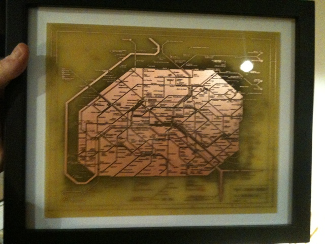
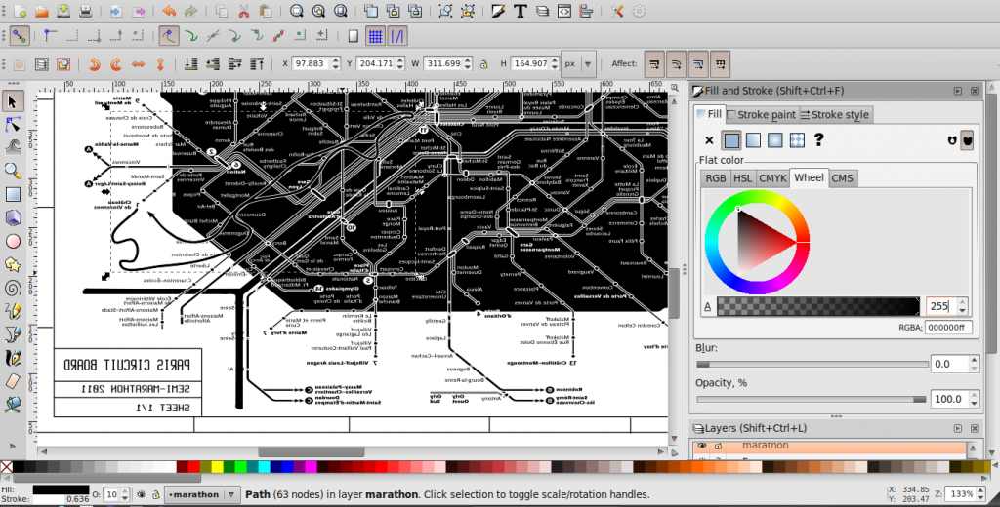
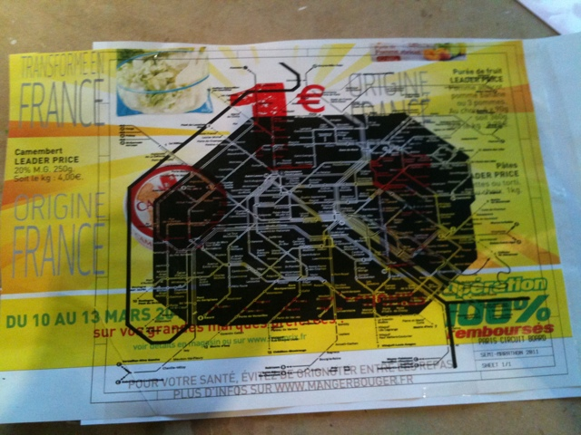
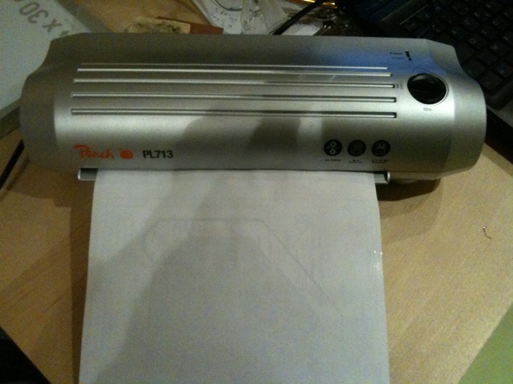
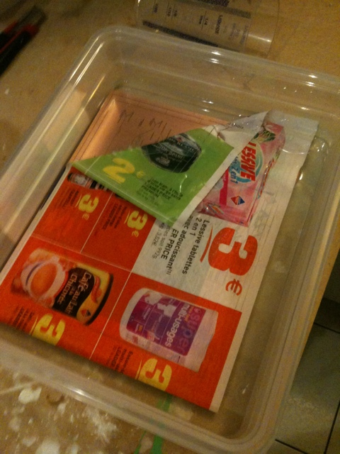
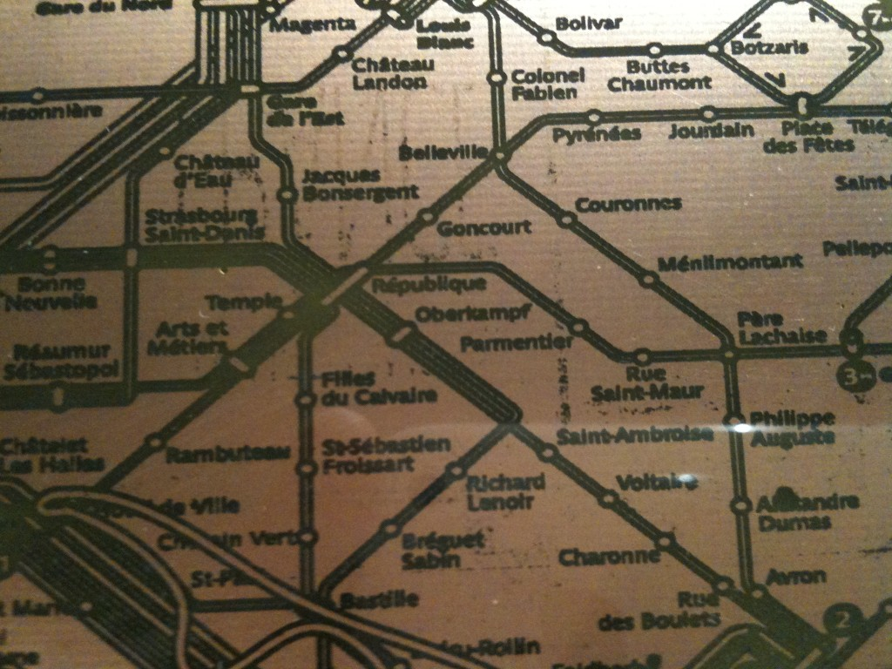
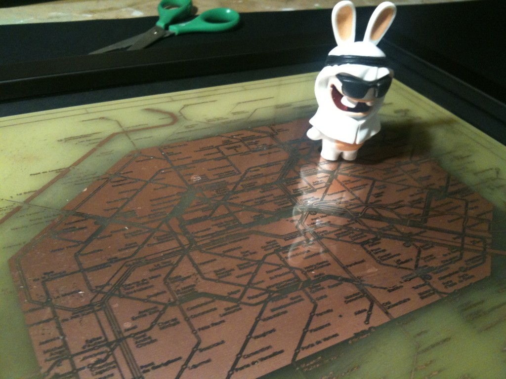

This post is a speciale dedicace to [anagram's map of Paris](http://www.gef.free.fr/metro.html).

I just received a bunch of cool new chips from my favorite dealer. The problem is that a lot of them are surface mount ( SOIC, SOP, MSOP, SOT23 and sometimes worse...) and I cannot really force them into the perforated board I was using before. So I decided to try and make my own PCB using the toner transfer technique (see [here](http://heartygfx.blogspot.com/2007/04/realiser-un-circuit-imprime-sans.html) and [here](http://goctruc.free.fr/Electron/CiCreat.html) for detailed french tutorials). The metro map is a perfect material for this because:

* 1. It has plenty of fine details.
* 2. This week end was the half-marathon of Paris and I could print the race track on top of it.
* 3. I like it (Even if there's no rabbit inside).

# 1. Inkscape craze 

First step is to remove trains, trams and boats to make more room for the actual metro tracks. Then make everything black and white and stroke the metro tracks with white so they are visible on top of black background. In the end, everything that is black will be copper, all the white will be epoxy.

# 2. Printing on shiny paper 

Second step is to print the map (dont forget mirror mode) on a shiny paper, like supermarket ads. 

# 3. Laminator transfer 

Third step is to transfer the black toner into the copper clad. This is made by pressing hard and heating, which is conveniently achieved using a laminator. Mine was a bit weak on the "heating" side so I added a hairdryer as well. The laminator was rated 0.6mm but swallowing 1.6mm PCB did not cause any obvious problem.

# 4. Paper removal 

Leaving the board inside water, the paper becomes soft and easy to remove. The toner stays on the copper clad.

# 5. Etching 

The board is etched using a mix of tap water, chlorhydric acid and hydrogen peroxyde (100/60/40). After 2 minutes, the solution becomes all green (sorry no pictures for this step, I was too focused...)

# 6. Cleaning 

The remaining toner is removed using acetone. The result is not that bad. SOIC8, SOIC20 and SOT23 should be ok, not sure for the other ones. There are still some small holes and black marks. Hopefully this will not happen on smaller boards (this one is A4).

