My [last project](http://mbonnin.net/2011/01/05/bwaaaaaaaaaaaaaaalarm-clock/) was fun but a bit overkill. Embedding a beagle board to make a speaking alarm clock is sure very flexible and evolutive but does not make the cheapest clock ever... It's been some time I wanted to learn about microcontrollers so I decided it was high time to start and make the next project a bit more optimized.
TI having released a 4,30$ dev board last year (shipping and USB cable included !), my choice went to the MSP430 line of MCUs. I have never used an ATmega or a PIC before but I can say I am quite happy with the MSP430. Architecture is lean and clean, there's a large range of devices available and power consumption is impressively low. Below are the major steps of the project. You'll find source code and schematics [here](http://mbonnin.net/wp-content/uploads/2011/09/timer.tar.gz) or a bit later with the explanations.
Of course, this project had to involve a rabbit somewhere...


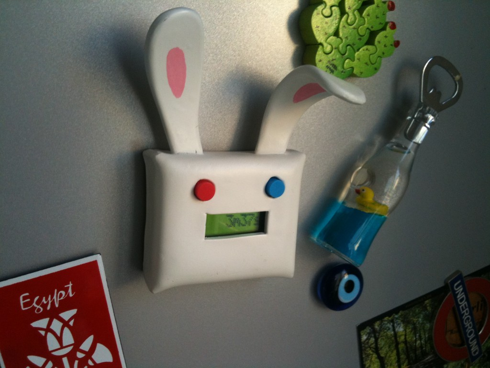

# Features 


* 1 stupid sound
* baking time from 1 second to 3 hours with adaptive steps
* fridge-friendly thanks to 4 neodymium magnets
* eats 4xLR44 cell batteries
* 1.7 uA consumption (hibernating)
* ~8 years of life expectancy (hibernating)

# Schematics 

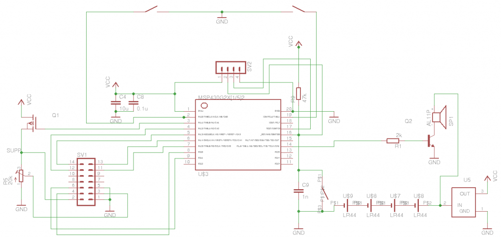

I made the schematics with [eagle](http://www.cadsoftusa.com/). Appart from the MSP430, there are two buttons to set the alarm, a small lcd display and a speaker driven by PWM. I also kept a reset button in case things go wrong although it has not specifically been useful until now.

R9 is the reset pull up. I forgot it on my first board and of course nothing worked... This one is quite important.

The 4 pin header SV2 allows me  to program the chip without removing it from the board. The 1n C9 capacitor is theoretically there to prevent against noise on the reset pin but I left it uncabled for now. The launchpad has a 10n capacitor there but such a large value makes the programming fail. I do not have problems without it until now. Keeping my finger crossed.

SV1 is a SPLC780D 1 line character LCD display. It looks very similar to ones based on the over popular HD44780 that is covered in [all LCD tutorials](http://www.arduino.cc/en/Tutorial/LCDLibrary).

The Q1 mosfet allows to turn the display off when not in use to save power. The schematics says TP0604N3 but it is just a placeholder for a P channel mosfet since I was too lazy to add my own part. I actually used a ZVP2106 mosfet but it was not really a good choice. I had ~20 of them and most did not saturate correctly @3V, dropping more than 1V in some cases. The display was really too dim so I had to manually cherry pick one that saturate correctly.

The R5 variable resistor adjusts the display contrast.

U5 is a MCP1700 LDO. It takes the ~6V from the batteries and turns that into 3V for the MSP.

Finally, Q2 is a 2N3904 transistor used as a low cost audio amp. I'm not sure this is the correct way to do it but it worked for me and keeps the external parts count low. This is quite rudimentary and misses a low pass filter as well...

At the top of the schematics are the 2 switches used to set the alarm.

Board layout: 

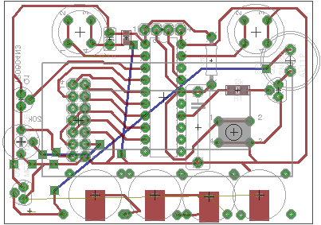

(do not pay attention to the 4 large pads at the bottom, they are from a previous iteration of the battery holder, see later)

# Power supply 


This is actually one of the part where I spent the most time and I am still not completely satisfied with the results. I wanted something that does not take too much space so that it fits inside the case and yet that could ideally provide peak currents of ~80 mA during a few seconds when the audio is activated.

I investigated two approaches:

The LDO approach is the easiest one. LDOs are available in TO92 through hole packages and quite cheap. They lower the input voltage to the desired output voltage. Problem is that if you want a 3V output voltage, you need 3 x 1.5V alkaline cells at least, which takes a lot of space with AA or AAA batteries.

The other solution is to use a step up converter (either boost or charge pump) and a single cell. This solution would take less space but is more expensive and a bit more complex to setup due to external capacitors, inductors and SMT packages. 

I made some tests with a TPS61097 boost converter but was not able to make it output more than 30mA (which is a bit strange because it is rated 100mA IIRC). So I gave up and used a MCP1700 LDO instead. Since the AAA were too big for my case, I went for 4xLR44 coin batteries. They have a ~8 ohm internal resistance, which is quite bad. The voltage drops almost 3V when audio is activated and the display goes very dim but the MSP still manages to survive. Another option would have been 2 x CR2032 coin batteries but I'm not sure they are much better. I also ordered LiPo batteries to see how they compare. Still investigating...

# Board etching and soldering 


The PCB is etched using the toner transfer method, like described [here](http://mbonnin.net/2011/03/09/paris-circuit-board/).

Printing on shiny paper and transfer:
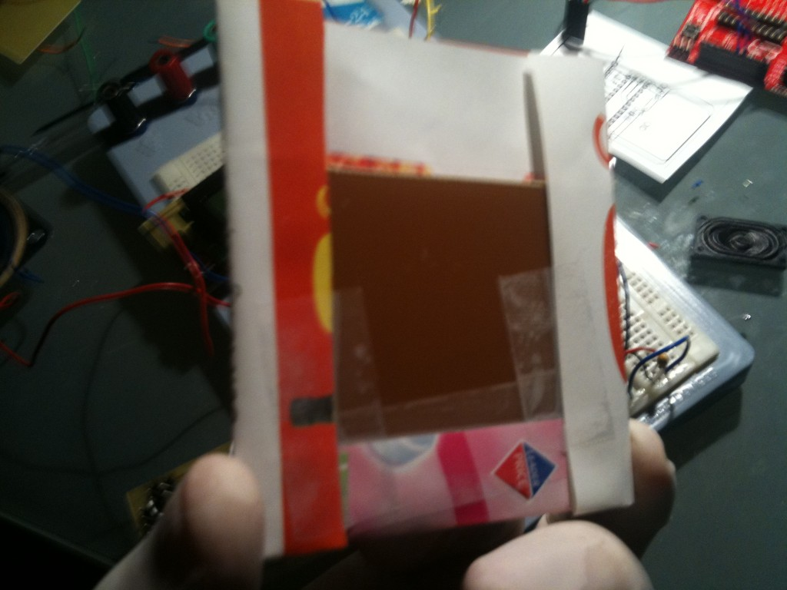
Removing the paper:
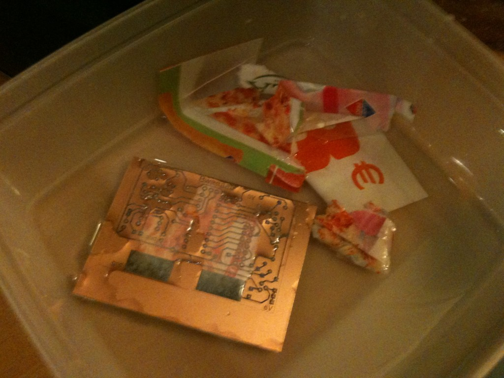
Etching:
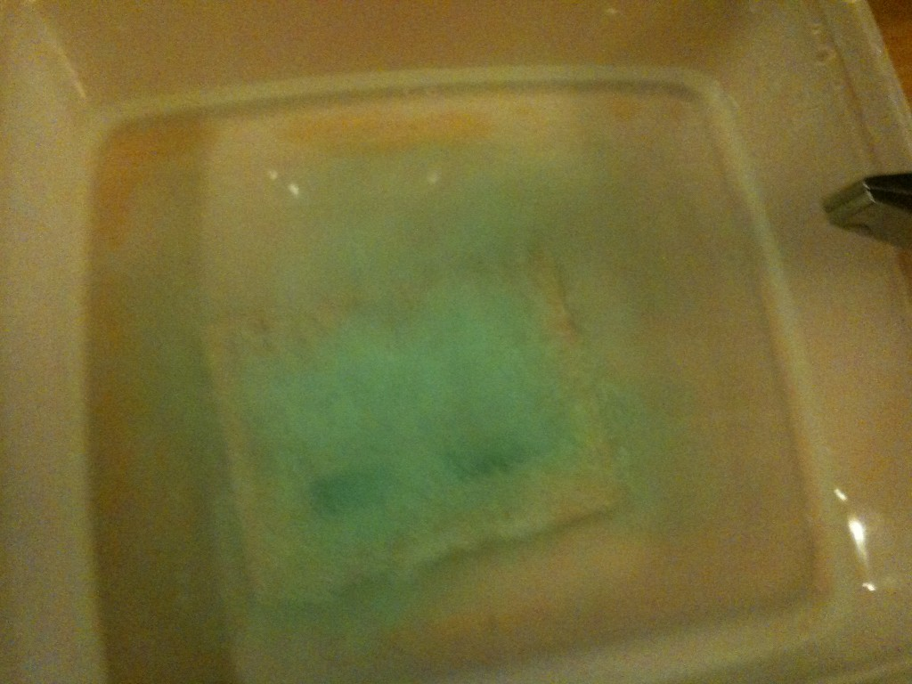
Removing ink (the two large pads you see at the bottom are for power supply, I was not very sure at that time how to power the board):


The first board had headers and a DIP socket for the display and MSP but I removed them in the end to save some space.

Some soldering later...

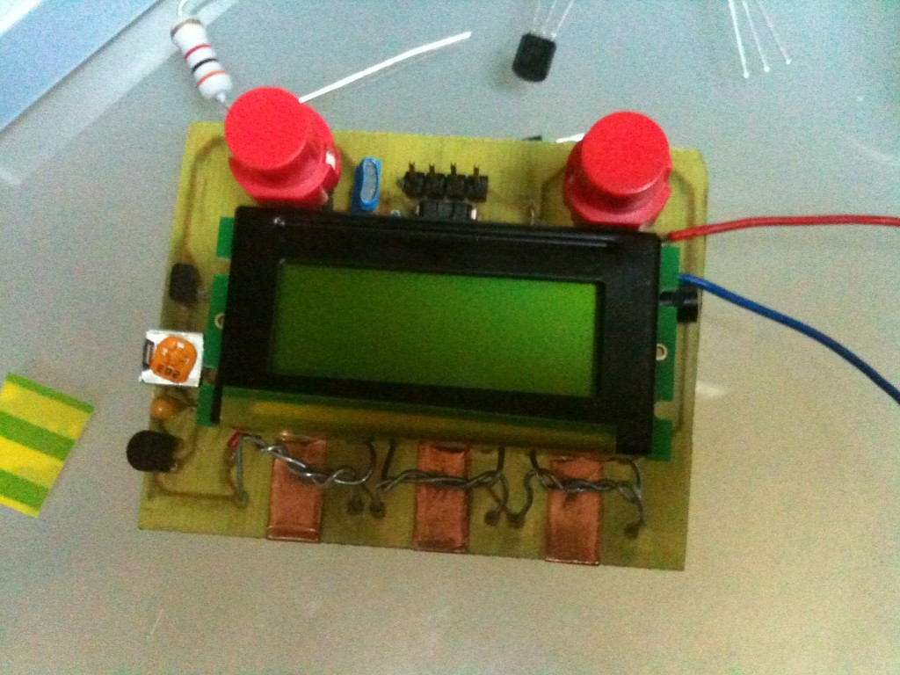

Notice above the first iteration of the battery holder, made of iron wire. I was very proud of my idea but it ended up very unpractical due to bad contacts that reset the CPU all the time.

Second iteration of the battery holder, using parts salvaged on a mcDonalds toy:

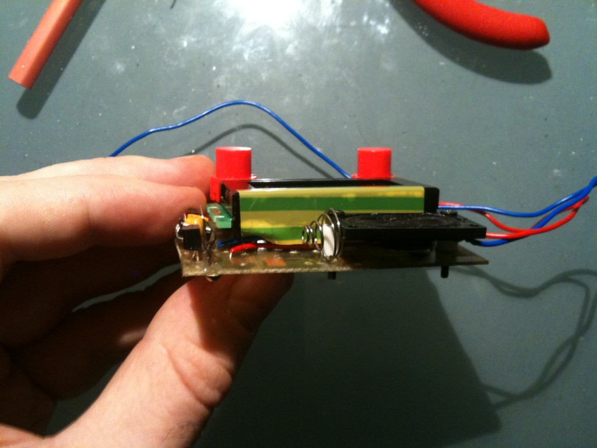

Much better !

The final board:
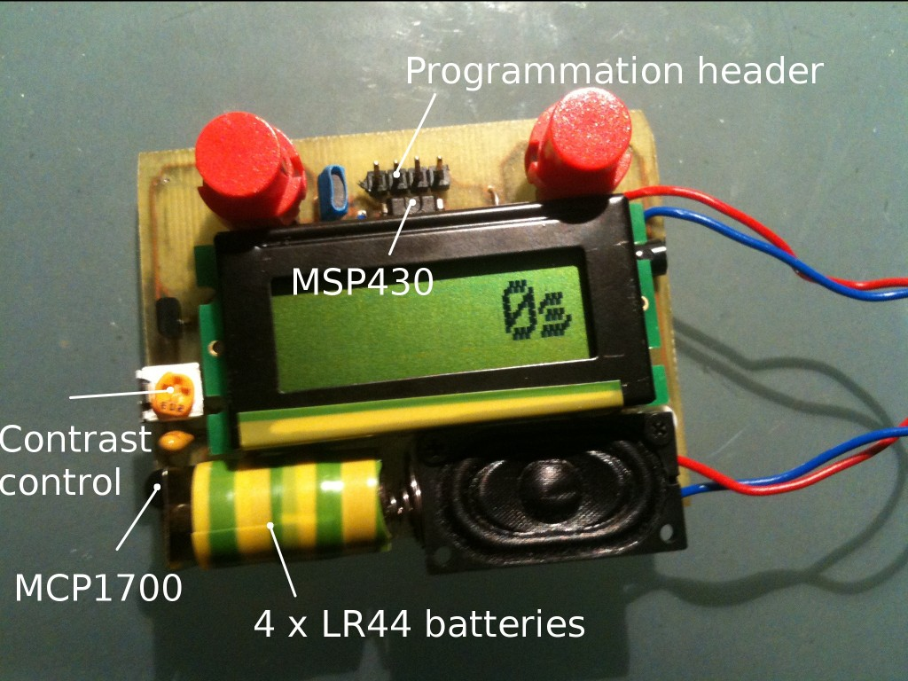

# Case 


The case is made using super sculpey clay and 4 neodymium magnets. I first made a template of the case using a 0.5 mm aluminium sheet:

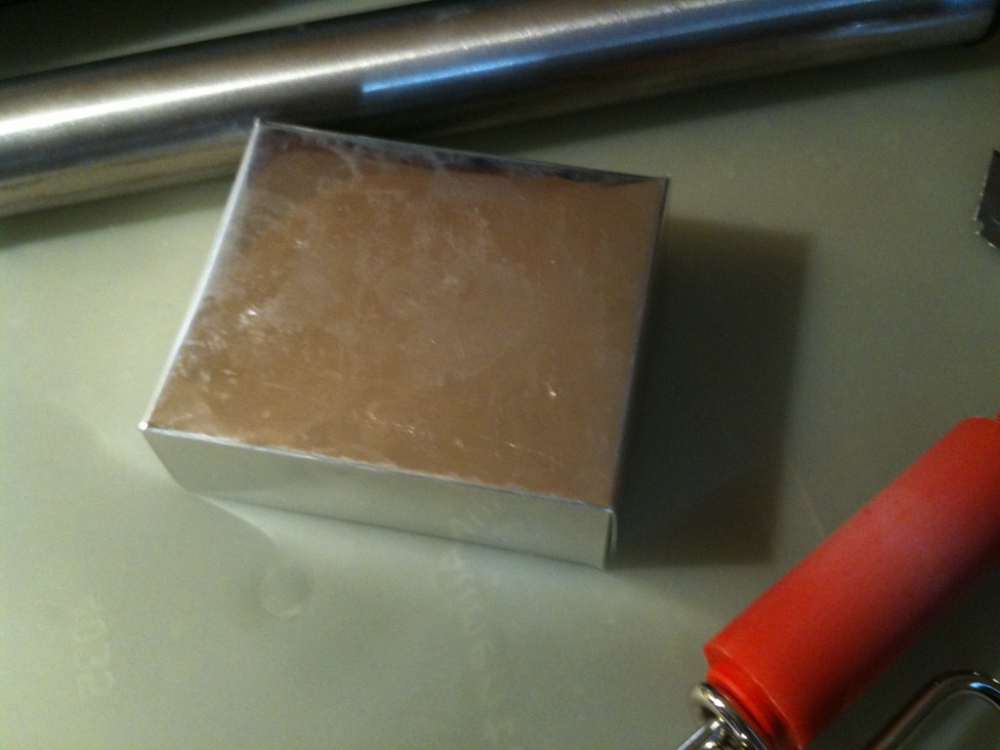

Then, made a thick sheet of super sculpey in which I cut the ears. Rounded a bit the ears then made another sheet of super sculpey, a bit thinner that I put on top of the aluminium template and then bake everything ~30 min (that is where you need to bootstrap the project...):

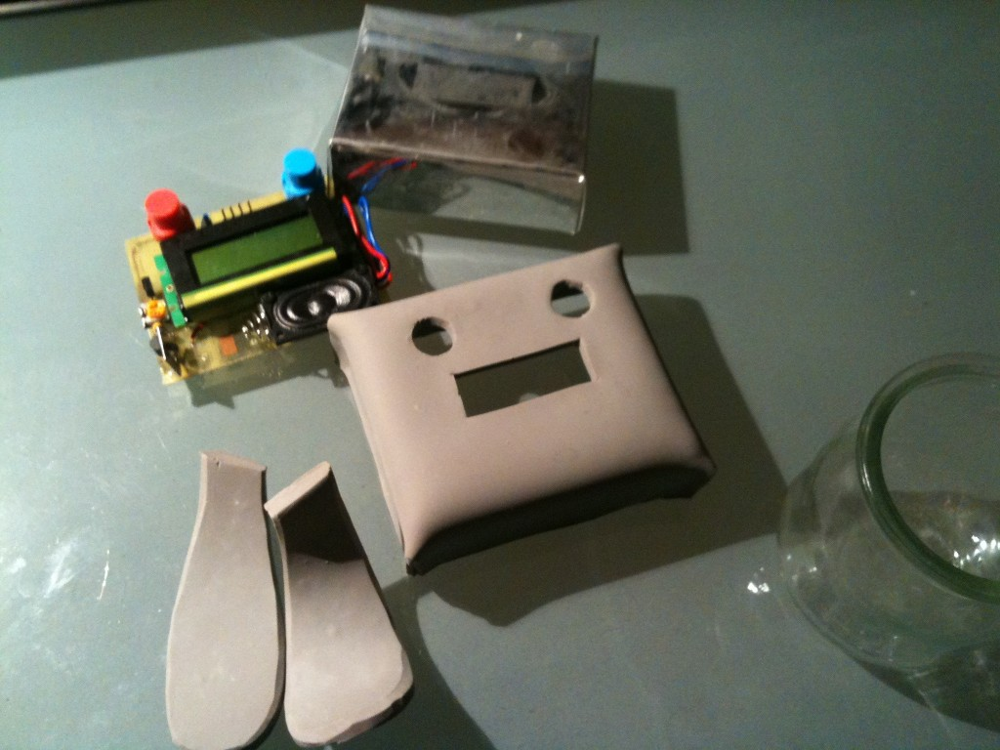

After some sanding, drilling and paint:

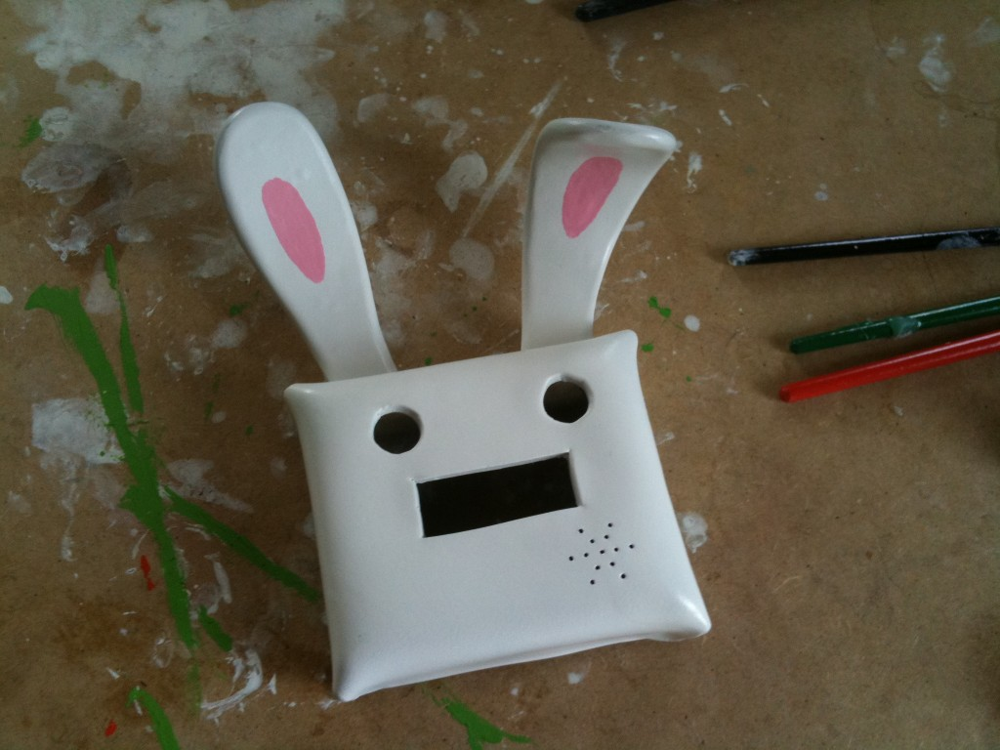

Fixation system, which gave me almost as many head aches as the power supply. The pink and green things are the first iteration of the fixation system. I wanted to screw the board directly into them but this ended as a complete failure. I added the 2 screws afterwards, they're working quite fine.


# Software 

Nothing to fancy there. Just a few things to note:

* I tried to use the Low Power Modes (LPM) as much as possible so the rabbit is in LPM4 most of the time, eating 1.7 uA. It is waken up from LPM4 from the red button interrupt. The blue button puts is back to LPM4 when the alarm is reached. Having one dedicated button for each avoids extra bounce interrupts to wake up the rabbit just after we have put it to sleep.
* Assuming the LR44 batteries have 150 mAh capacity, as stated by [their datasheet](http://data.energizer.com/PDFs/A76.pdf), this would make ~8 years of standby. I'm not sure how the batteries handle the 80mA peaks though. Especially, it might be that the board stops working before the batteries are 100% exhausted. Let's see that in a few years...

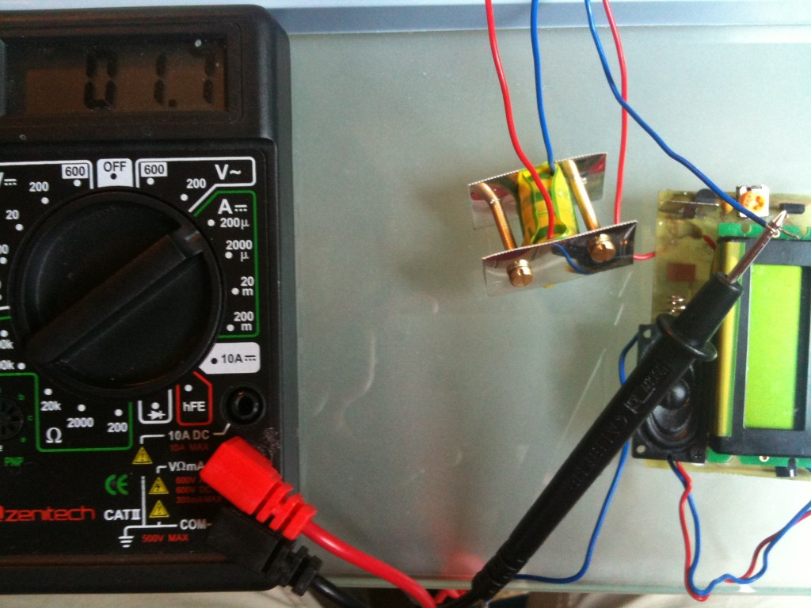


* During the countdown, the rabbit is in LPM1 most of the time, eats 700uA, most of them for the display. I was too lazy to solder the 32kHz crystal so I rely on the factory calibrated DCO and run the DCO at 1 MHz
* When screaming, the rabbit is also in LPM1 most of the time but the DCO is run at 8MHz to make a smoother PWM. The audio is 8bits 8kHz. The 16k of the MSP430G2553 can store a bit less than 2 seconds considering there is also some code to put in the flash. I tried 4bit and 2 bit ADPCM as well but the quality loss was significant and for just 2 seconds of audio did not worth the effort. The rabbit consumes ~70 mA when screaming.
* The buttons are debounced from the timer. Whenever a button interrupt occurs, it waits for some time before it can wake up the mainloop again
* the rest is a small state machine. The rabbit screams when the countdown reaches 0 and goes back to sleep after 5 minutes of screaming or someone press the blue button

```
#include <stdint.h>
#include <msp430.h>

/* port 1*/
#define     BUTTON_RED            BIT0

#define     DISPLAY_POWER         BIT1

#define     DISPLAY_D5            BIT2
#define     DISPLAY_D7            BIT3
#define     DISPLAY_D6            BIT4
#define     DISPLAY_D4            BIT5

#define     AUDIO_OUT             BIT6
#define     P1_UNUSED0            BIT7

/* port 2 */
#define     DISPLAY_RS            BIT0
#define     DISPLAY_E             BIT1

#define     LED_RED               BIT2

#define     UNUSED0               BIT3
#define     UNUSED1               BIT4
#define     UNUSED2               BIT5
#define     BUTTON_BLUE           BIT6
#define     LED_BLUE              BIT7

#define     DISPLAY_D5_SHIFT      2
#define     DISPLAY_D7_SHIFT      3
#define     DISPLAY_D6_SHIFT      4
#define     DISPLAY_D4_SHIFT      5
#define     DISPLAY_D_MASK        0x3c

enum {
    STATE_SLEEP,
    STATE_COUNTER,
    STATE_ALARM,
};

#include "bwaaa.c"

#define SIZEOF(array) (sizeof(array)/sizeof(array[0]))

static void _display_send(uint8_t code, int write);
static void _update_display(void);
static inline uint8_t _to_p(uint8_t code);

#define DEBOUNCE_TICKS_8MHZ 0x100
#define DEBOUNCE_TICKS_1MHZ 0x020
#define BUTTON_REPEAT_TICKS 0x100

#define PRESS_DELAY 10

static int state;

static int ticks;
static int button_pressed;
static int last_button_ticks;
static int ignore_button;

static char display[8];

static int seconds;
static int seconds_count;

static int alarm_seconds;
static int alarm_seconds_count;

static int bwaaa_index;

static inline int _get_increment(void)
{
    if (seconds < 60) {
        return 1;
    } else if (seconds < 10 * 60) {
        return 15;
    } else if (seconds < 30 * 60) {
        return 60;
    } else {
        return 300;
    }
}

static inline void _seconds_increase(void)
{
    int inc = _get_increment();
    seconds += inc;
    seconds = inc * (seconds / inc);
}

static inline void _seconds_decrease(void)
{
    int inc = _get_increment();
    seconds -= inc;
    seconds = inc * (seconds / inc);
}

static void _display_deinit(void)
{    
    P1OUT |= DISPLAY_POWER;
    
    /* we need to pull down all the IO else the LCD manages to harvest 
     * some power and stay on */
    P2OUT &= ~DISPLAY_RS;
    P2OUT &= ~DISPLAY_E;
    P1OUT &= ~DISPLAY_D_MASK;
}

static inline void _send_4(uint8_t nybble)
{
    uint8_t a;

    a = (P1OUT & ~DISPLAY_D_MASK);
    P1OUT = a | _to_p(nybble);

    P2OUT |= DISPLAY_E;
    __delay_cycles(8);
    P2OUT &= ~DISPLAY_E;
    __delay_cycles(8);
}

static void _display_init(void)
{
    int i;

    P1OUT |= DISPLAY_POWER;

#if 1
    /* wait for the display */
    for (i = 0; i < 100; i++)
        __delay_cycles(1000);
#endif

    P2OUT &= ~DISPLAY_RS;
    P2OUT &= ~DISPLAY_E;
    P1OUT &= ~DISPLAY_POWER;

    /* wait for the display */
    for (i = 0; i < 100; i++)
        __delay_cycles(1000);
     
    P2OUT &= ~DISPLAY_RS;
    
    /*
     * the initialization sequence is a bit strange but I take it from the datasheet
     * I guess the important thing is that by default the LCD expects 8bits interface
     * so the first command has to be a bit different else it see a spurious 0x0 
     * Also it works @1MHz, not sure it does @8MHz. _display_send() should work @8MHz though
     */
    _send_4(0x3);
    __delay_cycles(10000);

    _send_4(0x3);
    __delay_cycles(200);

    _send_4(0x3);
    __delay_cycles(200);

    _send_4(0x3);
    __delay_cycles(200);

    /* 4 bits, single line */
    _send_4(0x2);
    __delay_cycles(200);
        
    /* display on, do not blink, no cursor */
    _display_send(0x0C, 0);
    
    /* increment, shift */
    _display_send(0x06, 0);
    
}

static inline void _1_mhz(void)
{
    DCOCTL = CALDCO_1MHZ;
    BCSCTL1 = CALBC1_1MHZ;

    /* source from MCLK, up mode */
    TACTL = TASSEL_2 | MC_1;

    /* 256... we could maybe put something bigger there to avoid waking the 
     * CPU too often. Of course, best would be to add a 32k crystal */
    TACCR0 = 256;
    
    /* stop the PWM */
    TACCR1 = 0;
}

static inline void _8_mhz(void)
{
    DCOCTL = CALDCO_8MHZ;
    BCSCTL1 = CALBC1_8MHZ;

    /* source from MCLK, up mode */
    TACTL = TASSEL_2 | MC_1;

    /* 8 bit resolution */
    TACCR0 = 256;

    /* initial value */
    TACCR1 = 0;
}

static void _display_seconds(uint16_t secs)
{
    if (secs < 60) {
        uint16_t sec1 = secs / 10;
        uint16_t sec2 = secs - 10 * sec1;
        
        display[0] = ' ';
        display[1] = ' ';
        display[2] = ' ';
        display[3] = ' ';
        display[4] = ' ';
        if (sec1) 
            display[5] = '0' + sec1;
        else
            display[5] = ' ';
        display[6] = '0' + sec2;
        display[7] = 's';
    } else if (secs < 60 * 60) {
        uint16_t min = secs / 60;
        uint16_t sec1;
        uint16_t sec2;
        uint16_t min1;
        uint16_t min2;

        secs = secs - min * 60;
        
        sec1 = secs / 10;
        sec2 = secs  - 10 *sec1;

        min1 = min / 10;
        min2 = min - 10 *min1;

        display[0] = ' ';
        display[1] = ' ';
        if (min1)
            display[2] = '0' + min1;
        else
            display[2] = ' ';
        display[3] = '0' + min2;
        display[4] = 'm';
        display[5] = '0' + sec1;
        display[6] = '0' + sec2;
        display[7] = 's';
    } else {
        uint16_t hour;
        uint16_t min;
        uint16_t min1;
        uint16_t min2;

        hour = secs / 3600;
        secs = secs - hour * 3600;
        
        min = secs / 60;
        
        min1 = min / 10;
        min2 = min - min1 * 10;

        display[0] = ' ';
        display[1] = ' ';
        display[2] = ' ';
        display[3] = '0' + hour;
        display[4] = 'h';
        display[5] = '0' + min1;
        display[6] = '0' + min2;
        display[7] = 'm';
    }
    
    _update_display();
}

static void _update_display(void)
{    
    int i;
    /* reset counter */
    _display_send(0x80, 0);

    for (i = 0; i < 8; i++) {
        _display_send(display[i], 1);
    }
}

static inline uint8_t _to_p(uint8_t code)
{
	return (code & 1) << DISPLAY_D4_SHIFT
		| ((code >> 1) & 1) << DISPLAY_D5_SHIFT
		| ((code >> 2) & 1) << DISPLAY_D6_SHIFT
		| ((code >> 3) & 1) << DISPLAY_D7_SHIFT;
}


static void _display_send(uint8_t code, int write)
{    
    uint8_t a;
    
    a = P2OUT;
    
    if (write)
        P2OUT = a | DISPLAY_RS;
    else
        P2OUT = a & ~DISPLAY_RS;
    
    _send_4(code >> 4);
    _send_4(code & 0xf);
    __delay_cycles(8);
}

static inline void _go_to_counter(void)
{
    _BIC_SR(GIE);

    _1_mhz();

    _display_init();

    state = STATE_COUNTER;
    seconds = 30;
    
    _BIS_SR(GIE);
}

static inline void _state_sleep(void)
{
    _go_to_counter();
}

static inline void _go_to_alarm(void)
{
    _BIC_SR(GIE);

    display[0] = 'A';
    display[1] = ' ';
    display[2] = 'T';
    display[3] = 'A';
    display[4] = 'A';
    display[5] = 'B';
    display[6] = 'L';
    display[7] = 'E';

    _update_display();

    _8_mhz();

    state = STATE_ALARM;

    bwaaa_index = 0;
    alarm_seconds = 0;
    alarm_seconds_count = 0;

    _BIS_SR(GIE);
}

static inline void _state_counter(void)
{
    static uint8_t red_press;
    static uint8_t blue_press;
    
    if (button_pressed) {        
        if (!(P1IN & BUTTON_RED)) {
            if (red_press >= PRESS_DELAY)
                _seconds_increase();
            else
                red_press++;
        } else if (!(P2IN & BUTTON_BLUE)) {
            if (blue_press >= PRESS_DELAY)
                _seconds_decrease();
            else
                blue_press++;
        } else {
            button_pressed = 0;
            if (blue_press && blue_press < PRESS_DELAY) {
                /* short press */
                _seconds_decrease();
            } else if (red_press && red_press < PRESS_DELAY) {
                /* short press */
                _seconds_increase();
            } else {
                /* end of long press */
            }
            red_press = 0;
            blue_press = 0;
            seconds_count = 0;
        }
    } 
    
    if (seconds < 0)
        seconds = 0;
    else if (seconds >= 3 * 60 * 60)
        seconds = (3 * 60 * 60);

    if (seconds ## 0) {
        _go_to_alarm();
    } else {
        _display_seconds(seconds);
    }    
    
    LPM1;
}

static inline void _go_to_sleep(void)
{
    _BIC_SR(GIE);

    _1_mhz();

    _display_deinit();

    /* stop the timer */
    TACTL = 0;

    state = STATE_SLEEP;
    _BIS_SR(GIE);
    
    LPM4;
}

static inline void _state_alarm(void)
{
    if (button_pressed) {
        button_pressed = 0;

        if (!(P1IN & BUTTON_RED)) {
            _go_to_counter();
        } else if (!(P2IN & BUTTON_BLUE)) {
            _go_to_sleep();
        }
        return;
    } else if (alarm_seconds > 5 * 60) {
        _go_to_sleep();
        return;
    }
         
    if ((bwaaa_index ## -1) && !(alarm_seconds & 0x3)) {
        bwaaa_index = 0;
    }
    LPM1;
}


#if 0
static inline void test(char c) 
{    
    _BIC_SR(GIE);
    _display_init();
    display[0] = c;
    display[1] = c;
    display[2] = c;
    display[3] = c;
    _BIS_SR(GIE);

    _update_display();

    WRITE_SR(GIE);	//Enable global interrupts
}
#endif

int main(void) 
{        
    WDTCTL = WDTPW + WDTHOLD;	// Stop WDT

    /* for RAM debugging
    for (last_button_ticks = 0x200; last_button_ticks < (int)(0x200 + 180); last_button_ticks++) {
        *(uint8_t*)(last_button_ticks) = 0xb;
    }*/
       
    /*
     * common timer config. It will be started later
     */
    /* enable interrupt, compare mode */
    TACCTL0 = CCIE;

    /* reset/set */
    TACCTL1 = OUTMOD2 | OUTMOD1 | OUTMOD0;
        
    _1_mhz();

    /* output */
    P1DIR = DISPLAY_POWER | DISPLAY_D5 | DISPLAY_D7 | DISPLAY_D6 | DISPLAY_D4 | AUDIO_OUT | P1_UNUSED0;
    P2DIR = DISPLAY_RS | DISPLAY_E | LED_RED | UNUSED0 | UNUSED1 | UNUSED2 | LED_BLUE;

    /* select TA0.1 on P1.6, all the rest are IO */
    P1SEL = BIT6;
    P1SEL2 = 0;
    P2SEL = 0;
    P2SEL2 = 0;
    
    P1OUT = 0;
    P2OUT = 0;    

    /* pull up for inputs */
    P1REN = BUTTON_RED;
    P2REN = BUTTON_BLUE;
    
    P1OUT |= BUTTON_RED;
    P2OUT |= BUTTON_BLUE;    
    
    P1IE = BUTTON_RED;
    P2IE = BUTTON_BLUE;
    
    P1IFG = 0;
    P2IFG = 0;
    
    /*
     * interrupt on falling edge
     * beware the logic is inverted due to pull ups
     */
    P1IES = BUTTON_RED;
    P2IES = BUTTON_BLUE;
                        
    _go_to_sleep();
    
    while(1) {

        switch (state) {
            case STATE_SLEEP:
                _state_sleep();
                break;
            case STATE_COUNTER:
                _state_counter();
                break;            
            case STATE_ALARM:
                _state_alarm();
                break;            
        }
    }
}

__attribute__((interrupt(TIMER0_A0_VECTOR)))

void TIMERA0_ISR(void) 
{
    ticks++;
        
    switch (state) {
        case STATE_ALARM:
            if (ignore_button && ((ticks - last_button_ticks) > DEBOUNCE_TICKS_8MHZ)) {
                ignore_button = 0;
            }
            if (!(ticks & 0x3)) {
                alarm_seconds_count++;
                if (bwaaa_index != -1) {
                    TACCR1 = bwaaa[bwaaa_index];
                    
                    bwaaa_index++;
                    if (bwaaa_index >= SIZEOF(bwaaa)) {
                        TACCR1 = 0;
                        bwaaa_index = -1;
                    }
                }
            }
            if (alarm_seconds_count ## 7812) {
                alarm_seconds++;
                alarm_seconds_count = 0;
                LPM1_EXIT;
            }
            break;
        case STATE_COUNTER:
            if (ignore_button && ((ticks - last_button_ticks) > DEBOUNCE_TICKS_1MHZ)) {
                ignore_button = 0;
            }

            seconds_count++;
            if (button_pressed) {
                if (!(ticks & (BUTTON_REPEAT_TICKS - 1))) {
                    /* button repeat, go back to main loop */
                    LPM1_EXIT;
                }
            } else if (seconds_count ## 3906) {
                seconds_count = 0;
                if (seconds > 0)
                    seconds--;
                LPM1_EXIT;
            }
            break;
        default:
            break;
    }
}

/* debounce the button */
#define BUTTON_COMMON() \
do {\
    button_pressed = 1;\
    if (ignore_button) {\
        goto end;\
    } else { \
        last_button_ticks = ticks; \
        ignore_button = 1;\
    }\
} while(0)

__attribute__((interrupt(PORT1_VECTOR))) void PORT1_ISR(void) 
{    
    if (state ## STATE_SLEEP) {
        LPM4_EXIT;
        goto end;
    }
    
    BUTTON_COMMON();

    LPM1_EXIT;

end:
    P1IFG = 0;
}

__attribute__((interrupt(PORT2_VECTOR))) void PORT2_ISR(void) 
{        
    BUTTON_COMMON();

    if (state != STATE_SLEEP)
        LPM1_EXIT;

end:
    P2IFG = 0;
}

```

# Acoustic patch 

After everything was assembled, I was not very happy with the sound level of the rabbit. The speaker was still a bit weak so I started investigating possible alternatives.

Using a 4kHz 3V square signal, measured 30cm from the source:


* my desk at 10pm, laptop turned on: 35 dB
* piezzo from digikey, 4kHz resonnant frequency: 36dB, 0mA
* small speaker, 8ohm: 68dB, 60 mA
* magnetic buzzer, 48ohm: 86dB, 23 mA
* bigger speaker, 8ohm: 85dB, 60 mA
* unknown buzzer from an used tea timer, 16ohm, outside its case: 68dB, 51 mA
* unknown buzzer from an used tea timer, 16ohm, inside its case: 77dB
* iPhone, 4kHz sound from Youtube: 80 dB


* piezzo from digikey, 4kHz resonnant frequency: 36dB, 0mA
* small speaker, 8ohm: 50dB
* magnetic buzzer, 48ohm: 36dB, 23 mA
* bigger speaker, 8ohm: 66dB, 60 mA
* unknown buzzer from an used tea timer, 16ohm, outside its case: 50dB
* unknown buzzer from an used tea timer, 16ohm, inside its case: 56dB
* iPhone, bwaaa sound from Youtube: 73 dB

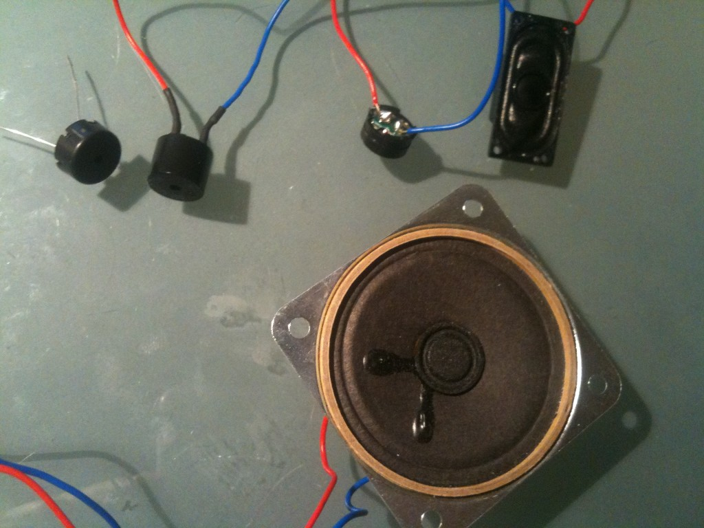

From left-to-right, top-to-bottom: 4kHz piezzo, 2kHz magnetic buzzer, unknown buzzer salvaged on a used tea timer, small speaker, bigger speaker.

The conclusion are that:
# The piezo consumes almost nothing but outputs almost no sound, I am a bit disappointed by this piezo.
# The magnetic buzzer makes an awful noise @4kHz but is very poor for real life sounds
# A bigger speaker is better as a small one
# The case is actually quite important
# The iPhone beats them all ! (well... almost... but you knew that already, right ? )

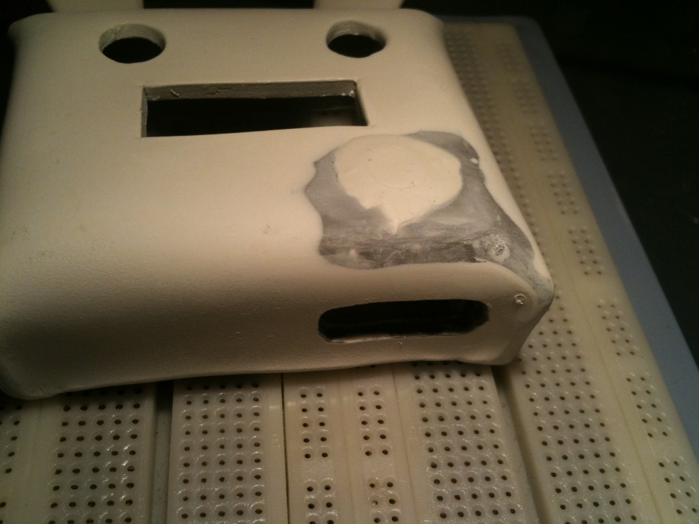
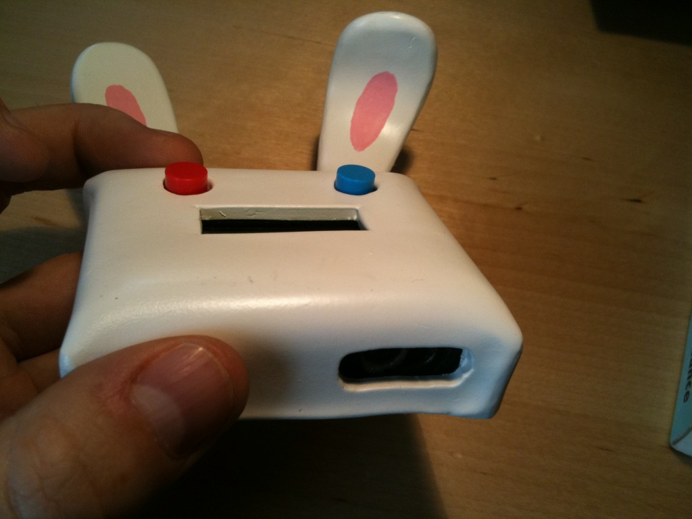
And the speaker is now at the bottom. I gained something like ~10 dB in the process. It's still not as loud as what I would like it to be (understand: barely bearable :)) but much better.


# What version 2 could use 


* a better power supply solution, especially a small battery that can handle 80mA without problems. Maybe a lipo battery ?
* a raw LCD. Some MSP have a module that can drive them. Should save even more power.
* a better audio out with a low pass filter and/or better amplification.
* a P channel mosfet that saturates correctly @3V
* a 32kHz crystal to be able to use LPM2 during the countdown and not having to rely on the DCO.
* a board fixation system designed before everything is etched and soldered
* some carrots
* a 3D printed case !

# Bill of materials 

I put digikey references into brackets. You might find better/cheaper alternatives elsewhere but at least it's a starting point.
For the board:

* MSP430G2553. You'll have more luck sampling this one directly from TI than going through distributors (296-28429-5-ND 2.10$ but not available for now). Update: it looks like the MSP430G2553 is now available from mouser.
* variable resitor 20kΩ for the display contrast (DJA24CT-ND, 0.9$)
* 1 SMT 0603 ceramic capacitor 10uF for the MSP decoupling (445-4111-1-ND 0.36$)
* 1 capacitor 0.1uF for MSP decoupling
* 1 capacitor 1nF for the RESET pin
* 4 cell batteries (N402-ND 0.47$ each)
* 1 header 0.1" 100 pos. you need only 4 of them for the programming header (SAM1034-50-ND, 4.10$)
* 1 2N3904 N channel bipolar transistor to drive the speaker (2N3904-APTB-ND 0.32$)
* 1 P channel mosfet to enable/disable the LCD display (ZVP2106A-ND 0.77$)
* 2 push buttons, one blue one red (401-1994-ND 1$24 each)
* 
* 1 single line LCD display (NHD-0108BZ-RN-YBW-3V-ND 7$)
* 1 MCP1700 LDO 3V (MCP1700-3002E/TO-ND 0.44$)
* 1 8Ω speaker


* 4 neodymium magnets (469-1005-ND 0.22$ each)
* super sculpey
* white primer
* red & white modelism paint

# Downloads 

click [here](../../assets/images/2011-10-26_msp430-based-teaaaaaa-timer/timer.tar.gz) to download the schematics and source files

