GOBOs (for GOes Before Optics) are used in theaters or fairs to display images or shadows on a flat surface. I saw one in a bar and found it nice, not knowing at that time it was called a gobo. Not knowing either how this damn thing could work. So I gave up...
...until some friends saw the same concept and found out how to build one. It is a pretty simple geometrical optics problem but the build process was fun. Below the instructions to build your own. Thanks Alain, Kiki & Arthur for their help, hosting and for telling me about metal snips !

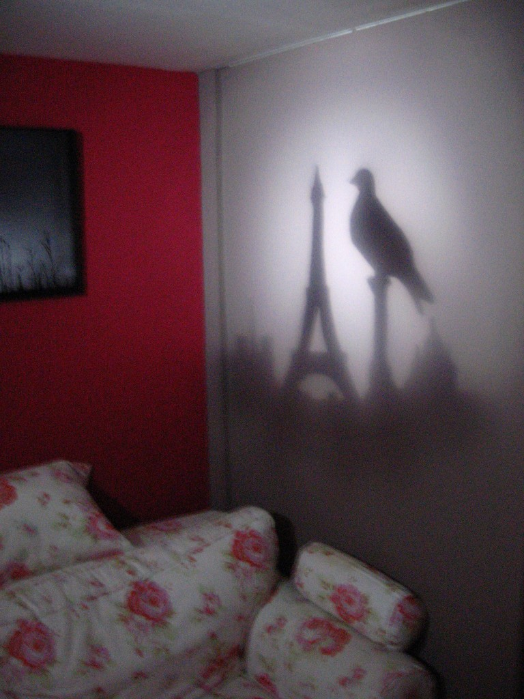
# You need: 

* 1 LED lamp, 600 lumens, possibly more
* power plug, wire and switch
* receptacle for the lamp
* 1 PVC pipe. Diameter ~60mm
* 1 convex lens, ~80mm focal length. That should make around 12 dioptries. I found mine at an optician for 15€.
* some matte plexiglass
* paint
* 1 big paper clip
* screws
* paper
* 1 aluminium sheet, 0.5 mm thick
* salt, water
* 1 cell phone charger

# How it works 

It's really the same mecanism as a projector:

The scale factor L/l is also the quotient between the distance of your wall and the focal length of your lens. Thales got it all figured out a few millenniums ago. Typically, the wall-lamp distance is 2 m and the lens focal length is 10 cm, giving a scale factor of 20. If your GOBO has a diameter of 5cm, it will make a 1 meter projection on your wall. If you find a lens with a lot of dioptres, the scale factor will be bigger. Just don't forget the projection is going to be upside down.

What this also means is that if you want to change the position of your lamp, you will most likely need to adjust a bit the position of the GOBO inside the lamp else you'll get a blurry projection.

This is what happens if you put your LED lamp near in the object plane of your lens. You can clearly see the LED lamp has 14 LEDs inside. Nice but not exactly the desired effect.

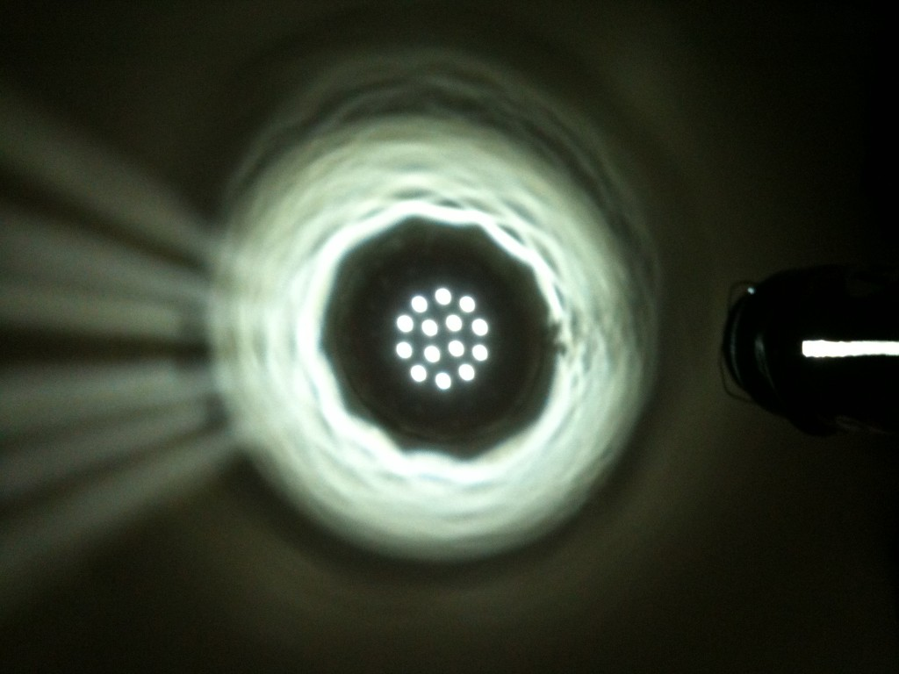

Same thing inside a reflecting aluminium case.

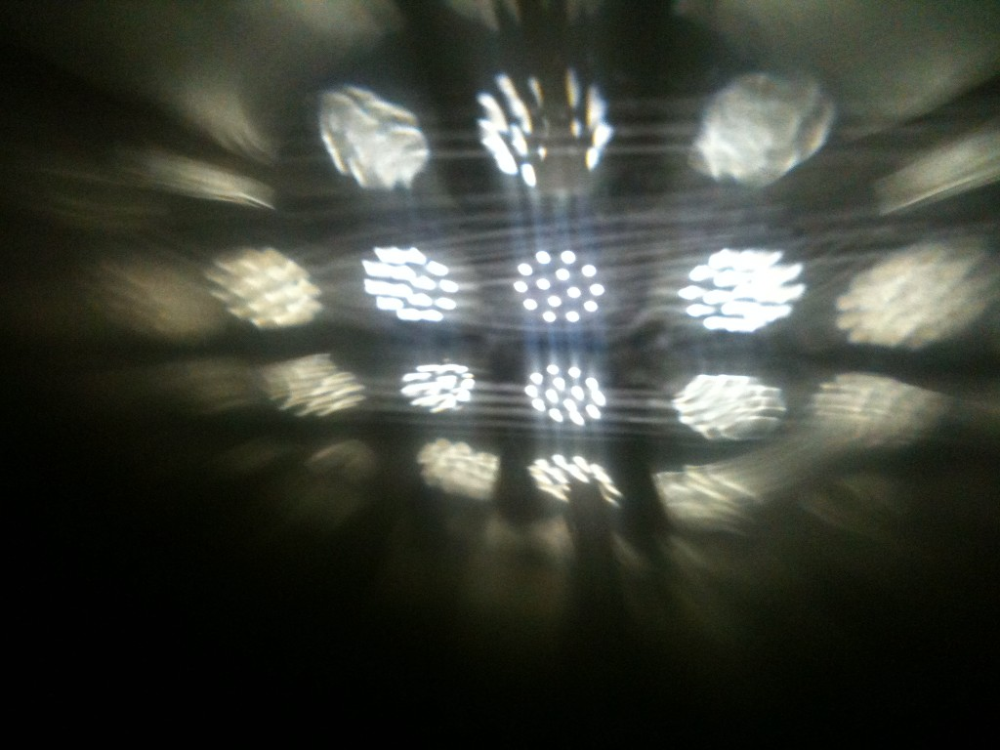
# Building the lamp 

Take a ~30cm long PVC pipe (used for plumbing). PVC is easy to cut with a hacksaw.

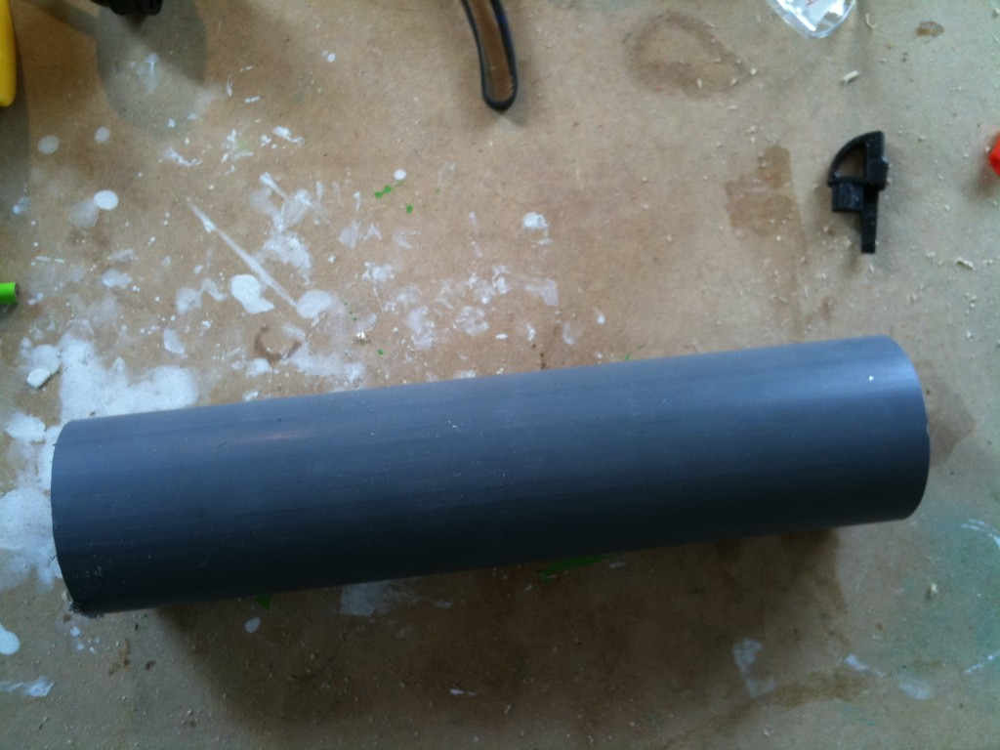

Paint the interior in white to make the light brighter and split the pipe in 2 parts, approximately 1/3 from the start. The small part will contain the LED lamp itself, the other the GOBO + lens.
Drill a small hole to be able to move the lens a bit.
Saw a small opening to insert the GOBO. And paint everything the color you want.

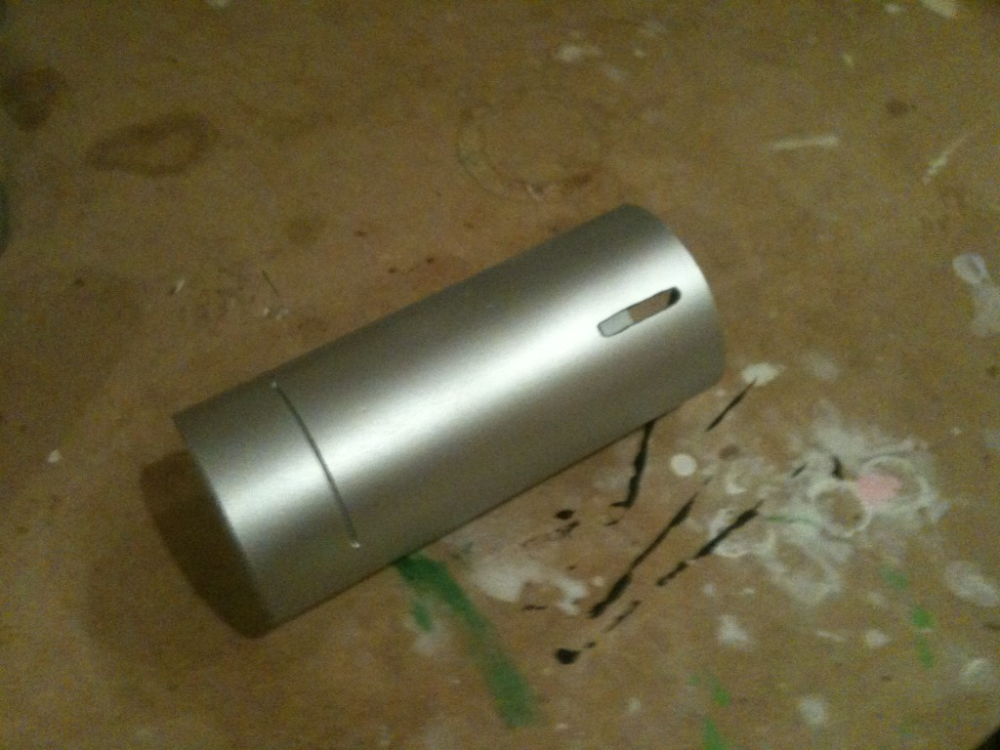

I'm using frosted plexiglass to diffuse the light and prevent the lamp details to appear in the resulting projection.

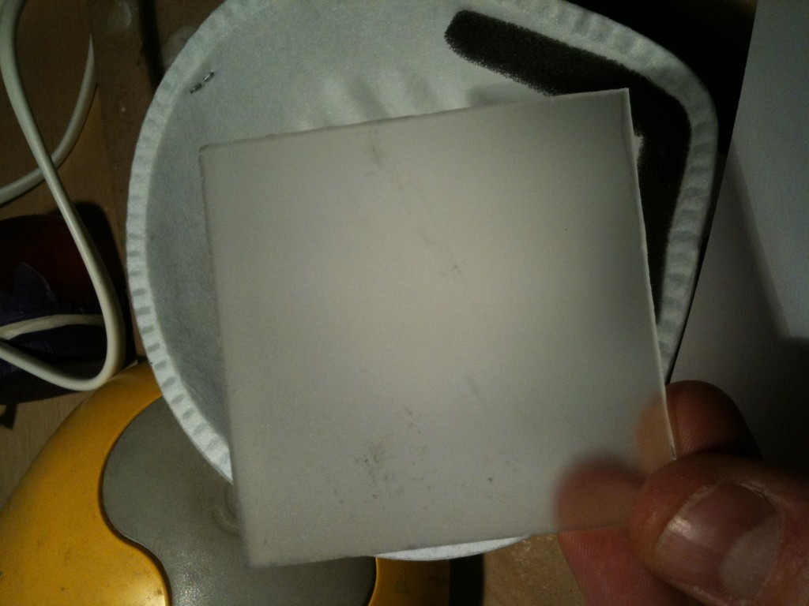

Once the 2 parts of the PVC pipe, we've got the main body of the lamp. Time to look into the GOBO itself. We wanted to do that from aluminium but aluminium is actually quite hard to cut, even with a dremel. Doing straight lines is easy but doing details of a 5cm long sheet is not that easy. So we came up with a [relatively easy and safe way](http://www.instructables.com/id/Simple-Electrolysis/) to work with aluminium.  First step, draw your model on the aluminium sheet and protect the part you want to keep with tape or nail polish. You have to do this on both faces so it requires some precision. Then connect your part to the + connector of a mobile phone charger and put everything into salted water.

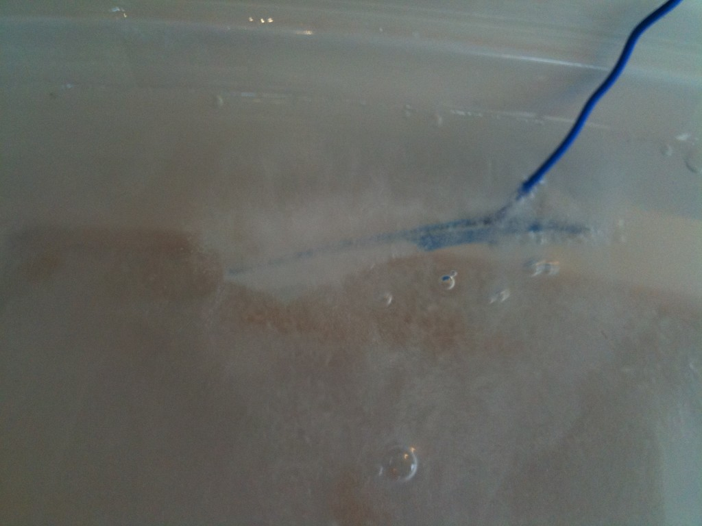

Wait a couple of hours, you should get something like this:

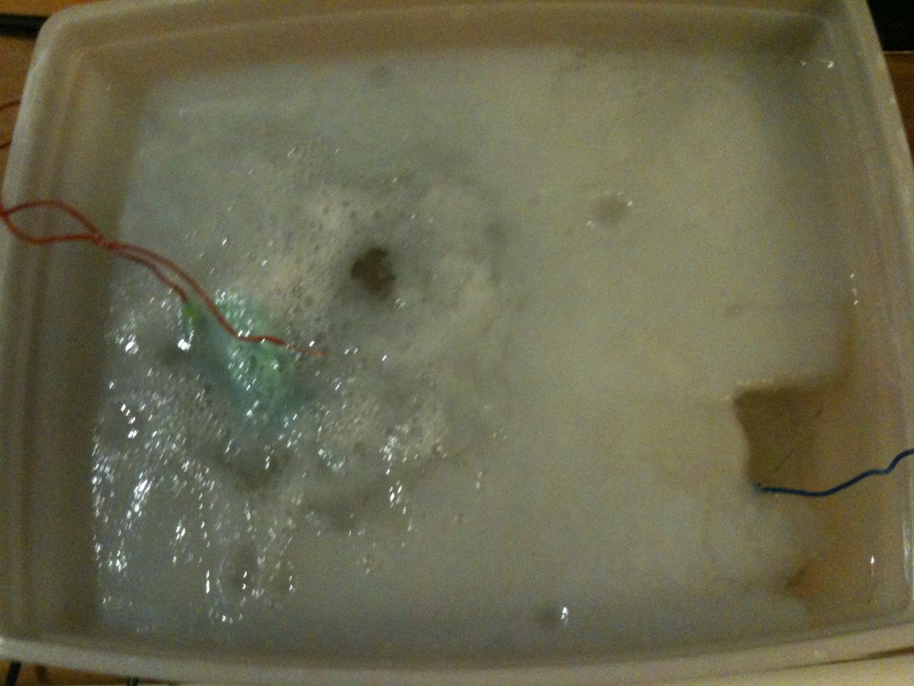

And once you remove your paint/tape/nail polish:

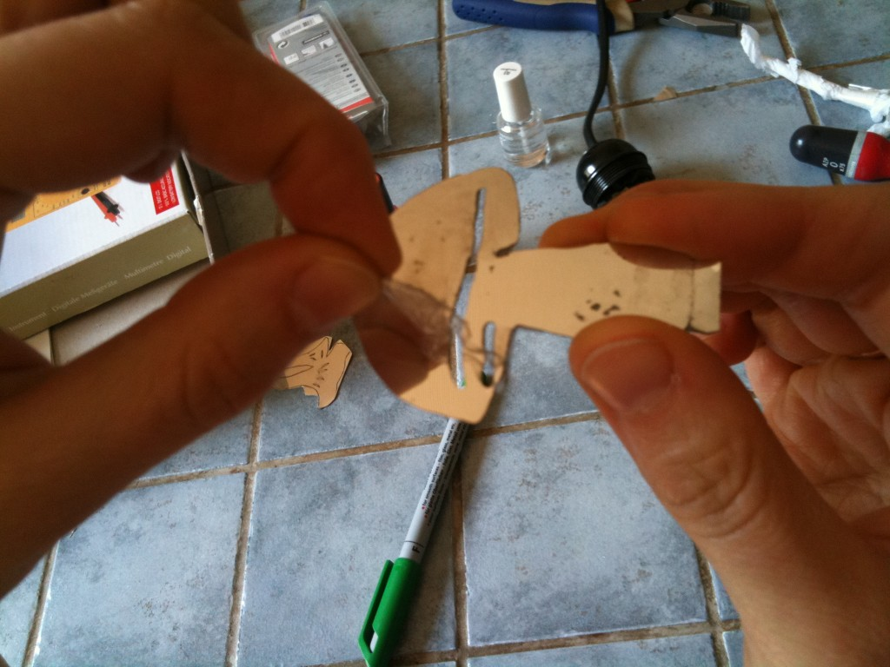

Not that bad. And requires no complicated tools. The drawback is that you still cannot do very fine details so unless you have a laser cutter, cardboard or thick paper will do as well.

The back of the lamp is etched using the same process (the orange thing is nail polish).

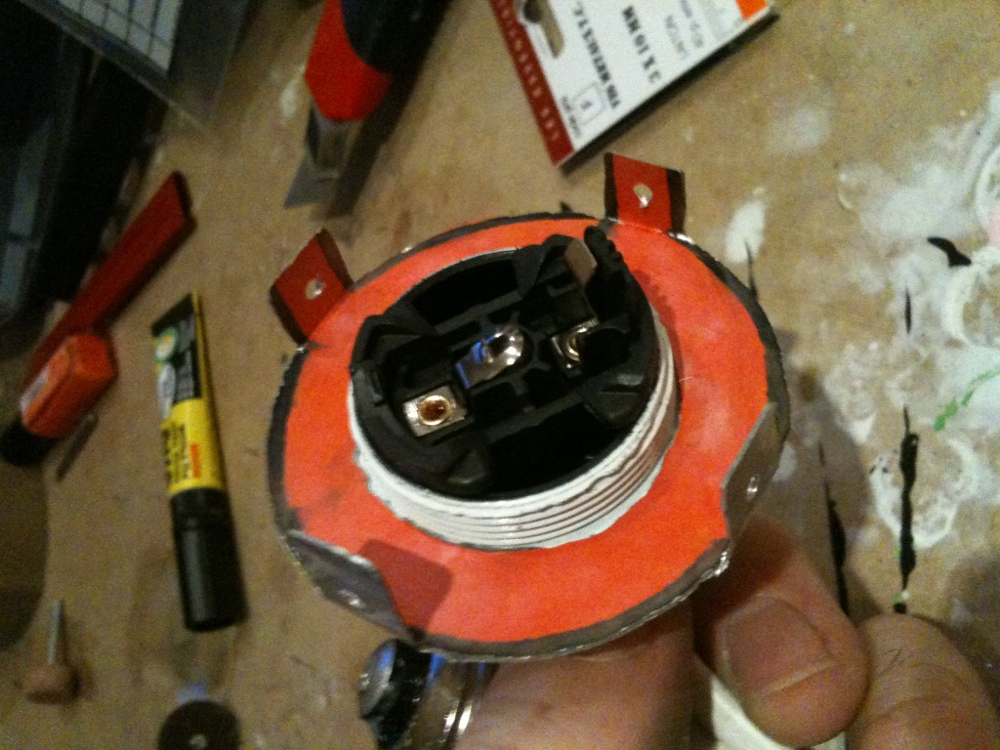

The lens is glued to a small section of pipe with a small part removed so it can fit inside the bigger pipe. The lamp is fixed to a big paperclip using aluminium and screws.

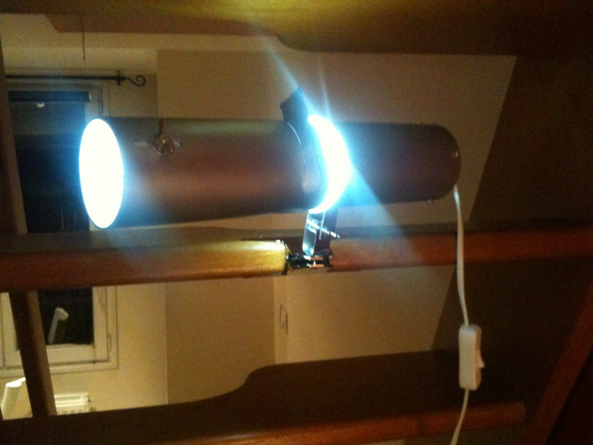

And the lamp is done !
# Results 

Les pigeons sont les rats des villes

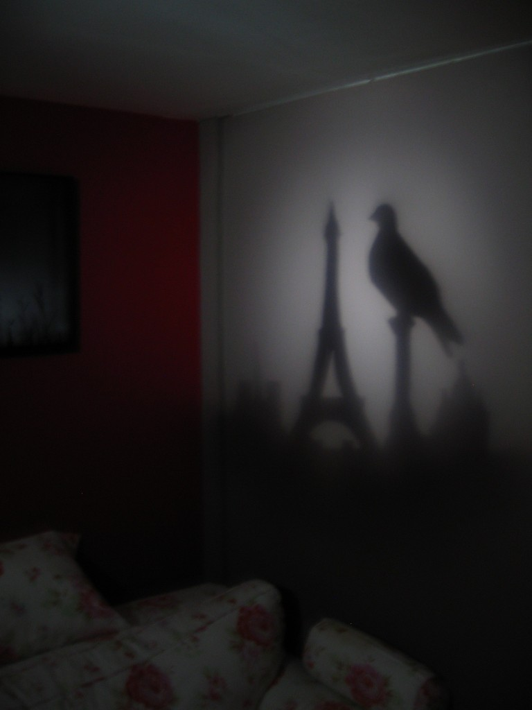

Caramba !

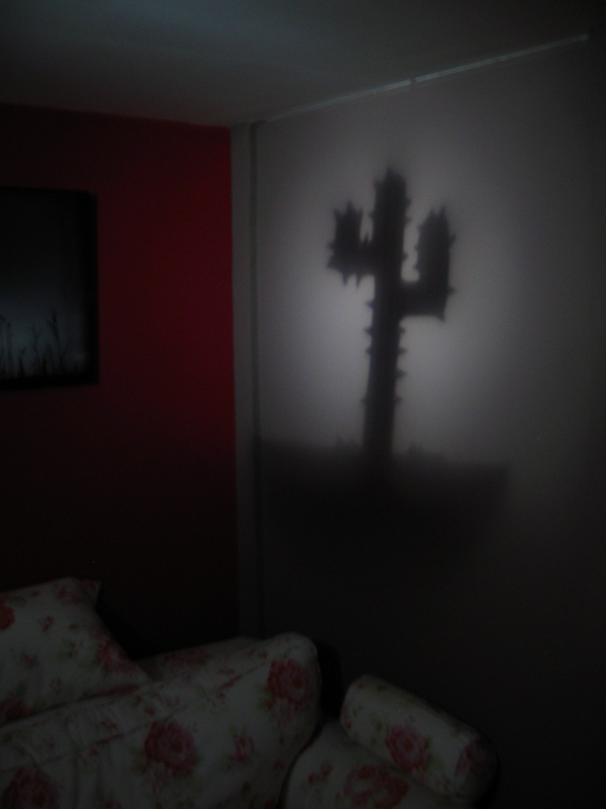

Glou glou...

Bwaaaaaaaaaaaaaaaaaaaaaah !!!!!!

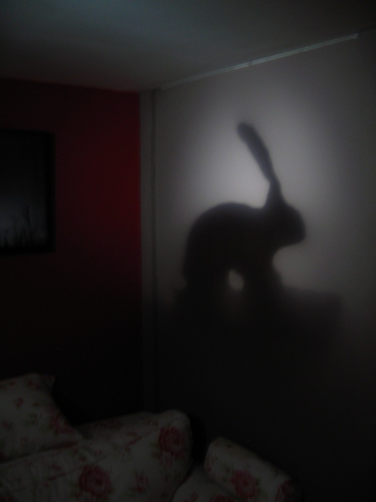
# What version 2 could use: 

* A bit more power
* A single high efficiency LED and a pocket camera lens in a tiny portable package

# I wonder whether rabbitman can see this one... 

