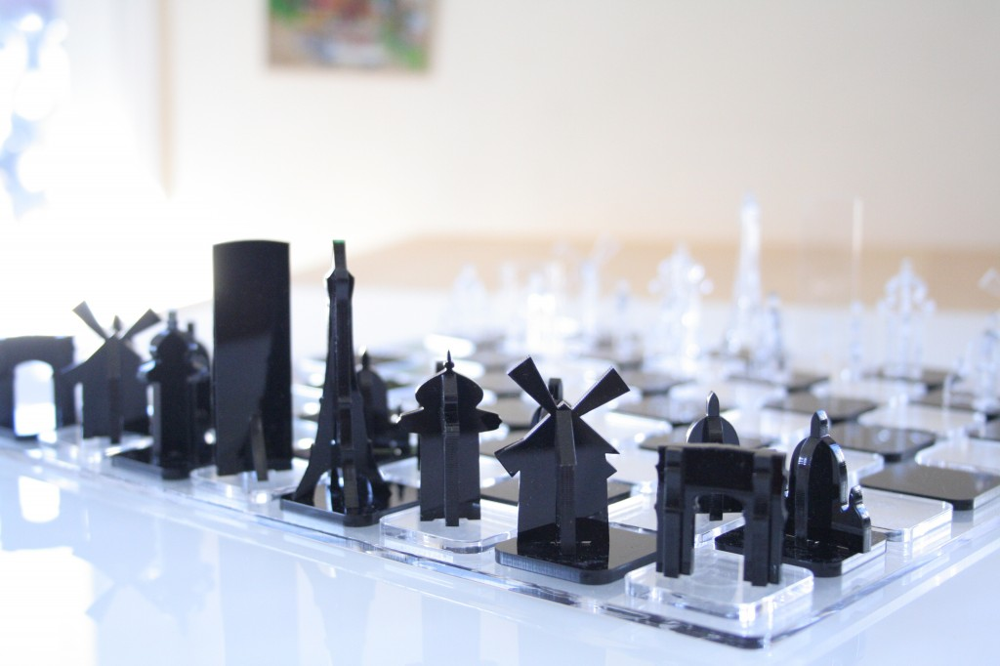
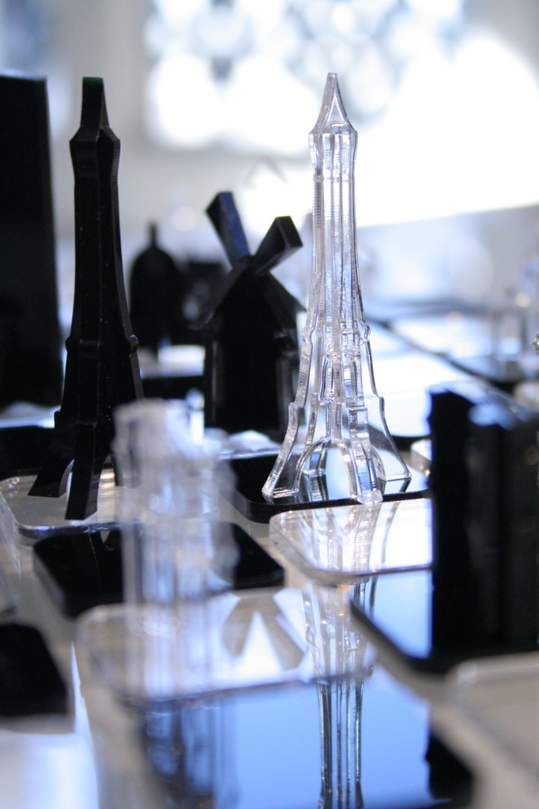

Another attempt of creating something with a laser cutter. After the [Paris Circuit Board](http://mbonnin.net/2011/03/09/paris-circuit-board/), I made another type of PCB, this time, I'll call it the Paris Chess Board. It still involves a fair amount of inkscape but with more plexiglass this time. And no chemicals except some glue.

* King => Tour Montparnasse
* Pawns => Sacré Coeur
* Rooks => Arc de triomphe
* Bishops => Colonne Morris
* Knights => Moulin Rouge
* Queen => Eiffel Tower of course !

