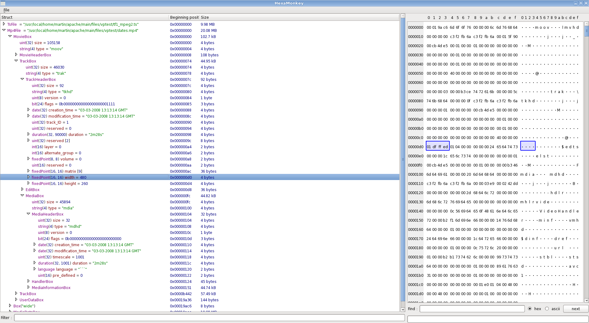

My daytime job is to develop video software. I like it but over the years I have been doing the same thing all over again and it is seriously beginning to bug me. Namely:

1.  Someone comes with a corrupt or crazy video file saying that 'it does not work' ©.
2.  You take the video file, try to play it and realize it crashes or fails around byte at position 0x4242.
3.  You fire hexedit and begin scanning the file around 0x4242 to see what is wrong with it. 
4.  If you are lucky, you have a huge pdf explaining the file structure in a window next to hexedit. If you're not lucky, you have plenty of chrome tabs opened on various RFCs and blog posts.
5.  You try to understand what the hell the bit #5 in byte at position 16962 means (yes, you have to convert to hex each time, it's no fun else).
6.  You repeat step 5. until the file structure is burnt into your brain and you can see what's wrong.
7.  You do a 5min fix.

It was 2012, we could stream videos using a single <code>&lt;video&gt;</code> element but I still needed hexedit. Ideally, I wanted something a bit like wireshark but that could work with huge files and not only packetized streams. I submited the idea for a students project at Ecole Centrale Paris and they came up with Hexamonkey.

# Hexamonkey 

After 2 years of development, Hexamonkey is in a state where it is usable. I especially like the mp4 support for debugging smoothstreaming files. It also supports:

-  mpeg4
-  mpeg2-ts
-  matrovska
-  avi
-  asf/wmw (incomplete)
-  png
-  jpeg (incomplete)
-  gif
-  zip
-  sqlite

The file format description is made using a custom-developped langage called 'hmscript'. It works fairly well for tree-like data like mp4 but has some limitations as of now for packetized formats like mpeg2-ts where data has to be 're-assembled'.

Anyway, it's a pretty nice software. I wanted to thank Sevan, Nicolas, Guillaume and Vincent for their involvment in the project. I hope it can be usefull for others too.

# More information 

-  Hexamonkey website: <a href="http://hexamonkey.com">http://hexamonkey.com</a>
-  Github: <a href="https://github.com/hexamonkey/hexamonkey">https://github.com/hexamonkey/hexamonkey</a>
-  Google groups: <a href="https://groups.google.com/forum/#!forum/hexamonkey">https://groups.google.com/forum/#!forum/hexamonkey</a>
-  Slides for Paris-Hackers #10: <a href="https://mbonnin.net/hexamonkey-slides/">https://mbonnin.net/hexamonkey-slides/</a>

