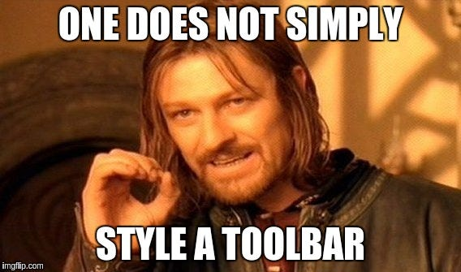

When it was released, I welcomed the addition of the [Support Toolbar](https://developer.android.com/reference/android/widget/Toolbar.html) with joy and happiness ! The [ActionBar](https://developer.android.com/reference/android/app/ActionBar.html) API has always been a bit cumbersome. With the support Toolbar, things are much easier. On top of my head:

* Toolbars are normal Views so you can decouple them from your Activities, making the code much more modular.
* It is much easier to manipulate the Toolbar programmatically. You have access to the Menu so you can add/remove [OnMenuItemClickListener](https://developer.android.com/reference/android/view/MenuItem.OnMenuItemClickListener.html)s very easily.
* You can set individual MenuItems visibility individually without having to invalidate the whole menu with invalidateOptionsMenu().

All in all, the design is much much better except for one thing: **Theming**. I have spent countless hours trying to change the color of the overflow icon. Looking at the stack overflow questions, I think I'm not alone. Below is my journey.

*** ** * ** ***

### Pitfall #1: there is no (simple) programmatic solution

How come there is no java method like setOverflowIconColor() to change the color of the icon ? This is one of my biggest gripe with the Android theme system. It impossible to know what attributes are modifiable in a widget without looking at the source code or the various stackoverflow answers. The documentation is very lacking and looking at [android.R](https://developer.android.com/reference/android/R.attr.html) is ... well... like trying to solve a puzzle. It can be fun but it takes a very loooong time.

I don't understand why Google didn't start by implementing the programmatic version. With a nice annotation, it could even generate the documentation automatically:

```java
class Toolbar extends ViewGroup {
    @StyleAttribute("overflowIconColor")
    public void setOverflowIconColor(@ColorInt int color) {
        // do stuff
    }
}
```

Leaving out the "overflowIconColor" and just using the same naming for the method and the XML attribute would further eliminate confusion.

```java
class Toolbar extends ViewGroup {
    @StyleAttribute
    public void setOverflowIconColor(@ColorInt int color) {
        // do stuff
    }
}
```

With some reflection magic, it could even make the 3rd constructor generic:

```java
public Toolbar(Context context, @Nullable AttributeSet attrs, int defStyleAttr) {
    super(context, attrs, defStyleAttr);

    for (attribute: attrs) {
        callMethodFor(attribute);
    }
}
```

compare to:

```java
public Toolbar(Context context, @Nullable AttributeSet attrs, int defStyleAttr) {
    super(context, attrs, defStyleAttr);

    mTitleTextAppearance = a.getResourceId(R.styleable.Toolbar_titleTextAppearance, 0);
    mSubtitleTextAppearance = a.getResourceId(R.styleable.Toolbar_subtitleTextAppearance, 0);
    mGravity = a.getInteger(R.styleable.Toolbar_android_gravity, mGravity);
    mButtonGravity = a.getInteger(R.styleable.Toolbar_buttonGravity, Gravity.TOP);

    // First read the correct attribute
    int titleMargin = a.getDimensionPixelOffset(R.styleable.Toolbar_titleMargin, 0);
    if (a.hasValue(R.styleable.Toolbar_titleMargins)) {
    // Now read the deprecated attribute, if it has a value
        titleMargin = a.getDimensionPixelOffset(R.styleable.Toolbar_titleMargins, titleMargin);
}
    mTitleMarginStart = mTitleMarginEnd = mTitleMarginTop = mTitleMarginBottom = titleMargin;

    // etc... each attribute has to be handled individually
```

And if reflection is too slow, there might be a way to auto-generate the constructor with apt.

**Edit**: closest I could get to a programmatic solution

```java
Drawable drawable = getOverflowIcon();
    if(drawable != null) {
        drawable = DrawableCompat.wrap(drawable);
        DrawableCompat.setTint(drawable.mutate(), Color.WHITE);
        setOverflowIcon(drawable);
    }
}
```

### Pitfall #2: there is no style attribute

So if there is no setOverflowIconColor(), surely there must be a XML attribute right ? The answer is no. You simply cannot do:

```xml
<android.support.v7.widget.Toolbar
    android:id="@+id/editToolbar"
    android:layout_width="match_parent"
    android:layout_height="wrap_content"
    android:overflowIconTint="@android:color/white" />  
           ^^^^^^^^^^^^^^^^^^^^^^
            That won't work :-(
```

You can't. Period.


### So where does this color come from ?

It comes from the support libs: [abc_ic_menu_overflow_material.xml#22](https://chromium.googlesource.com/android_tools/+/1a05e6e0c759f1bb95f1c698150fa17a986d7619/sdk/extras/android/support/v7/appcompat/res/drawable/abc_ic_menu_overflow_material.xml#22), deep down in the vector drawable itself.

```xml
<vector xmlns:android="http://schemas.android.com/apk/res/android" 
       android:width="24dp"
       android:height="24dp"
       android:viewportWidth="24.0" 
       android:viewportHeight="24.0"
       android:tint="?attr/colorControlNormal">    

    <path android:pathData="M12,8c1.1,0 2,-0.9 2,-2s-0.9,-2 -2,-2c-1.1,0 -2,0.9 -2,2S10.9,8 12,8zM12,10c-1.1,0 -2,0.9 -2,2s0.9,2 2,2c1.1,0 2,-0.9 2,-2S13.1,10 12,10zM12,16c-1.1,0 -2,0.9 -2,2s0.9,2 2,2c1.1,0 2,-0.9 2,-2S13.1,16 12,16z"            android:fillColor="@android:color/white"/>
</vector>
```

See the ?attr/colorControlNormal ? This will be looked up directly in the theme. That really feels strange to me. If we agree that:

* Themes are global to the app.
* Styles are used on a specific widget.

Then, this way of doing things is completely bypassing the style. There is just no way to customize your widget without defining or reusing an existing theme. That sounds like reverse thinking to me.

Instead of having**XML** *fallbacks to* **Style** *fallbacks to* **Theme**, we are now stuck with just themes. And it's not like it's very old legacy code we are talking about, this was all introduced in Lollipop so it's not that old.

### Pitfall #3: the Appcompat themes are really confusing

Appcompat defines a bunch of Themes but it is really hard to know what's happening behind the scenes:

* Themes and Styles are syntactically identical although they behave differently. Nothing prevents you to put all your themes in styles.xml.
* Themes have implicit and explicit inheritance. So even if your Theme has no "parent" XML attribute, it might still inherit from something. "Theme.AppCompat.Light.NoActionBar" inherits from "Theme.AppCompat.Light". That took me a while. See the [aapt source code](https://android.googlesource.com/platform/frameworks/base/+/master/tools/aapt/ResourceTable.cpp#1527) for the gory details.
* There are ThemeOverlays. The simple fact that those exist sounds like there was something wrong in the first place. Why introducing another concept when we already had Themes and Styles ?
* Last but not least, there is almost no documentation about what the themes actually do. CSS is another very complicated styling system but at least they have documentation.

### What do we do now ?

There are good clues here: <https://chris.banes.me/2014/11/12/theme-vs-style/>

```xml
<Toolbar  
    android:layout_height="?android:attr/actionBarSize"
    android:layout_width="match_parent"
    android:background="?android:attr/colorPrimaryDark"
 android:theme="@android:style/ThemeOverlay.Material.Dark.ActionBar" />
```

I don't know where "ThemeOverlay.Material.Dark.ActionBar" comes from. Another inconsistency into the framework... But if you replace it with "ThemeOverlay.AppCompat.Dark" it works !

"ThemeOverlay.AppCompat.Dark.ActionBar" would work to as well as many others from [themes.xml](https://android.googlesource.com/platform/frameworks/support/+/master/v7/appcompat/res/values/themes.xml). Up to you to choose (guess ?) the one you want.

### Success !!!


We did it !!! After investigating how the whole system works, learning about vector drawables, colorPrimary and colorSecondary, we were able to change a single color ! Impressive, right ?

### What if you have 2 Toolbars ?

Now imagine you have 2 or more Toolbars (I do, and that's the nice thing about using Toolbars vs ActionBars). Is there a way you can specify to use the Theme.Whatever.Dark in a single place ? Can you do something like:

```xml
<style name="MyTheme"
    parent="Theme.AppCompat.Light.NoActionBar">
    ....
    <item name="toolbarStyle">@style/MyToolbarStyle</item>
</style>

<style name= "MyToolbarStyle" parent="@style/Widget.AppCompat.Toolbar" >
    <item name="theme">@style/Theme.Whatever.Dark</item>
</style>
```

The answer is unfortunately no :-(. The theme has to be explicitely set in the XML attributes. See [LayoutInflater.java](https://android.googlesource.com/platform/frameworks/base/+/refs/heads/master/core/java/android/view/LayoutInflater.java#753) for more gory details.

If you put it inside a style (parsed in the all might [applyStyle()](https://android.googlesource.com/platform/frameworks/base.git/+/android-4.3_r3.1/core/jni/android_util_AssetManager.cpp#870) C++ function), it's too late and your theme will not be picked.

So I still haven't found the solution to this. I guess I could change colorPrimary in my theme but this will also have side effects. I am really curious if someone has a solution.

### One last thing...

As the blog post above mentions:
> One thing to note is that android:theme in Lollipop propogates to all children declared in the layout

So by putting the theme in the XML attributes, we actually achieved more than what we wanted to do (or less, depends on your point of view...). Changing the theme has side effects. Which might be something you want or something you don't want.

*** ** * ** ***

### Conclusion

After writing all this, I don't know anymore if I am more or less confused than before. I cannot help but feel that the Android way of doing Theming is overly convoluted. "Styles into themes into styles" and a daunting lack of documentation.

And the recent addition of tint and themed Drawables feels a bit awkward. Given the size of the Android ecosystem, I doubt the concepts can be fixed any time soon so I hope these few paragraphs can at least help you navigate the framework a bit better and do what you want to do more easily.
By [Martin Bonnin](https://medium.com/@mbonnin) on [September 16, 2016](https://medium.com/p/39d8c3497ccc).

[Canonical link](https://medium.com/@mbonnin/the-curious-case-of-the-overflow-icon-color-39d8c3497ccc)

Exported from [Medium](https://medium.com) on November 9, 2024.
