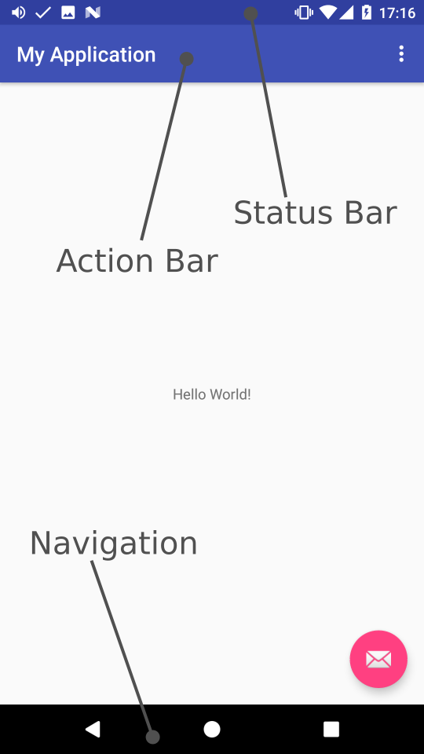

It took me a very long time, but I think I finally got the setSytemUIVisibility() stuff.

### 1.\`FULLSCREEN\`is not actually "fullscreen"

It's about the status bar. This is what got me confused in the first place. SYSTEM_UI_FLAG_FULLSCREEN and SYSTEM_UI_FLAG_LAYOUT_FULLSCREEN are actually about the status bar (and maybe action bar too but I never use those).

### 2.The LAYOUT_XXX allow you to draw behind the bars

* SYSTEM_UI_FLAG_LAYOUT_FULLSCREEN will allow you to draw behind the status bar.
* SYSTEM_UI_FLAG_LAYOUT_HID_NAVIGATION will allo you to draw behind the navigation bar.

It makes a lot of sense when you look at it this way.

### 3.The IMMERSIVE modes allows you to get \*all\* the touch events

Without them, Android will eat the first touch event to display the navbar. It feels a bit clunky so use them when possible (≥ kitkat)

### 4.Don't use Window.addFlags()

I'm not sure exactly what's the difference but so far, I've always managed to do what I wanted with setSystemUIVisibility so I'll stick to that.

### Conclusion

It's not that difficult in the end. I just wish the Android team would have come up with more meaningful names and/or less flags. Happy coding !
By [Martin Bonnin](https://medium.com/@mbonnin) on [April 24, 2017](https://medium.com/p/ff0f56ff8b89).

[Canonical link](https://medium.com/@mbonnin/setsytemuivisibility-magic-ff0f56ff8b89)

Exported from [Medium](https://medium.com) on November 9, 2024.
