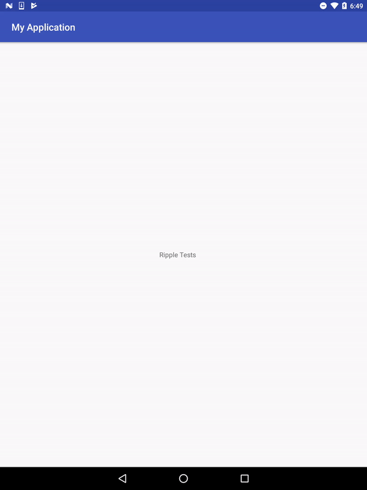
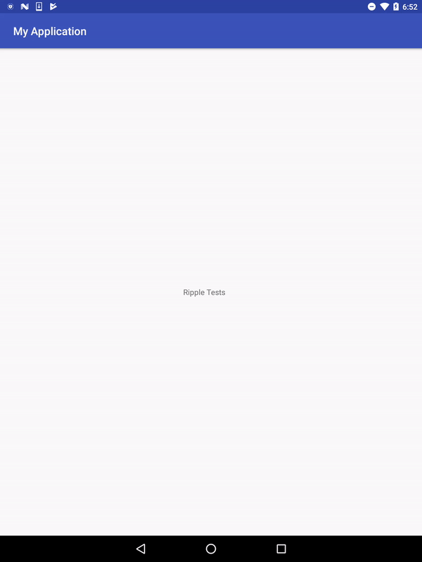
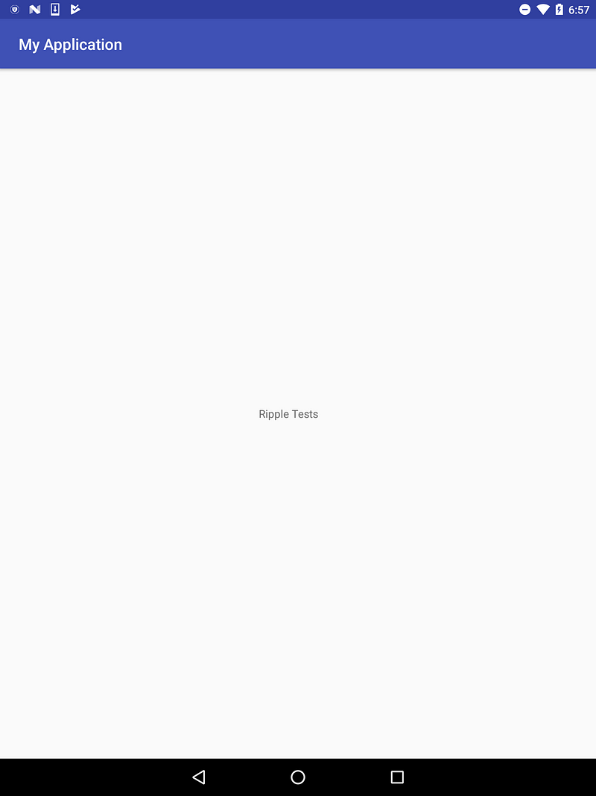

### The regular Ripple

```
<ripple xmlns:android="http://schemas.android.com/apk/res/android"
    android:color="#f00">
    <item android:id="@android:id/mask">
        <color android:color="#ff0000ff" />
    </item>
</ripple>
```



### The borderless Ripple

```xml
<ripple xmlns:android="http://schemas.android.com/apk/res/android"
    android:color="#f00">
</ripple>
```



### The semi-transparent Ripple

```xml
<ripple xmlns:android="http://schemas.android.com/apk/res/android"
    android:color="#f00">
    <item android:id="@android:id/mask">
        <color android:color="#8000ffff" />
    </item>
</ripple>
```


### The completely transparent Ripple (hint: not super useful)

```xml
<ripple xmlns:android="http://schemas.android.com/apk/res/android"
    android:color="#f00">
    <item android:id="@android:id/mask">
        <color android:color="#0000ffff" />
    </item>
</ripple>
```

 By [Martin Bonnin](https://medium.com/@mbonnin) on [May 29, 2017](https://medium.com/p/d8aa92f5a05a).

[Canonical link](https://medium.com/@mbonnin/different-kinds-of-ripple-d8aa92f5a05a)

Exported from [Medium](https://medium.com) on November 9, 2024.
