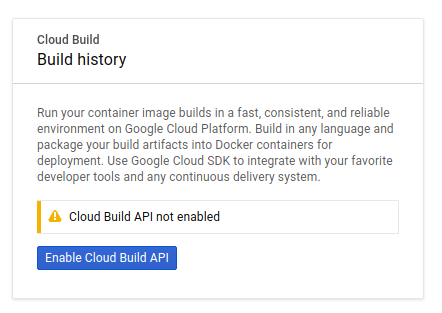
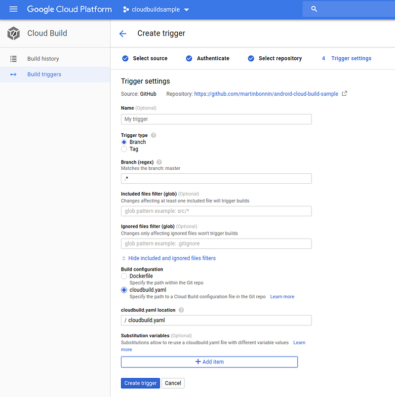
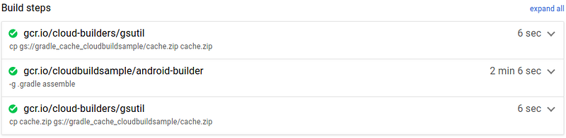

You don't need travis-ci or bitrise to spin Android virtual machines that can build your Android apps. Follow these steps and benefit the flexibility and scalability of the Google Cloud Platform.

*** ** * ** ***

### 1. Fork and clone the tutorial repo

You will need to fork the repo first to have rights to install github triggers (see below):

```
git clone https://github.com/martinbonnin/android-cloud-build-sample
```

If you're only interested in building the docker image, just clone the origin repo:

```
git clone https://github.com/dailymotion/android-cloud-build-sample
```

### 2. Create a new Google Cloud project and enable Cloud Build API

Go to <https://console.cloud.google.com> and create a new project. The project for this tutorial is named `cloudbuildsample`.

Then, enable Cloud Build API from your project page ([https://console.cloud.google.com/cloud-build/builds?project=](https://console.cloud.google.com/cloud-build/builds?project=cloudbuildsample)\[PROJECT_ID\])


### 3. Create your docker cloud-builder image and upload it to the Google container registry

```
# If you haven't already, install gcloud from these instructions: 
# https://cloud.google.com/sdk/install
cd android-cloud-build-sample/cloud-builder
gcloud auth login
gcloud config set project cloudbuildsample
gcloud builds submit --config cloudbuild.yaml 
# You now have a docker image with gradle and the android SDK 
# uploaded to the google container registry
```

The [docker file](https://github.com/dailymotion/android-cloud-build-sample/blob/master/cloud-builder/Dockerfile) is where the magic happens. It describes how to build a docker image based on a pre-existing base image.

From the base image, add the android SDK:

```dockerfile
FROM gcr.io/cloud-builders/javac

# Install Dependencies
RUN apt-get update \
    && apt-get install -y wget zip unzip \
    && mkdir -p /opt/android-sdk-linux

ENV ANDROID_HOME /opt/android-sdk-linux

# Download Android SDK tools
RUN wget -q "https://dl.google.com/android/repository/sdk-tools-linux-4333796.zip" -O sdk-tools.zip \
    && unzip -q -d $ANDROID_HOME sdk-tools.zip \
    && rm sdk-tools.zip

ENV PATH $PATH:$ANDROID_HOME/tools/bin

# Install Android SDK components
RUN echo y | sdkmanager --install 'platforms;android-27' "build-tools;27.0.3" "platform-tools"
```

You can obviously tweak what SDK components you need. If you're compiling for API level 28, install `platforms;android-28`.

### 4. Speedup: cache your .gradle files !

This is where having lower level access to the infrastructure running the images comes in handy. You can tell Google Cloud Build to fetch a previous version of the gradle cache. Not only does this speed up the build but it makes it more reliable when maven, jcenter or any other hosting provider goes down. This unfortunately happens often and it's frustrating to see a failed build just because dependencies fail to download.

In order to secure the build, we're going to save the gradle cache in a `gs://gradle_cache` bucket in Cloud Storage. Create the bucket in cloud storage and add the gradle-build wrapper script to your image:

```dockerfile
# Install the wrapper script
COPY gradle-build /bin/
```

`gradle-build` takes care of unziping/ziping the contents of the gradle cache:

```shell
# unzip command might fail the first time if cache.zip does not 
# exist. That's okay
unzip -o -q cache.zip 
./gradlew $@
status=$?
zip -qr cache.zip .gradle
echo "Exit status is: $status"
exit $status
```

### 5. Create the github triggers

Tell Google Cloud build to start a build on every push to your Github repository.

Go to the triggers page (<https://console.cloud.google.com/cloud-build/triggers?project=PROJECT_ID>) and add a github trigger, specifying the cloudbuild.yaml file [at the root of the repo](https://github.com/dailymotion/android-cloud-build-sample/blob/master/cloudbuild.yaml) as config file:


`cloudbuild.yaml` defines what builder images to use and their parameters. They all share a common persistent `/workspace` directory which is also the working directory:

```yaml
steps:
# get the cache from cloud storage
- name: gcr.io/cloud-builders/gsutil
  args: ['cp', 'gs://gradle_cache_$PROJECT_ID/cache.zip', 'cache.zip']
# build the app
- name: 'gcr.io/$PROJECT_ID/android-builder'
  entrypoint: 'gradle-build'
  args: ['-g', '.gradle', 'assemble']
# push the cache to cloud storage
- name: gcr.io/cloud-builders/gsutil
  args: ['cp', 'cache.zip', 'gs://gradle_cache_$PROJECT_ID/cache.zip']
```

### 6. That's it, you're done !

Next time you push something to your repo, Google Cloud Build will build it for you:
Yay ! All Green !

### Wrap up

#### Pros

* Per-minute pricing. There is no extra cost if no-one is pushing during the weekends.
* 2 hours of free build time/day for small projects (including private projects).
* Google Cloud scale. You can use up to 32 CPUS/28GB RAM machines if you really want to.
* Complete control of your docker images and the build process.
* Easy integration with other Google Cloud products. Storing artifacts in Cloud storage is a matter of adding a new step.
* You can cache your `.gradle` directory!

#### Cons

* We didn't find a solution that automatically displays the status of pull requests. You'll most likely have to set up the status hook handlers yourself.
* It's not possible to start multiple builds for the same commit like Travis CI build matrices.
* There's a bit of overhead to setup and maintain everything.

In the end, it really depends on your needs. If your existing CI isn't broken, there's no need to fix it. If you want to fine-tune your images, build times or bills, Cloud Build provides that flexibility. Hopefully the platform will continue to improve in the future!
By [Martin Bonnin](https://medium.com/@mbonnin) on [August 28, 2018](https://medium.com/p/2487c8b70ccf).

[Canonical link](https://medium.com/@mbonnin/run-your-android-ci-in-google-cloud-build-2487c8b70ccf)

Exported from [Medium](https://medium.com) on November 9, 2024.
