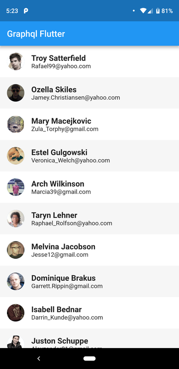
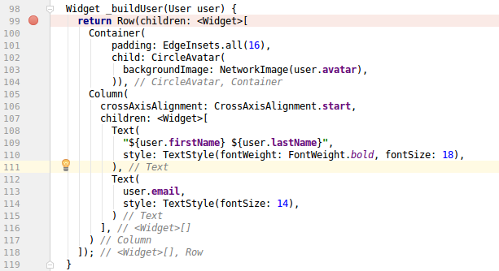

With version 1.0 [released a few weeks ago](https://developers.googleblog.com/2018/12/flutter-10-googles-portable-ui-toolkit.html) and the Christmas Holidays around the corner, it was high time to start writing some dart!

This article describes my journey trying to rewrite my [graphql sample app](https://github.com/martinbonnin/github-graphql-sample) to flutter. From the joy of onboarding to the occasional hiccups and final questions.

The final flutter source code is available on [github](https://github.com/martinbonnin/graphql-flutter).
The app in flutter using <https://fakerql.com/> data

### 1. Onboarding is a breeze!

Kudos to the flutter team! Getting started is super easy and documentation is really good for a v1.

The [developer site](https://flutter.io/docs) is well organized and has plenty of [tutorials](https://flutter.io/docs/reference/tutorials) and [samples](https://github.com/flutter/samples/blob/master/INDEX.md). The [widget reference](https://flutter.io/docs/reference/widgets) is very complete and most of the APIs are self-descriptive enough that you get how to do things quite easily. It looks like a lot of time has been spent on designing a comprehensive and coherent layout and widget system and this is very appreciated. The team even went the extra mile to document the [internal layout system](https://flutter.io/docs/resources/inside-flutter).

Extra bonus, the community is very active and the[git tree hygiene](https://github.com/flutter/flutter/wiki/Tree-hygiene) is nicely written. It's going to be a great source of inspiration for future projects :-).

```dart
// I want my data classes back !!!
class User {
  final String firstName;
  final String lastName;
  final String avatar;
  final String email;

  User({
    this.firstName,
    this.lastName,
    this.avatar,
    this.email,
  });
}
```

**All in all**: Advantage Flutter. It took me a few hours to write the app. This feels really good!

### 2. Dart

In the few hours I spent writing dart, I won't pretend to be an expert. Dart is close enough to other languages java or Kotlin so you can be productive fast enough but there is still a fair amount of friction compared to Kotlin.

Some quirks:

* You have to write semicolons! This might sound silly but it's very frustrating after getting used to not typing them.
* No data class, no sealed class.
* The type system doesn't look as strong. There are some null-aware operators but that doesn't seem backed in the type system like in Kotlin.

**All in all**: Advantage Android. Switching to dart really feels like a step backwards compared to writing Kotlin.

### 3. Tools

Android Studio makes it easy to keep track of what widget is nested where

As always, IntelliJ makes wonders as long as you have enough RAM and CPU. Writing flutter widgets might seem complex due to the big number of widgets and their deep nesting. But Android Studio identifies the closing braces/brackets so it's easier to keep track of your widgets. Also being able to define functions that build a sub-tree of the widget tree makes it really easy to reuse UI code.

H̵o̵t̵ ̵r̵e̵l̵o̵a̵d̵ ̵o̵n̵ ̵t̵h̵e̵ ̵c̵o̵n̵t̵r̵a̵r̵y̵ ̵w̵a̵s̵ ̵a̵ ̵b̵i̵t̵ ̵d̵e̵c̵e̵p̵t̵i̵v̵e̵.̵ ̵I̵ ̵w̵a̵s̵ ̵h̵a̵v̵i̵n̵g̵ ̵h̵i̵g̵h̵ ̵h̵o̵p̵e̵s̵ ̵a̵f̵t̵e̵r̵ ̵y̵e̵a̵r̵s̵ ̵o̵f̵ ̵w̵a̵i̵t̵i̵n̵g̵ ̵f̵o̵r̵ ̵a̵d̵b̵ ̵t̵r̵a̵n̵s̵f̵e̵r̵s̵/̵i̵n̵s̵t̵a̵l̵l̵s̵ ̵b̵u̵t̵ ̵I̵ ̵f̵o̵u̵n̵d̵ ̵o̵u̵t̵ ̵t̵h̵a̵t̵ ̵t̵h̵e̵r̵e̵ ̵a̵r̵e̵ ̵s̵o̵m̵e̵ ̵o̵c̵c̵a̵s̵i̵o̵n̵s̵ ̵w̵h̵e̵r̵e̵ ̵t̵h̵e̵ ̵f̵l̵u̵t̵t̵e̵r̵ ̵h̵o̵t̵ ̵r̵e̵l̵o̵a̵d̵ ̵d̵o̵e̵s̵n̵'̵t̵ ̵w̵o̵r̵k̵ ̵l̵i̵k̵e̵ ̵e̵x̵p̵e̵c̵t̵e̵d̵.̵ ̵T̵h̵i̵s̵ ̵a̵p̵p̵e̵a̵r̵s̵ ̵t̵o̵ ̵b̵e̵ ̵t̵h̵e̵ ̵c̵a̵s̵e̵ ̵m̵o̵s̵t̵l̵y̵ ̵w̵h̵e̵n̵ ̵w̵o̵r̵k̵i̵n̵g̵ ̵o̵n̵ ̵d̵a̵t̵a̵ ̵s̵o̵u̵r̵c̵e̵s̵ ̵a̵n̵d̵/̵o̵r̵ ̵m̵o̵d̵e̵l̵s̵.̵ ̵U̵I̵ ̵c̵h̵a̵n̵g̵e̵s̵ ̵g̵e̵t̵ ̵r̵e̵f̵l̵e̵c̵t̵e̵d̵ ̵c̵o̵r̵r̵e̵c̵t̵l̵y̵ ̵b̵u̵t̵ ̵n̵o̵t̵ ̵c̵h̵a̵n̵g̵e̵s̵ ̵t̵o̵ ̵t̵h̵e̵ ̵l̵o̵g̵i̵c̵ ̵t̵h̵a̵t̵ ̵c̵r̵e̵a̵t̵e̵s̵ ̵t̵h̵e̵ ̵s̵t̵a̵t̵e̵s̵.̵ ̵I̵ ̵n̵e̵e̵d̵ ̵t̵o̵ ̵d̵i̵g̵ ̵a̵ ̵b̵i̵t̵ ̵m̵o̵r̵e̵ ̵i̵n̵t̵o̵ ̵t̵h̵i̵s̵ ̵b̵u̵t̵ ̵t̵h̵a̵t̵ ̵r̵e̵m̵o̵v̵e̵s̵ ̵a̵ ̵l̵o̵t̵ ̵o̵f̵ ̵t̵h̵e̵ ̵a̵p̵p̵e̵a̵l̵ ̵o̵f̵ ̵t̵h̵e̵ ̵f̵e̵a̵t̵u̵r̵e̵.̵ ̵I̵f̵ ̵I̵ ̵c̵a̵n̵'̵t̵ ̵r̵e̵l̵y̵ ̵o̵n̵ ̵h̵o̵t̵ ̵r̵e̵l̵o̵a̵d̵ ̵t̵o̵ ̵w̵o̵r̵k̵ ̵1̵0̵0̵%̵ ̵o̵f̵ ̵t̵h̵e̵ ̵t̵i̵m̵e̵,̵ ̵I̵ ̵m̵i̵g̵h̵t̵ ̵a̵s̵ ̵w̵e̵l̵l̵ ̵d̵i̵s̵a̵b̵l̵e̵ ̵i̵t̵.̵

**EDIT** : [F](https://github.com/flutter/flutter-intellij/issues/1011)lutter has hot reload and hot restart. Hot reload keeps your state while hot restart will recreate it so it looks like I've been using hot reload while I should have been using hot restart. I'll need to make some more tests but that explains a lot.

Also, assets are not compiled/preprocessed the way android does. Identifying them by string works fine but I wonder how scalable this is. And it might not refactor very well.

**All in all**: Tie. Hot reload looks great on paper but my first interactions with it haven't made me incline to trust the system too much.

### 4. Limitations

This is the most painful point. Compared to Android, there are still a lot of things missing:

* No strongly-typed graphql client yet. There a a [flutter_graphql package](https://pub.dartlang.org/packages/graphql_flutter) but it's not strongly typed like apollo-android.
* No WebView JavascriptInterface yet. For a long time, WebView was not available. It is now but some functionality is still missing. Adding a [JavascriptInterface](https://developer.android.com/reference/android/webkit/JavascriptInterface) for an example is [not possible at the moment](https://github.com/fluttercommunity/flutter_webview_plugin/issues/71) in flutter.
* It is [not possible to get the position of items currently visible in a ListView](https://github.com/flutter/flutter/issues/19941).

The fact that I bumped into these after just a few hours of trying makes me wonder whether there are other roadblocks down the road.

**All in all**: Advantage Android. You can do more things in android that you can do in flutter.

### Verdict

Writing Flutter apps is fun and productive. It might or might not be the best tool for what you want to do. If you want to have every bit of performance and functionality you should certainly stick with Android development for now. If you want to develop good looking apps on two platforms at the same time on the other hand, it's very promising.
By [Martin Bonnin](https://medium.com/@mbonnin) on [January 2, 2019](https://medium.com/p/dbf89d14228a).

[Canonical link](https://medium.com/@mbonnin/a-first-look-at-flutter-from-an-android-developer-dbf89d14228a)

Exported from [Medium](https://medium.com) on November 9, 2024.
