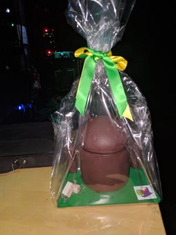

At Android Makers, we like desserts... a lot!🍦🍩😋

When we realized the conference was taking place the day following Easter, we couldn't resist the urge of organizing a small Dessert Hunt. We also love experimenting with new Android tech, so we did it using [ARCore](https://developers.google.com/ar/).

### Building the app

The app is entirely on [github](https://github.com/paug/AndroidMakersApp). The dessert hunt code is in the [flash_droid directory](https://github.com/paug/AndroidMakersApp/tree/aa6bcc3462db9af87d94a1f2269338bf9fc4d0c9/app/src/main/java/fr/paug/androidmakers/flash_droid). It uses an ArFragment to detect the augmented images like in the [augmentedImage sample](https://github.com/google-ar/sceneform-android-sdk/tree/master/samples/augmentedimage).

The augmented images database is built offline using [arcoreimg](https://developers.google.com/ar/develop/c/augmented-images/arcoreimg). Then the ArFragment will give us a callback when an augmented image is detected:

```kotlin
// This is called from onUpdateFrame if a new augmentedImage has been detected
val view = getRenderableView(augmentedImage.name)
val completableFuture = ViewRenderable.builder().setView(context, view).build().handle { renderable, throwable ->
    if (throwable == null) {
        val base = AnchorNode()
        base.anchor = augmentedImage.createAnchor(augmentedImage.centerPose)

        // Since base is anchored, we need another node to
        val node = Node()
        node.setParent(base)
        // Not sure why this one is needed
        node.localPosition = Vector3(0f, 0f, augmentedImage.extentZ)
        // Make our renderable view vertical
        node.localRotation = Quaternion.axisAngle(Vector3(1.0f, 0f, 0f), -90f)
        // Make our renderable view the same width as the detected augmented image
        node.localScale = Vector3(augmentedImage.extentX, augmentedImage.extentX, 0f)
        node.renderable = renderable
        trackedImages[augmentedImage.index] = ImageState(null, base)

        // Display the renderable view
        arSceneView.scene.addChild(base)
    }
}
```

We then use a [ViewRenderable](https://developers.google.com/ar/reference/java/sceneform/reference/com/google/ar/sceneform/rendering/ViewRenderable) to display the Thumbs up 👍👍. Worth noting is that any view can be displayed in the scene. It can also be animated/interacted with, which opens a lot of possibilities. Definitely something to dig more!


The backend is a simple Firestore instance. Saving a scan is as simple as writing a map to Firestore. We saved the timestamp. Even though it's not completely hacker proof, this allowed us to detect a few cheaters :).

```kotlin
doc["desserts"].put(dessert, iso8601DateFormat.format(Date()))

FirebaseFirestore.getInstance().collection("flash-droid")
        .document(user.uid)
        .set(doc)
```

### Replacing the poster on the Beffroi

That one didn't work until the very last moment when we realized we needed to help arcoreimg by giving the size of the poster (it's big!):

```
//images.txt
montrouge|montrouge.png|8
```

It went smoothly after that:


### Hiding the desserts

The desserts were hidden the morning just before the conference in different locations:

- Cupcake: on the cloakroom desk
- Donut: downstairs next to room Blin and the dolls exhibition
- Eclair: in the corridor leading to room Blin
- Froyo: in the stairs between the lobby and 1st floor

Froyo was the last one to be found despite being in plain sight

- Gingerbread: on the ceiling next to room 203
- Honeycomb: next to the coffee machine on the 2nd floor
- IceCreamSandwich: in the foyer-bar, next to Leboncoin
- Jelly Bean: in the lobby, behind the plant on the left
- KitKat: behind the curtain, next to Blablacar
- Lollipop:1st floor, in front of Hiway, next to an extinguisher
- Marshmallow: left side of the bar on the 1st floor
- Nougat: behind the kakemono On the 1st Floor

Nougat was behind a kakemono

Two of them were digital:

- Oreo: the now classic 7 taps on the app version
- Pie: ask the Google Assistant!

### The aftermath


Over the two days, there were:

- 265 participants
- 899 desserts successfully scanned
- 34 participants found all 14 desserts

The full data set is available in [Google Sheets](https://docs.google.com/spreadsheets/d/1CwTvh7xbiKPDr1-f5l-KuacW-wGp7LntHqTmMs2rqOM/edit#gid=1463112622). A few insights:

- Cupcake was one of the first and most found. It makes sense as it was hinted in the app.
- Froyo was the last one to be found despite being quite visible in the stairs. Mostly because no one ever stopped there.
- The first participant found the whole 14 desserts on Tuesday \~2pm.
- 24 participants finished their scanning in the last 2 hours. Some information sharing might have happened at that time :).
- Some desserts were found during the party around \~11pm on Tuesday night. They were in the Google Assistant, no one broke into the beffroi!
- Pie and Oreo were also found with difficulty. In the google assistant, scrolling right in the list of suggestions would hint at the dessert.

Ask about our easter eggs!

### Making a prize

The prize (a 2 pound chocolate bugdroid), was entirely custom made using:

- a Droid Mega to serve as a model
- food-safe silicon to make the mold
- and a lot of Valhrona chocolate! 🍫🍫

This was a long and involved process, especially tempering chocolate... That would require another post I'm afraid! Don't hesitate to use the comments section if you feel like doing your own chocolate mold!

A few pictures:
Bugdroid Mega before being covered in siliconMold doneChocolate incomingEaster Droid waiting for his new owner!

We hope you had as much fun looking for desserts as we did building the it! Congrats to all participants who founds the desserts!!

And bon appétit Maximilien ;)

See you next year!
By [Martin Bonnin](https://medium.com/@mbonnin) on [May 14, 2019](https://medium.com/p/bde3b4c8b8dd).

[Canonical link](https://medium.com/@mbonnin/android-makers-2019-dessert-hunt-behind-the-scenes-bde3b4c8b8dd)

Exported from [Medium](https://medium.com) on November 9, 2024.
