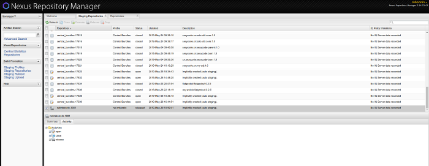

*This is the second article in a series describing how I started distributing my android/kotlin libraries. This article focuses on choosing between jcenter and mavenCentral from the point of view of a project maintainer. It assumes you're familiar with the terms defined in article 1/3.*

[*Part 1/3*](https://proandroiddev.com/publishing-a-maven-artifact-1-3-glossary-bc0068a440e0) focuses on terms, especially some misconceptions around maven, MavenCentral, bintray, jcenter, etc...

[*Part 3/3*](https://medium.com/p/bd661081645d) describes a step-by-step solution to publishing your android/kotlin project o MavenCentral.

**Edit: oh well,** [**Jcenter is going down**](https://jfrog.com/blog/into-the-sunset-bintray-jcenter-gocenter-and-chartcenter/)**. That makes the choice even easier :)**

Jcenter and mavenCentral are two hugely popular repositories in the Android community. [There has been a lot of debate which one is better](https://stackoverflow.com/questions/24852219/android-buildscript-repositories-jcenter-vs-mavencentral). Let's try to look in details at the differences.

### 1. Availability

As a maintainer, you want your library to be available to as many developers as possible. Historically:

* maven and sbt users default to mavenCentral
* gradle users default to jcenter

Android studio used to default to mavenCentral and now defaults to jcenter for unclear reasons that seem involve [lagging HTTPS support from mavenCentral](https://twitter.com/JakeWharton/status/1073205231884910593)).

Ideally, you'll want your library to be available through both jcenter and mavenCentral. Luckily you have two solutions:

#### 1.1 Publish to OSSRH first, promote to mavenCentral and let jcenter proxy mavenCentral

* jcenter proxies mavenCentral.
* For an example, okhttp is available [there](https://jcenter.bintray.com/com/squareup/okhttp3/okhttp/4.0.0-alpha02/) on jcenter despite being uploaded to mavenCentral [there](https://repo1.maven.org/maven2/com/squareup/okhttp3/okhttp/4.0.0-alpha02/) in the first place.
* Some confusion is caused by the fact that the listing is updated lazily so your package might not appear in the search engine even though actually trying to request the package works.
* Also, [claiming the same groupId on jcenter would cause some synchronization issues](https://github.com/bumptech/glide/issues/544#issuecomment-495391386).
* But overall this works well. If you publish to mavenCentral, your library should be available to both jcenter and mavenCentral users.

#### 1.2 Publish to bintray first and promote to both jcenter and mavenCentral using the bintray console

* The bintray console [has an option to synchronize your packages to mavenCentral](https://www.jfrog.com/confluence/display/BT/Syncing+with+Third-Party+Platforms).
* Your package is then hosted on both platforms and therefore available for everyone to use.
* This requires slightly more administration as you need at the same time one sonatype account and one bintray account.

**Verdict:** draw. I would go to mavenCentral because I just don't like having multiple accounts but if you don't mind, using bintray to deploy to both at the same time seems easy enough.

### 2. Network Speed

Network speed is typically very hard to measure as it depends a lot of factors like your ISP, location, cache state, etc...

I wrote a [kscript](https://github.com/holgerbrandl/kscript) script to compare jcenter, mavenCentral and the [Google EU mirror](https://cloudplatform.googleblog.com/2015/11/faster-builds-for-Java-developers-with-Maven-Central-mirror.html) in my conditions.

Conditions:

* The script is available on [gist](https://gist.github.com/martinbonnin/3fc42a5bc315583a2efd1398156fdd27).
* It downloads \~30MB of jars, sources and javadoc and measures the time it takes.
* I made 5 dry-runs to warm up the caches before measuring the speed.
* My home ISP is [free](https://www.free.fr/freebox/fibre-optique/). A [speed test](http://speedtest.net) gives me a download speed of roughly 900Mbps.
* AWS is an EC2 micro instance in eu-west-3c.
* GCP is a compute engine instance in europe-west3-c.

Results (higher is better):

|     Repo      |  At Home   |    AWS     |    GCP     |
|---------------|------------|------------|------------|
| MavenCentral  | 25985 kB/s | 11424 kB/s | 18335 kB/s |
| Jcenter       | 9320 kB/s  | 7306 kB/s  | 11420 kB/s |
| Google mirror | 5019 kB/s  | 4388 kB/s  | 6183 kB/s  |

**Verdict:** In my very special case, mavenCentral is a clear winner. It is worth noting that the google mirror is actually significantly slower, even when running from GCP. Also, this doesn't show on these numbers but during cache warmup, MavenCentral was way ahead of Jcenter, maybe because more users use it or I just happened to choose very cached artifacts, not sure.

### 3. Network Reliability

That's a tough one too. Both jcenter and mavenCentral have had network issues. If you have any quantitative data that could help compare, please comment this post.

**Verdict**: not sure

### 4. Security

#### 4.1 HTTPS

Both repositories now offer HTTPS. MavenCentral was [blamed](https://max.computer/blog/how-to-take-over-the-computer-of-any-java-or-clojure-or-scala-developer/) for not enabling HTTPS by default in 2014. But this is all resolved now.

#### 4.2 Identity verification on MavenCentral

Sonatype requires that you verify ownership of your groupId before you can upload artifacts. In my case, it is net.mbonnin. The process requires to open an issue on sonatype's jira system and prove that you own the DNS with a redirect or TXT entry. This is not the most fun thing to do but prevents impersonation.

#### **4.3 Identity verification on Jcenter**

Anyone can signup on bintray, upload artifacts and ask to promote them to Jcenter. If you go to [my bintray profile](https://bintray.com/mbonnin) you can see that I verified my github account with bintray. That's a strong indication that I am indeed who I am and you can decide to trust what I upload there (or not).

The thing is nothing prevents me to upload packages in a completely different groupId than net.mbonnin or com.github.martinbonnin. I could try to upload `com.squareup.okhttp3:okhttp` and see what happens. It's unclear to me the level of verification made by the bintray team. What's clear is that they messed up a few months ago by [hosting malicious Jake Whaarton libs](https://twitter.com/jakewharton/status/1073102730443526144?lang=en) (notice the aa). They [apparently hosted malformed google libs around the same time](https://issuetracker.google.com/issues/120759347#comment30). You could notice that if you went to the bintray profile but few developers do that.

**Verdict**: Advantage MavenCentral. The groupId verification prevents namespace impersonation. Plus their average time since last incident is longer.

### 5. UX

The [OSSRH console](https://oss.sonatype.org) is pretty old school. Although [there is some work to be able to promote artifacts without having to login](https://github.com/vanniktech/gradle-maven-publish-plugin/issues/60), the UI is pretty discouraging if you have to connect. Advantage bintray here.
The OSSRH UI in all its 80's glory

**Verdict**: advantage Bintray. The OSSRH console really comes from another age. Bintray feels way more modern. The fact that they do not enforce groupId verification might also be seen as an advantage for those not too security focused.

### Wrap-up

If you can go past the ugly management console, MavenCentral seems to be a way more reasonable choice. Network speed is better and more importantly, additional verification give this warm feeling that you can trust who you're giving your artifacts to.

In [part 3/3](https://medium.com/p/bd661081645d), we will see how to step by step upload your artifacts on MavenCentral.
By [Martin Bonnin](https://medium.com/@mbonnin) on [June 7, 2019](https://medium.com/p/e0f82ba3f473).

[Canonical link](https://medium.com/@mbonnin/publishing-a-maven-artifact-2-3-jcenter-or-mavencentral-e0f82ba3f473)

Exported from [Medium](https://medium.com) on November 9, 2024.
