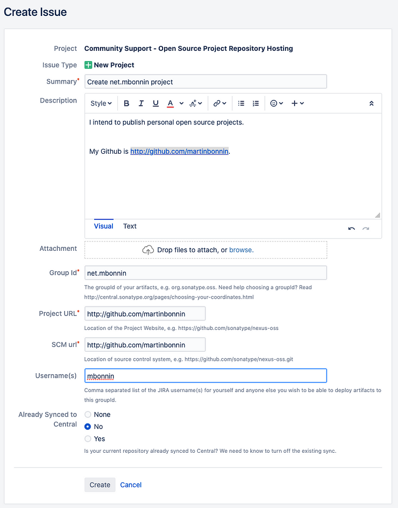

> ***2021--02--04 Edit*** *: The* [*end of life of jcenter*](https://jfrog.com/blog/into-the-sunset-bintray-jcenter-gocenter-and-chartcenter/)*has brought some attention to this article. Most of it is still valid. I updated it to reflect recent changes to the* *maven-publish**plugin, signing configs and a few other things. Many thanks to everyone that provided feedback!*

*Now that we know who are different actors of the maven ecosystem (*[*part 1/3*](https://proandroiddev.com/publishing-a-maven-artifact-1-3-glossary-bc0068a440e0)*) and have chosen MavenCentral as our repository of choice (*[*part 2/3*](https://proandroiddev.com/publishing-a-maven-artifact-2-3-jcenter-or-mavencentral-e0f82ba3f473)*), let's see how to deploy !*

*Disclaimer: there are multiple steps involved. Nothing too complex but it's not straightforward. Grab yourself a coffee and put your favorite playlist on. Let's go!*

### 1. Choose your groupId

The groupId is usually your domain name reversed.

* If you own a domain name, use it. For an exemple: `net.mbonnin`
* If you don't own a domain name, use your github account: `com.github.martinbonnin`

This is going to be the prefix for your uploaded artifacts so choose with care.

### 2. Create a sonatype jira account

Head to <https://issues.sonatype.org/> and create an account. If possible, use an email address from your own domain. That might help the verification process.

### 3. Create a new project jira issue

Create the issue, put your groupId in the summary and `groupId` fields.

**Note** : Use the link below (from the [OSSRH guide](https://central.sonatype.org/pages/ossrh-guide.html)) to create the issue and not the "create" button in the UI or you will end up in the wrong form. [https://issues.sonatype.org/secure/CreateIssue.jspa?issuetype=21\&pid=10134](https://issues.sonatype.org/secure/CreateIssue.jspa?issuetype=21&pid=10134)


You can use your github url in the project url and SCM url. Don't forget to add your jira username.

Hit create 📝 and wait for someone at Sonatype to ask you about a DNS record or a redirect.

### 4. Add a TXT DNS record

Go to your DNS provider of choice and add a TXT record containing the id of the jira ticket. It should be in the form

```
@    TXT    3600    OSSRH-12345
```

* `@` is the [origin](https://serverfault.com/questions/83874/whats-the-meaning-of-in-a-dns-zone-file). It should go in the "host" or "name" section of your zone file
* `TXT` is the type of record. Think of it as some freeform metadata information transmitted by DNS.
* `3600` is the TTL in seconds. The amount of time in seconds the records stays cached. Since the record doesn't change much, this value doesn't matter much. Put 1h like here or leave empty to use your providers default.
* `OSSRH-12345` is the value of the TXT record. This is what allows Sonatype to verify your domain.

Wait for someone from Sonatype to reply. DNS verification is now automated so it should be pretty fast ⚡.

### 5. Add the gradle-maven-publish-plugin to your project:

<https://github.com/vanniktech/gradle-maven-publish-plugin>

```groovy
// build.gradle
buildscript {
  repositories {
    mavenCentral()
  }
  dependencies {
    classpath 'com.vanniktech:gradle-maven-publish-plugin:0.8.0'
  }
}
```

```groovy
apply plugin: "com.vanniktech.maven.publish"
```

`gradle-maven-publish-plugin` is a helper plugin on top of the first party [maven-publish](https://docs.gradle.org/current/userguide/publishing_maven.html)[plugin](https://docs.gradle.org/current/userguide/publishing_maven.html). This plugin adds a bunch of things, including:

* automates the configuration of the [gradle 'maven-publish' plugin](https://docs.gradle.org/current/userguide/maven_plugin.html).
* [configures the dokka plugin](https://github.com/Kotlin/dokka) to generate kotlin javadoc.
* creates publications for Android/JVM projects.
* for multiplatform, publications are created by the Kotlin plugin so you can use `maven-publish` directly

### 6. Configure your project POM attributes:

```
#project/gradle.properties
```

```
GROUP=net.mbonnin.mooauth
VERSION_NAME=0.0.1-SNAPSHOT
```

```
POM_URL=https://github.com/martinbonnin/mooauth
POM_SCM_URL=https://github.com/martinbonnin/mooauth
POM_SCM_CONNECTION=scm:git:https://github.com/martinbonnin/mooauth
POM_SCM_DEV_CONNECTION=scm:git:https://github.com/martinbonnin/mooauth
POM_LICENCE_NAME=MIT License
POM_LICENCE_URL=https://opensource.org/licenses/MIT
POM_LICENCE_DIST=repo
POM_DEVELOPER_ID=mbonnin
POM_DEVELOPER_NAME=Martin Bonnin
POM_ARTIFACT_ID=mooauth
POM_NAME=mooauth
POM_PACKAGING=jar
```

### 7. Create a GPG key

Sonatype requires that you sign your artifacts before uploading them. To do so, you'll need a GPG key:

```shell
# create a new key
> gpg --full-generate-key # the defaults are certainly ok
                          # choose a strong password and note it

pub   rsa2048 2019-05-30 [SC]
# this is your key Id. This is public, you can share it (and should)
80D5D092EA7F0F3F374AB28F67328B201D9BB9FE 
uid
                      Martin Bonnin <martin@martin.com>
sub   rsa2048 2019-05-30 [E]

# export and backup your secret key somewhere safe
# export with --armour so that it can be used as environment 
# variable if needed
> gpg --armour --export-secret-keys 1D9BB9FE > sonatype_upload.asc

# upload your public key to a public server so that sonatype can find 
> gpg --keyserver keyserver.ubuntu.com --send-keys 1D9BB9FE
```

### **8. Configure your credentials**

```shell
# ~/.gradle/gradle.properties

SONATYPE_NEXUS_USERNAME=mbonnin
SONATYPE_NEXUS_PASSWORD=[jira/ossrh password]

signing.keyId=1D9BB9FE
signing.password=YOUR_PASSWORD
signing.secretKeyRingFile=sonatype_upload.gpg
```

### 9. Check that Sonatype gave you access (or wait)

By the time you've done all the above steps, you should have a response on jira giving you access to the OSSRH management console (<https://oss.sonatype.org/>). If you don't, then... wait⌛

Once you have the green light, you can upload your first artifacts!

### 10. Upload your artifacts

```shell
# disable parallel builds to avoid split staging repositories 
./gradlew uploadArchives -Dorg.gradle.parallel=false
```

If your version is a snapshot version then you're good to go and it should be available on <https://oss.sonatype.org/content/repositories/snapshots/>

If it's a release, you have to promote it before it can be accessible on MavenCentral. Detailed instructions are available there: <https://central.sonatype.org/pages/releasing-the-deployment.html>

* login on <https://oss.sonatype.org>
* Go to \`staging repositories\`
* You should see your repo in the list: `net.mbonnin-1000`
* Click 'close'. This will trigger the sonatype checks on your release (signatures, source, javadoc, etc...)
* If everything went well you can click 'release'
* Go back to jira to let Sonatype know you've done your first release. *This step is needed only once.*
* And your release should be on MavenCentral!!!

### 11 Profit !

Get the word out, polish your README.md and make a nice tweet, you deserved it !

I hope this guide was helpful. There's still room to improve this onboarding process. Hopefully Sonatype can improve their UX. We're also [working on automatic promotion of released artifacts](https://github.com/vanniktech/gradle-maven-publish-plugin/issues/60). Stay tuned and release plenty of libs !

By [Martin Bonnin](https://medium.com/@mbonnin) on [June 9, 2019](https://medium.com/p/bd661081645d).

Photo: "Pièces prêtes à être livrer" by [Frédéric Bisson](https://flic.kr/p/gY4Dn9).

[Canonical link](https://medium.com/@mbonnin/publishing-a-maven-artifact-3-3-step-by-step-instructions-to-mavencentral-publishing-bd661081645d)

Exported from [Medium](https://medium.com) on November 9, 2024.
