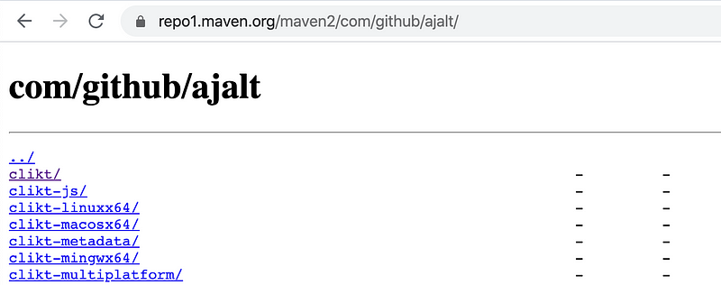

*Disclaimer: the below was tested with Gradle 6.2.2, I'm not sure how much support for module files is in Gradle \< 6.0*

If you're coming from the JVM ecosystem, chances are you are familiar with the Maven ecosystem, which I covered in [another article](https://proandroiddev.com/publishing-a-maven-artifact-1-3-glossary-bc0068a440e0).

Maven works well and is based on [pom files](http://maven.apache.org/pom.html#What_is_the_POM). Pom files describe a project, its license, repository, authors and, importantly, dependencies. You can take a look at the [okhttp pom file](https://repo1.maven.org/maven2/com/squareup/okhttp3/okhttp/4.4.1/okhttp-4.4.1.pom) if haven't seen a pom file before.

With the advent of Kotlin Multiplatform, the same project can target multiple platforms (js, JVM, native) and the pom file format became too limited. Depending the platform you're building, the build system will have to lookup a different artifact file (.jar for JVM, .klib for native) and dependencies. Luckily, around the same time as KMP was developed, Gradle introduced [Gradle Metadata](https://blog.gradle.org/gradle-metadata-1.0) in the form of .module files that are much more flexible that pom files.

The Gradle Metadata and the .modules file structure are described in details in [the gradle blog](https://blog.gradle.org/gradle-metadata-1.0) so I won't go over it here. Instead, we'll take a look at a real-life exemple: [Clikt](https://github.com/ajalt/clikt)

#### Clikt

[Clikt](https://github.com/ajalt/clikt) is a multiplatform library for writing command-line applications. It's awesome but even if you're not writing command-line applications, bear with me as we'll just be looking at publication today.

If you browse the [maven repository for Clikt on MavenCentral](https://repo1.maven.org/maven2/com/github/ajalt/), you'll find this:
The Clikt artifacts

Here you'll find:

* `clikt` : the JVM project, as expected in the JVM world. This should actually be named `clikt-jvm` but the author [kept the](https://github.com/ajalt/clikt/blob/master/clikt/build.gradle.kts#L140)[clikt](https://github.com/ajalt/clikt/blob/master/clikt/build.gradle.kts#L140)[name](https://github.com/ajalt/clikt/blob/master/clikt/build.gradle.kts#L140)for backward compatibility.
* `clikt-js` , `clikt-linxux64` , `clikt-macosx64` , `clikt-mingwx64` : the other platforms. `mingw64` is for building apps for windows. Note that there is no iOS or ARM platform so you won't be able to compile your command line app for mobile devices just yet
* `clikt-metadata` : contains metadata about functions and types that cannot always be represented inside the individual platforms artifacts. Think of nullability, variance, etc... This is used by the IDE and by `kotlin.reflect` to have more information about the types.
* `clikt-multiplatform` : the main entry point of the multiplatform lib. Multiplatform users of Clikt can just add this project to their dependencies instead of having to include each individual platform project.

#### Using a multiplatform library

Using Clikt in your projects [with Gradle 6.0](https://gradle.org/whats-new/gradle-6/) is as easy as adding `clikt-multiplatform` to the list of dependencies:

```kotlin
kotlin {
  sourceSets {
        get("commonMain").apply {
            dependencies {
                implementation("com.github.ajalt:clikt-multiplatform:2.6.0")
            }
        }
    }
}
```

An look at the [clickt-multiplatform](https://repo1.maven.org/maven2/com/github/ajalt/clikt-multiplatform/2.6.0/clikt-multiplatform-2.6.0.module)[module](https://repo1.maven.org/maven2/com/github/ajalt/clikt-multiplatform/2.6.0/clikt-multiplatform-2.6.0.module) file gives the following:

```kotlin
{
  "formatVersion": "1.1",
  "component": { [SKIPPED] },
  "createdBy": { [SKIPPED] },
  "variants": [
    {
      "name": "js-api",
      "attributes": {
        "org.gradle.usage": "kotlin-api",
        "org.jetbrains.kotlin.platform.type": "js"
      },
      "available-at": {
        "url": "../../clikt-js/2.6.0/clikt-js-2.6.0.module",
        "group": "com.github.ajalt",
        "module": "clikt-js",
        "version": "2.6.0"
      }
    },
    [jvm, macOS, mingw, etc...],
    {
      "name": "metadata-api",
      "attributes": {
        "org.gradle.usage": "kotlin-api",
        "org.jetbrains.kotlin.platform.type": "common"
      },
      "available-at": {
        "url": "../../clikt-metadata/2.6.0/clikt-metadata-2.6.0.module",
        "group": "com.github.ajalt",
        "module": "clikt-metadata",
        "version": "2.6.0"
      }
    }
  ]
}
```

Instead of a `files:{ ... }` section, this module file contains a `available-at:{ ... }` to make Gradle point to the appropriate artifacts, including the Kotlin metadata.

#### Gradle Metadata vs Kotlin Metadata

Despite sharing the Metadata name, Gradle and Kotlin Metadata are quite different.

Gradle Metadata [was introduced in Gradle 5.3](https://blog.gradle.org/gradle-metadata-1.0). It refers to the ability of Gradle to write and read .module files that are more flexible than the .pom files.

Kotlin Metadata has been there for some time and allows to information about the Kotlin code in a single place, even if some of it is lost in the respective platforms.

It just happens that Gradle Metadata is a convenient way to distribute Kotlin Metadata but they shouldn't be mistaken.

#### Conclusion

Using Multiplatform libraries could historically be a bit complex but as the ecosystem matures it's becoming easier and easier. If you're a library author, publishing has also greatly improved, especially using the `maven-publish` plugin.

I'm looking forward to see the KMP ecosystem grow!

By [Martin Bonnin](https://medium.com/@mbonnin) on [March 21, 2020](https://medium.com/p/47d0dc8223e5).

Photo: "parallel lines" by [theilr](https://www.flickr.com/photos/theilr/10268837315/in/photolist-gDqtze-7oAiS7-7oAm2s-7owuot-7oAqMY-5NkEaS-7oAnKf-zXCcc-5Gh1qZ-7owBEe-7m9eKP-7owq38-7oAjQY-7oAjbG-7oAqxj-7oAuHG-7oAoj9-7oAjYj-7owBr8-7owAsz-7owsoF-7oAmLf-7oAuy1-7oAvTu-7oAtCs-7owwiF-7owzFn-7owuxg-P4RRy7-7owvxH-hkMoBr-7owC7F-7oAoqm-7owqWT-7oAuQ1-69YqeW-39SyR4-9PopNC-7owwmH-7Aq5me-7owqQT-7owrJZ-7owAea-7oAnxE-7oAmob-7oAneS-4fEHYf-7owuBr-7owB3M-7owtpV)


[Canonical link](https://medium.com/@mbonnin/a-closer-look-at-the-kotlin-multiplatform-artifacts-47d0dc8223e5)

Exported from [Medium](https://medium.com) on November 9, 2024.
