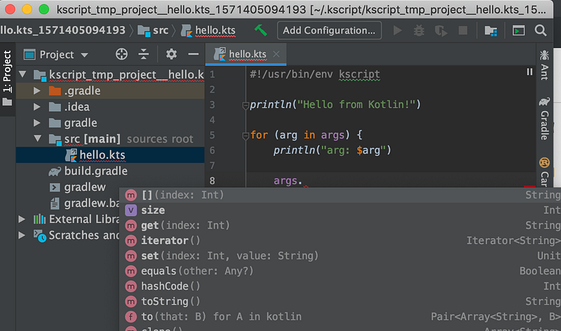
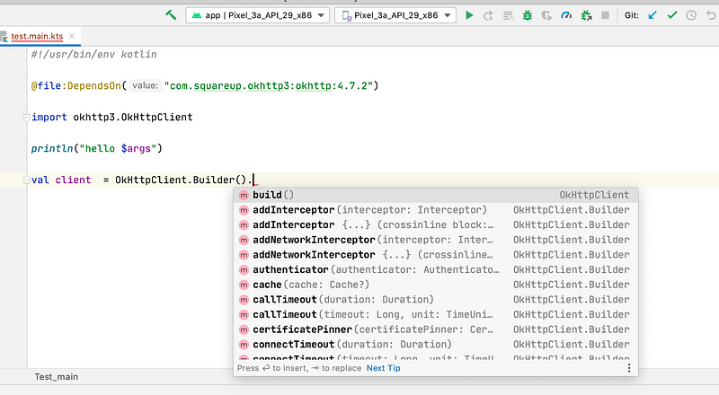

I am a huge Kotlin fan. I'm using Kotlin daily for Android development, sometimes a little bit of macOS and occasionally on the backend to power a small API. Lately, I started replacing my Bash and Python scripts with Kotlin and I'm loving Kotlin even more!

I won't go into the many advantages of using the same language for everything and avoiding context changes or the great tooling that comes with a strongly typed language like Kotlin. If you ever had to read a perl script written by someone else, you'll know what I mean. Instead, I'll try to explain where Kotlin scripting is coming from, what's possible today and what still remains to be done.

### What is Kotlin Scripting?

Kotlin Scripting is explained by a KEEP (Kotlin Enhancement and Evolution Process) document. The KEEP contains the [whole proposal](https://github.com/Kotlin/KEEP/blob/master/proposals/scripting-support.md) in a whooping 900 lines of markdown. You should read it, but we'll sum it up as:

Kotlin Scripting is:

* A way to easily compile Kotlin source files...
* ... with a given context, i.e. a set of variables/methods accessible to the script.

Most of us are actually already using Kotlin Scripts in the form of `build.gradle.kts` files. These files know about the current `Project`, which is exposed as context.

Thinking forward, this could be used in a lot of different places like games scripting engines or maybe browser extensions one day.

For the time being, I'm mainly interested in replacing my Python or Bash scripts and there are 2 solutions for this:

### Kscript

[Kscript](https://github.com/holgerbrandl/kscript/) is the de facto solution. It's been there since 2016. There is a great [KotlinConf video](https://www.youtube.com/watch?v=cOJPKhlRa8c) that explains why it was done (spoiler: initially for data science!). Kscript allows you to take any file, name it `*.kts` and make it executable:

```kotlin
// hello.kts
#!/usr/bin/env kscript

println("my args are ${args.joinToString(",")}")
```

You can make hello.kts executable and run it:

```shell
$ chmod +x hello.kts
```

```
$ ./hello.kts a few arguments
my args are a,few,arguments
```

Pretty neat right ?
Autocomplete in your Kotlin scripts

Kscript has **a lot of features**:

* Scripts caching: Running the same script will be way faster the second time.
* Maven dependencies: If you want to use OkHttp in your scripts, just drop `@file:DependsOn("com.squareup.okhttp3:okhttp:4.7.2")` and say goodbye to curl/wget.
* IntelliJ support: Kscript generates an intelliJ project to edit your scripts with autocomplete.
* Bootstrap header: To make you script install kscript automagically.
* And a lot of other ones: See the [kscript repo](https://github.com/holgerbrandl/kscript) for the list.

And **a few drawbacks**:

* It requires a local Kscript install on your machine. This is pretty easy to do thanks to [SdkMan](https://sdkman.io/) but still annoying when distributing scripts or trying to run them in your CI.
* [Dependency resolution doesn't work with Java11](https://github.com/holgerbrandl/kscript/issues/239). You will be stuck with Java8. Again, you can have multiple JDKs installed on your machine but it's still annoying.

### Kotlin-main-kts

[Kotlin-main-kts](https://github.com/JetBrains/kotlin/tree/master/libraries/tools/kotlin-main-kts) is the contender and is the first party solution from the Kotlin team. Kotlin1.3.70 has largely improved the support for scripting as described in the [1.3.70 blog post](https://blog.jetbrains.com/kotlin/2020/03/kotlin-1-3-70-released/).

You can now name a file `*.main.kts` and make it executable, just like with Kscript except the file will need to end with `*.main.kts`:

```kotlin
// hello.main.kts
#!/usr/bin/env kotlin

println("my args are ${args.joinToString(",")}")
```

Everything else works pretty much as you would expect, with arguments, autocomplete, etc.
Autocomplete your \*.main.kts files directly in IntelliJ

Compared to Kscript, Kotlin-main-kts has less features but also less friction. It has the following advantages:

* First party support.
* Directly edit in intelliJ. No need for a wrapper Gradle project.
* Only Kotlin is required, not need to install anything else.

And a few drawbacks:

* No builtin bootstrap header and other nice helpers from Kscript.
* Dependency resolution is limited.

That last one is a bit annoying. [Snaphots are not resolved](https://youtrack.jetbrains.com/issue/KT-38212) and [dependency resolution will only take the first version encountered](https://youtrack.jetbrains.com/issue/KT-38006), even if another lib requires a higher one. Luckily, [the team is working on it for Kotlin 1.4](https://github.com/holgerbrandl/kscript/issues/239#issuecomment-628547025) so hopefully this will become even better soon.

### Conclusion

Whether you'd like the extra features of Kscript or the nice integration and first party support of Kotlin-main-kts, writing Kotlin scripts has never been this easy. Kotlin can easily start new processes, do redirections and text processing, all that with the autocompletion and the strong typing we all love. For a few examples, you can check [this script](https://github.com/HearthSim/HSTracker/blob/master/scripts/release.kts) or [this other](https://github.com/apollographql/apollo-android/blob/master/scripts/release.main.kts). And Kotlin 1.4 should make it even easier!

Happy scripting!

By [Martin Bonnin](https://medium.com/@mbonnin) on [May 25, 2020](https://medium.com/p/99cb6cc57db1).

Photo: "Mentmore Regent fountain pen" by [Athanasius](https://www.flickr.com/photos/keithpatterson/)

[Canonical link](https://medium.com/@mbonnin/may-2020-the-state-of-kotlin-scripting-99cb6cc57db1)

Exported from [Medium](https://medium.com) on November 9, 2024.
