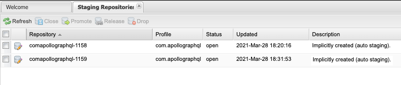

Publishing Kotlin/Java/Android libraries can be intimidating at first sight with plenty of options to choose from and a lot of different plugins providing different sometimes overlapping features to upload your jar files.

The good news is that the sunsetting of Jcenter brought some welcome clarification in this process and the ecosystem is starting to mature.

I'll pass quickly over the process of setting up a Sonatype Account and uploading a simple library as there are some excellent resources out there to explain the process like [this blog post](https://h4pehl.medium.com/publish-your-gradle-artifacts-to-maven-central-f74a0af085b1) or [this other](https://proandroiddev.com/publishing-a-maven-artifact-3-3-step-by-step-instructions-to-mavencentral-publishing-bd661081645d).

Instead, this article focuses on all the little different steps needed for publication like:

* Configuring repositories
* Creating publications
* Configuring sources \& javadoc
* Configuring signatures
* Avoiding split repositories
* Publishing artifacts from different CI jobs.
* Automating the release process

Some are optional, some are mandatory. Depending whether you want to publish JVM libraries, Android, Gradle plugins, multiplatform libraries or maybe something else, the use cases can be a little bit different and the configuration matrix quickly becomes huge.

Over time, plugins have been developed to help with this. If you're looking for the best plugin for your needs, skip to the [conclusion](#994b) for a feature matrix of different publishing plugins. But first, let's go over the different features offered by the different plugins.

#### Configuring repositories

At heart, a maven repository is nothing else that files organized in a certain layout. For an example, you can find okhttp at <https://repo1.maven.org/maven2/com/squareup/okhttp3/okhttp/4.9.1/>. All files are named and organized in a certain way so that maven and Gradle can lookup `group` (com.squareup.okhttp3), `artifact` (okhttp here) and `version` (4.9.1 here). These are called the GAV coordinates (for Group, Artifact, Version) and this is what goes in the `dependencies {}` block of your Gradle files:

```groovy
repositories {
    // Usually you'll have mavenCentral() there but this is just a shortcut
    // to the full version
    maven("https://repo1.maven.org/maven2/")
}

dependencies {
    // GAV coordinates goes here
    // This all works because there's a file at
    // https://repo1.maven.org/maven2/com/squareup/okhttp3/okhttp/4.9.1/okhttp-4.9.1.jar
    // The general maven layout is:
    // ${group.replace(".", "/")}/$artifact/$version/$artifact-$version.jar
    // ${group.replace(".", "/")}/$artifact/$version/$artifact-$version.pom
    // ...
    implementation("com.squareup.okhttp3:okhttp:4.9.1")
}
```

Now there's no magic there. You can host the same files in a S3 bucket or on your ftp and point your Gradle script to the url, it'll work exactly the same.

MavenCentral is included in a lot of builds already so it makes sense to upload there for your users to find your artifacts easily. Uploading to MavenCentral is a [simple POST request](https://support.sonatype.com/hc/en-us/articles/213465868-Uploading-to-a-Staging-Repository-via-REST-API):

```shell
curl -v -u $USERNAME:$PASSWORD --upload-file artifact-1.0.jar http://localhost:8081/nexus/service/local/staging/deploymaven2/com/mycompany/artifact/1.0/artifact-1.0.jar`
```
This is all the [maven-publish](https://docs.gradle.org/current/userguide/publishing_maven.html)[plugin](https://docs.gradle.org/current/userguide/publishing_maven.html) does behind the scenes. You still need to tell it where to upload as you usually don't want to upload to localhost:


```kotlin
publishing {
    // Note the repositories block is inside the publishing block here
    repositories {
      maven {
        // OSSStaging is where you upload to later release on MavenCentral
        // (more on that later)
        name = "OSSStaging"
        // If you signed up on Sonatype recently, you might have a url like
        // "https://s01.oss.sonatype.org/service/local/" instead
        url = uri("https://oss.sonatype.org/service/local/staging/deploy/maven2/")
        credentials {
          username = System.getenv("SONATYPE_NEXUS_USERNAME")
          password = System.getenv("SONATYPE_NEXUS_PASSWORD")
        }
      }

      maven {
        // Sonatype also hosts SNAPSHOTs for you 
        // If you ever try to upload a SNPASHOT to OSSStaging, you will get an error
        name = "OSSSnapshots"
        // If you signed up on Sonatype recently, you might have a url like
        // "https://s01.oss.sonatype.org/content/repositories/snapshots/" instead
        url = uri("https://oss.sonatype.org/content/repositories/snapshots/")
        credentials {
          username = System.getenv("SONATYPE_NEXUS_USERNAME")
          password = System.getenv("SONATYPE_NEXUS_PASSWORD")
        }
      }
    }
  }`
```

#### Creating publications

Once you have configured your repositories, the next step is to create your publications. The default setup is like below:

```kotlin
publishing {
  publications {
    create<MavenPublication>("maven") {
      groupId = project.group.toString()
      artifactId = project.name
      version = project.version.toString()
      from(components["kotlin"])
      artifact(tasks["sourcesJar"])
      artifact(tasks["javadocJar"])
      pom {
        // Configure your pom file here
      }
    }
  }
}
```

The above repositories and publications will create 2 tasks:

```
./gradlew publishMavenPublicationToOSSStagingRepository
./gradlew publishMavenPublicationToOSSSnapshotsRepository
```

Some plugins will create the publications automatically for you like the Kotlin multiplatform plugin or the [java-gradle-plugin](https://docs.gradle.org/current/userguide/java_gradle_plugin.html) plugin. But others will not, leaving you to configure everything.

#### Configuring sources \& javadoc

Also MavenCentral [requires that you upload matching sources and javadoc with your artifacts](https://central.sonatype.org/pages/requirements.html). Here again some plugin will include sources and javadoc but some others will not. Depending the kind of projects you are in, collecting the sources might be slightly different. For an example, this is [how the](https://github.com/vanniktech/gradle-maven-publish-plugin/blob/4b3df71b859bf5260d90542a12c991ed31d42af2/src/main/kotlin/com/vanniktech/maven/publish/tasks/SourcesJar.kt#L18)[com.vanniktech.maven.publish](https://github.com/vanniktech/gradle-maven-publish-plugin/blob/4b3df71b859bf5260d90542a12c991ed31d42af2/src/main/kotlin/com/vanniktech/maven/publish/tasks/SourcesJar.kt#L18)[plugin does it for Android](https://github.com/vanniktech/gradle-maven-publish-plugin/blob/4b3df71b859bf5260d90542a12c991ed31d42af2/src/main/kotlin/com/vanniktech/maven/publish/tasks/SourcesJar.kt#L18):

```kotlin
tasks.register("androidSourcesJar", SourcesJar::class.java) {
  val androidExtension = extensions.getByType(LibraryExtension::class.java)
  it.from(androidExtension.sourceSets.getByName("main").java.srcDirs)
}
```

#### Configuring signatures

Again, MavenCentral requires signatures:

```kotlin
signing {
    useInMemoryPgpKeys(key, passphrase)
    val extension = extensions.getByName("publishing") as PublishingExtension
    sign(extension.publications)
}
```

It's not a lot of code but some plugins like `com.vanniktech.maven.publish` automate that for you. They also add some logic to disable signing for SNAPSHOTs where they are not required for example (see [here](https://github.com/vanniktech/gradle-maven-publish-plugin#signing) for more details).

#### Avoiding split repositories

**Heads up:** *This is where things become Sonatype specific. While the maven file layout and signatures apply to any maven repository/publication, interacting with a* [*Nexus repository*](https://www.sonatype.com/products/repository-pro)*such as the one powering MavenCentral is 100% Sonatype/MavenCentral specific. (In other terms, Maven != MavenCentral)*

If you've done everything until here, you can now upload your artifacts to OSS Staging:

```
./gradlew publishMavenPublicationToOSSStagingRepository
```

Then head to <https://oss.sonatype.org/#stagingRepositories> to see your files. If you see only one line there, congrats, things worked well! But there is a chance you see two lines there:


This is what I call split staging repository and happens because the sonatype server incorrectly grouped uploaded artifacts. This is problematic because verifications will not be atomic anymore. For an example, if one jar ends up in a repository and the matching signature ends up in another, verifications will fail and you will be unable to close (=verify) your repository.

To mitigate this, the `io.github.gradle-nexus.publish-plugin` creates an explicit staging repository id where to upload your artifacts and POST your artifact to that specific url, making sure the repository is always used:

```
# Will upload to 
"https://oss.sonatype.org/service/local/staging/deployByRepositoryId/${repositoryId}/"
# instead of
"https://oss.sonatype.org/service/local/staging/deploy/maven2/"
```

#### Publishing artifacts from different CI jobs.

For large multiplatform projects that need to be built on different machines (Windows, Linux, MacOS), split repositories are especially frequent. Using `io.github.gradle-nexus.publish-plugin` is an option that will create one staging repository per machine. You can then close them separately and if they are not overlapping things should go well. It makes the release non-atomic though. Assume something is wrong in your windows artifacts. If you already released the linux one, your release is in a weird state with only partial files.

To mitigate that, you'll have to create the repository ahead of time in a separate job and forward that to each platform specific job. The [create-nexus-staging-repo](https://github.com/nexus-actions/create-nexus-staging-repo) Github Action will help with that. Check out [Romain Boisselle](https://twitter.com/romainbsl) [excellent post about it](https://medium.com/kodein-koders/publish-a-kotlin-multiplatform-library-on-maven-central-6e8a394b7030) for more details.

#### Automating the release process

Finally, once everything is uploaded in a single staging repository, you can release your artifacts to MavenCentral. Using the UI, you would:

1. close the repository: this triggers the verifications
2. release the repository: this moves your files from the staging repo to MavenCentral where they will be publicly available

In order to do everything automatically, both the `io.github.gradle-nexus.publish-plugin` and `com.vanniktech.maven.publish` plugins offer a `closeAndReleaseRepository` task

```
# Will retrieve the list of open repositories. If there is only one, close it,
# wait for the close to be performed and release it.
# Fail if there are multiple open repositories.
./gradlew closeAndReleaseRepository
```

As described above, this process will fail if you have multiple open repositories open at the same time so there is still room for improvement but it should work in the canonical case and allow to have a release process 100% automated

## Conclusion

Over time, multiple plugins were built to help with the above. I tried to list them, hopefully not forgetting any:


| Id                                             | Github                                 | Depends on                                   | Publishes            | Configures Repositories | Adds sources | Adds javadoc | Adds signatures | Single Staging Repo                                                                                          | Close And Release | Description                                                                     |
|------------------------------------------------|----------------------------------------|----------------------------------------------|----------------------|-------------------------|--------------|--------------|-----------------|--------------------------------------------------------------------------------------------------------------|-------------------|---------------------------------------------------------------------------------|
| `maven-publish`                                | builtin                                | nothing                                      | yes                  | no                      | no           | no           | no              | no                                                                                                           | no                | The new builtin gradle solution for publishing to a maven repository            |
| `io.github.gradle-nexus.publish-plugin`        | gradle-nexus/publish-plugin            | `maven-publish`                              | with `maven-publish` | yes                     | no           | no           | no              | yes                                                                                                          | yes               | The merge of `io.codearte.nexus-staging` and `de.marcphilipp.nexus-publish`     |
| `com.vanniktech.maven.publish`                 | vanniktech/gradle-maven-publish-plugin | `maven-publish`, `dokka`                     | with `maven-publish` | yes                     | yes          | yes          | yes             | yes ([if a staging repo already exists](https://github.com/vanniktech/gradle-maven-publish-plugin/pull/200)) | yes               | Configures Dokka and the different publications for Android and other projects. |
| `maven` (**Deprecated**)                       | builtin                                | nothing                                      | yes                  | no                      | no           | no           | no              | no                                                                                                           | no                | The legacy builtin gradle solution                                              |
| `io.codearte.nexus-staging`(**Deprecated**)    | Codearte/gradle-nexus-staging-plugin/  | `maven-publish`                              | with `maven-publish` | yes                     | no           | no           | no              | no                                                                                                           | yes               | A plugin to automate the release process                                        |
| `de.marcphilipp.nexus-publish`(**Deprecated**) | marcphilipp/nexus-publish-plugin       | `maven-publish`, `io.codearte.nexus-staging` | with `maven-publish` | no                      | no           | no           | no              | yes                                                                                                          | no                | A plugin to automate the release process                                        |
| `com.jfrog.bintray` (**Deprecated**)           | bintray/gradle-bintray-plugin          | nothing                                      | yes                  | yes                     | no           | no           | no              | n/a                                                                                                          | n/a               | The legacy plugin to publish to bintray and jcenter                             |
| `com.bmuschko.nexus` (**Deprecated**)          | bmuschko/gradle-nexus-plugin           | `maven`                                      | with `maven`         | yes                     | yes          | yes          | optional        | no                                                                                                           | no                | A legacy all in one solution for maven publishing                               |

All in all, you will most likely always need `maven-publish` as it is the base plugin on top of which others work. From there you can either:

1. configure everything by hand, maybe using libs like [Vespene](https://github.com/martinbonnin/vespene) to call the Nexus API.
2. add `io.github.gradle-nexus.publish-plugin` to avoid split staging repositories and `closeAndReleaseRepository`
3. add `com.vanniktech.maven.publish` as a one-stop shop that will configure all your publications, sources and javadoc as well as provide `closeAndReleaseRepository`
4. If you're building multiplatform project, use `create-nexus-staging-repo` to make your release atomic

That's it! It's still a lot of details and I'm hoping this process could be improved. For an example removing the requirement for javadocs, making closeAndRelease only one step or standardizing the signature process. But there's already been a lot of improvements over the past months and since the adoption of `maven-publish`. There's also more and more resources online so now is a good time to start publishing your libs!

💙 *Many thanks to* [*Romain Boisselle*](https://twitter.com/romainbsl)*and* [*Louis CAD*](https://twitter.com/louis_cad?lang=en)*for their advices and proofreading*💙

By [Martin Bonnin](https://medium.com/@mbonnin) on [June 21, 2021](https://medium.com/p/a2f04bba6f13).

Photo: [Numbers](https://flic.kr/p/7XEruh) by [duncan c](https://www.flickr.com/photos/duncan/)

[Canonical link](https://medium.com/@mbonnin/gradle-publishing-plugins-a-decision-matrix-a2f04bba6f13)

Exported from [Medium](https://medium.com) on November 9, 2024.
