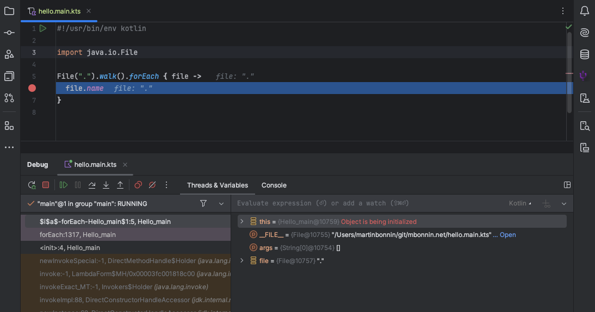

Jetbrains recently published a blog post about [the current state of Kotlin scripting](https://blog.jetbrains.com/kotlin/2024/11/state-of-kotlin-scripting-2024/).

This sparked a series of reactions that Kotlin scripting was ["not recommended"](https://x.com/androiddevnotes/status/1859061750567407652), ["dead"](https://www.reddit.com/r/Kotlin/comments/1gv4j8j/comment/ly06lyj/) or just [general questions](https://bsky.app/profile/gakisstylianos.bsky.social/post/3lbd4jvmycc2i) about what the post really meant for the future of Kotlin scripting.

I believe the future of Kotlin scripting is bright. Despite some of the initial impressions, I believe the post is really about shifting focus to where Kotlin scripting really matters:

- `*.main.kts`
- `build.gradle.kts`
- [Notebooks](https://kotlinlang.org/docs/kotlin-notebook-overview.html)

I myself wrote about [Kotlin scripting back in May 2020](https://mbonnin.medium.com/may-2020-the-state-of-kotlin-scripting-99cb6cc57db1). To this day, this is one of my most read blog post so this felt like the perfect opportunity to make a small refresher.

Let's see how you can use `*.main.kts` today, in November 2024! 

And what's in stock for the future!

# What are `*.main.kts` scripts?

[`*.main.kts`](https://github.com/Kotlin/kotlin-script-examples/blob/master/jvm/main-kts/MainKts.md) files are a first-party solution to run Kotlin code without having to use a full build system such as Amper/Gradle/Maven.

Just create a `hello.main.kts` file:

```kotlin
#!/usr/bin/env kotlin

println("Hello ${args[0]}!")
```

Make it executable and run it:

```
$ chmod +x hello.main.kts
$ ./hello.main.kts world
Hello world!
```

Pretty cool right? If your file ends with `.main.kts`, `kotlin` knows that it's a script and does a bunch of cool stuff:

- Caching: for faster invocations
- IDE support
- Dependencies: `@file:DependsOn` and `@file:Repository`

If you don't want to use a [shebang line](<https://en.wikipedia.org/wiki/Shebang_(Unix)>), you can also call your script explicitly:

```
$ kotlin hello.main.kts world
Hello world!
```

Want to replace text using a regex in some of your files? Use your favorite Kotlin constructs:

```kotlin
#!/usr/bin/env kotlin

File(args[0]).walk().filter {
  it.isFile && it.name.startsWith("MyPrefix")
}.forEach {
  it.writeText(it.readText().replace(myRegex, myReplacement))
}
```

Sure you can do the same with a collection of `find`, `xargs`, `sed` and what not but do you really have [that much space in your brain](https://i.imgflip.com/9b4rt3.jpg)?

What's more, the IDE can help your brain find and remember Kotlin patterns much better. Autocomplete is available everywhere:


Want to parse a [CSV](https://en.wikipedia.org/wiki/Comma-separated_values) file? No problem either, the [JVM ecosystem has everything](https://central.sonatype.com/artifact/com.opencsv/opencsv) for you:

```kotlin
#!/usr/bin/env kotlin

@file:DependsOn("com.opencsv:opencsv:5.9")

import com.opencsv.CSVReader
import java.io.File

// Find the minimum value of column #1
CSVReader(File(args[0]).bufferedReader()).minBy {
  it[1].toInt()
}
```

Good luck doing all of that in shell...

Oh! And did I mention you can debug your scripts?



Modern syntax, autocomplete, debugging, huge ecosystem with JavaDoc accessible from your IDE and more, using `*.main.kts` is a simple, efficient to run Kotlin with just a simple file today.

# `*.main.kts` can replace your shell scripts

For the last 4 years or so, I've been using `*.main.kts` scripts [quite happily](https://github.com/martinbonnin/kscripts). One of my favorite scripts [updates my SIEVE email spam filters](https://gist.github.com/martinbonnin/b24d4d536952d6083139ea04b63cf4b4) from a GitHub action. Goodbye spammers 👋

I use Kotlin scripts at Apollo to [run our benchmarks in Firebase test labs](https://github.com/apollographql/apollo-kotlin/blob/fc9e9412ec7b084c6d03ecc14002d6748ed93231/scripts/run-benchmarks.main.kts) or [keep the Kotlin shadow branch in sync](https://github.com/apollographql/apollo-kotlin/blob/fc9e9412ec7b084c6d03ecc14002d6748ed93231/scripts/bump-kotlin-nightlies.main.kts).

[GitHub actions supports Kotlin scripting out of the box](https://github.com/actions/runner-images/issues/3687) making them perfect candidates for one-off tasks in CI. Kotlin scripts can even help you write [typesafe GitHub actions workflows](https://github.com/typesafegithub/github-workflows-kt/)!

What's more, JetBrains is planning to improve `*.main.kts` files even more. From the [aforementioned blog post](https://blog.jetbrains.com/kotlin/2024/11/state-of-kotlin-scripting-2024/#main.kts):

```
We will continue to develop the `.main.kts` script type, which is already
helpful for simple automation tasks.
We have plans to extend its functionality and streamline IDE support.
```

Every time I want to write a bash script (or zsh? beware the incompatibilities!), I'd say it can be written in Kotlin and leverage a modern language with sensible syntax and escaping rules, a huge ecosystem of libraries and state of the art IDE support. 

Not to forget, one less language to learn and remember!

# What's missing in `*.main.kts`?

For the sake of completeness, and despite being a huge fan, I'll mention the current limitations:

1. Initial compile time may take several seconds (subsequent runs are faster).
2. [Including scripts from other scripts has issues](https://youtrack.jetbrains.com/issue/KT-42101).
3. [The resolver does not understand Gradle metadata](https://youtrack.jetbrains.com/issue/KT-42775/Kotlin-Scripts-Gradle-metadata-support-for-dependencies-resolution).
4. You have to manually reload the dependencies when adding/removing them.
5. Process redirection is a bit awkward. 

I'm quite happy with the kotlin vs shell tradeoff at the moment and the lost time in compile time and writing `ProcessBuilders` is more than made up with Kotlin syntax and IDE support.

Can this be improved? Sure. But the value proposition of `*.main.kts` scripts is already quite good in my opinion.

# So what is the post about?

Alright so if `*.main.kts` is great and there are plans to make it even better, if `build.gradle.kts` and Notebooks are here to stay, then what is it all about?

If I'm reading right and trying to summarize, the post is mostly about:

1. REPL is going away, replaced by scratch files and Notebooks.
   - This includes [`Tools > Kotlin > Kotlin REPL` in IntelliJ](https://youtrack.jetbrains.com/issue/KTIJ-30898/Kotlin-REPL-item-not-visible-in-Tools-Kotlin-menu-when-K2-mode-is-enabled#focus=Comments-27-11098359.0-0) as well as the interactive `kotlinc` [REPL mode](https://www.jetbrains.com/help/idea/kotlin-repl.html#kotlin-repl).
   - Scratch files are not working yet in K2 mode, making the timing of the post unfortunate but [they will be supported in the future](https://youtrack.jetbrains.com/issue/KTIJ-30385).
2. `JSR-223 support`, `KotlinScriptMojo`, `kotlin-scripting-ide-services` are also going away.
3. [Custom scripting APIs](https://kotlinlang.org/docs/custom-script-deps-tutorial.html) are staying experimental. Those are the APIs powering the `build.gradle.kts` files.

While the interactive Kotlin REPL console could be handy, I have always preferred scratch files for full IDE support so I don't mind too much there.

I have never used `JSR-223 support`, `KotlinScriptMojo`, `kotlin-scripting-ide-services` and won't be missing them.

Custom scripting APIs are unchanged. For all matters, stable features such as `build.gradle.kts` can be built on top of experimental APIs. KSP is another great example where experimental APIs allow faster innovation while another layer provides stability.

Most importantly, `*.main.kts`, `build.gradle.kts` and Notebooks are going to get more focus, which is in my opinion great news.

I'm looking forward to the next 25 years of Kotlin scripting!
