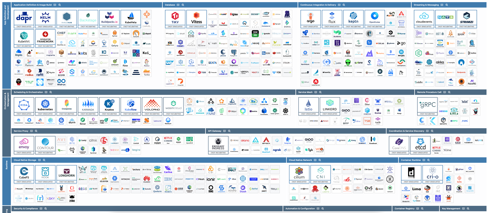

Happy new year everyone! 🎉

You may not have noticed it yet, but something big has happened on January 1st 2025...

GraphQL servers are now required to support the `application/graphql-response+json` content type 🎉! (PS: At least [according to the current GraphQL over HTTP draft](https://github.com/graphql/graphql-over-http/blob/main/spec/GraphQLOverHTTP.md?plain=1#L474))

> From 1st January 2025 (2025-01-01T00:00:00Z), a server MUST support any GraphQL-over-HTTP request which accepts the application/graphql-response+json media type (as indicated by the Accept header) using the UTF-8 encoding.

Doesn't sound like a big deal? Well, it might not be a huge deal right now because the spec itself is a draft, and it will take time for the ecosystem to adapt, but it's paving the way for a much better error handling story.

Let's dive in.

## What problem are we fixing?

In 2024 and the years before, the traditional Content-Type for GraphQL response was `application/json`:

```json5
// 200 OK
// Content-Type: application/json
{
  "data": {
    "user": {
      "name": "Luke Skywalker",
      "email": "luke@alliance.org"
    }
  }
}

// or if there is an error
// 503 Service Unavailable
// application/json
{
  "errors": [
    {
      "message": "The GraphQL server is under maintenance",
      "extensions": {
        "code": "some-internal-graphql-server-code",
      }
    }
  ]
}
```

A GraphQL response is indeed formatted in JSON so `application/json` as a content-type made perfect sense at the time.

Unfortunately, `application/json` can also be used by non-GraphQL servers... And [your typical micro-services infrastructure usually has a bunch of those non-GraphQL servers](https://landscape.cncf.io/):



Let's assume your CDN goes down for some reason and your clients start seeing responses like so:

```JSON5
// 503 Service Unavailable
// application/json
// This is not a valid GraphQL response
{
  "code": "some-internal-cdn-code",
  "message": "The CDN is under maintenance, please try again later."
}
```

See the problem?

How can the client know whether the body is valid GraphQL response that it can parse or some other error introduced by a network node in the infrastructure?

It can't.

The best it can do is display a generic error.

The community tried to avoid this case as much as possible. To do so, [the typical solution is to always return a `200 OK` status code](https://graphql.github.io/graphql-over-http/draft/#note-ba11a), even if there is an error (because it would be very evil of an intermediate node to modify a successful response).

This solution was an opportunity for some [nice memes](https://x.com/iamdevloper/status/1384074981840097289), [interesting GitHub comments](https://github.com/rmosolgo/graphql-ruby/issues/1130#issuecomment-347373937) and other [funny reddit posts](https://www.reddit.com/r/ProgrammerHumor/comments/q4g93s/why/):


This is funny and all... Until you have to deal with it in production.

## Entering `application/graphql-response+json`

In 2025, clients supporting [the current GraphQL over HTTP draft](https://graphql.github.io/graphql-over-http/draft/) may now accept `application/graphql-response+json` as a Content-Type:

```
POST /graphql HTTP/2
Accept: application/graphql-response+json, application/json
...
```

If the server supports it, it'll respond with an `application/graphql-response+json` body:

```
HTTP/2 503
Content-Type: application/graphql-response+json

{
  "errors": [
    {
      "message": "The GraphQL server is under maintenance",
      "extensions": {
        "code": "some-internal-graphql-server-code",
      }
    }
  ]
}
```

Because the Content-Type is now `application/graphql-response+json`, the frontend can now safely parse the `data` and `errors` parts. And have the warm fuzzy feeling that their response is indeed coming from their origin GraphQL server. The server can use the HTTP status code of their liking. No more memes!

Because your server can now use any HTTP status code, it can reuse all the existing tooling and internet infrastructure while still allowing your clients to make informed decisions. It's win-win 🙌


## Conclusion

`application/graphql-response+json` is great.

If you're not using it already, you should!

If your server/client doesn't support it, open an issue, it's high time to fix this issue in 2025 (and find a new source of memes too 😁)!

In a future post, I'll talk about partial error handling. This is another area where best practices are evolving and where the new year brings a couple welcome improvements.

Stay tuned and happy 2025!
