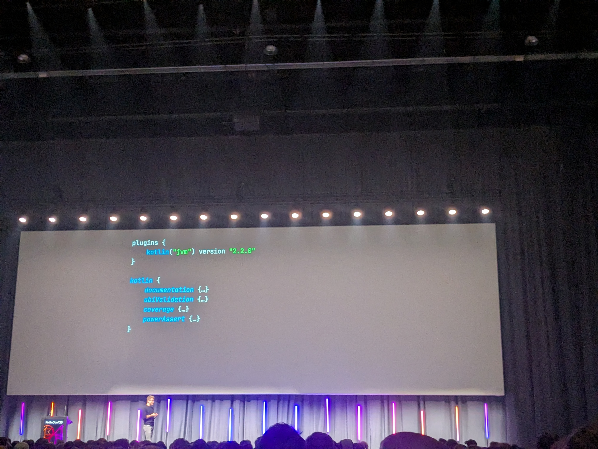
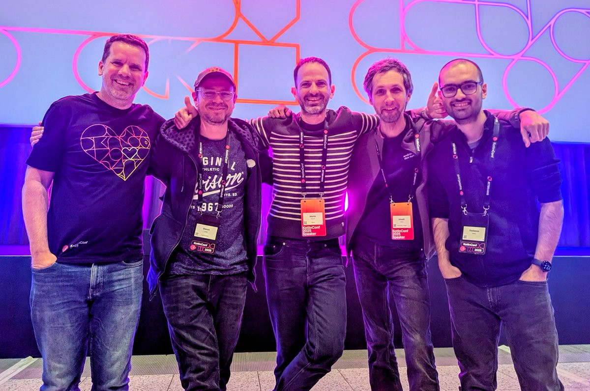

import { BlueskyPost, YouTube } from 'astro-embed';

I am just back from KotlinConf! This was a blast!

Some rudimentary notes below, mainly for myself as I'm trying to make sense of the ridiculous amount of information that my brain had to process over the last few days! I hope it can help you too!

So much happened, it's hard to keep track of everything, but this is my very personal, very limited, and very biased view. For the official view, you can also read [this post from the JetBrains team](https://blog.jetbrains.com/kotlin/2025/05/kotlinconf-2025-language-features-ai-powered-development-and-kotlin-multiplatform/).

## Vibes

JetBrains knows how to throw a party! With 2100 attendees, I think this was the biggest KotlinConf to date, and the logistics were mostly flawless. Everything went smoothly (and no fire alarm this time)!

After San Francisco (2017), Amsterdam (2018), Copenhagen (2019), Amsterdam (2023), Copenhagen (2024), this was the sixth edition of KotlinConf and the third time in Bella Center, Copenhagen, which starts to feel like the home of KotlinConf (but not for long, see end of this post!).

The venue was organized slightly differently this year. The keynote room was on the right, not left, which felt very confusing for a while. Change is hard!

Similarly, no more access to the sunny tree house. But given the amount of sun we got during the two days (hint: none), it's probably for the best 😄

The party was cool, with a live band remix all the classics from my teenage years, a saxophone and a shiny jacket! There were two separated spaces, so you could decide whether you preferred dancing or talking about Kotlin 🤓

Sadly no karaoke this year but there was a tattoo bar (featuring Kodee tattoos!).

I'm still mad that I missed the Kotlin quizz. When did that happen??

If you wanted to relax/work, there was an area for this too:

<BlueskyPost id="https://bsky.app/profile/ggrell.bsky.social/post/3lpqwbdjgrk2k" />

Although not the most eco-friendly conference out there (hello [Devlille](https://devlille.fr/) 🌱👋), I appreciated the non-disposable cutlery and plates, packaging-free fruit/nuts, water fountains and recycling of the lanyards (using a clever system that doubles as a feedback form).

Oh and this year the speaker travel form included train 🙌. Maybe a bike option next year? 🚲

## It's the small details!

What really sets KotlinConf apart is the attention to detail. From the [teaser videos from local employees](https://bsky.app/profile/kotlinconf.com/post/3lo5z5yvhhs2f) to the detailed list of ingredients and allergens and custom stickers (anyone got the "Kodee as a mermaid sticker"? Or is this just a rumor?), everything felt like the team genuinely cared.

The speaker gift is once again amazing. A LEGO set in the country of LEGO™ makes a lot of sense. LEGO Kodee is super cute 🥰. Extra detail, Kodee has a hidden feature inside!

<BlueskyPost id="https://bsky.app/profile/mbonnin.net/post/3lq3k2ojyuk2d" />

Same thing for the app. Being someone that contributes not [one](https://github.com/paug/AndroidMakersApp/), but [two](https://github.com/joreilly/Confetti) (and soon [three](https://graphql.org/conf/2025/)) conference apps, I'm impressed by what the team managed to pull off.

Building a conference app is a lot harder than what it seems. Overlapping sessions, breaks, bookmarks, timezones, etc... The devil is in the details but the KotlinConf app is lean and runs smoothly. Everything is there and it's straightforward to use. Also runs on both Android and iOS. And of course, [it's all open source](https://github.com/JetBrains/kotlinconf-app).

The inline feedback (featuring Kodee) is very convenient. Same for the "now" indicator, something we have never really managed to get 100% right in the Android Makers app.

<BlueskyPost id="https://bsky.app/profile/kotlinlang.org/post/3lponb2psa22m" />

Can you find the secret debug menu?

## Kotlin Multiplatform is now just Kotlin

That didn't make a big splash announcement, but KMP is pretty much just Kotlin now.

There were multiple KMP talks (From [Google](https://kotlinconf.com/schedule/?day=2025-05-22&session=945d0f64-a307-5346-9425-565a26100fad), [RevenueCat](https://kotlinconf.com/schedule/?day=2025-05-22&session=e458b84e-379e-5860-af00-bdb4b630a7ae), [AWS,](https://kotlinconf.com/schedule/?day=2025-05-22&session=060ee4d3-1a7b-584f-97e3-0d3284b64339) and more..) but what stroke me is that other sessions also casually mentioned KMP, be it in [Amper](https://kotlinconf.com/schedule/?day=2025-05-22&session=60652b85-a557-5bd4-a3bf-fd7f017c12a9), [Androidx](https://kotlinconf.com/schedule/?day=2025-05-22&session=f233a87f-d533-59c6-a623-04a9d3d8f0c7), etc...

Compose web is now even supported in playground now, which adds cool new opportunities for learning material.

<BlueskyPost id="https://bsky.app/profile/johnoreilly.dev/post/3lpqn52g6m22s" />

The new [KMP IJ plugin](https://blog.jetbrains.com/kotlin/2025/05/kotlin-multiplatform-tooling-now-in-intellij-idea-and-android-studio/) promises to make it easier than ever to write with Swift and start and debug your iOS apps directly from IJ/AS (disclaimer, haven't tried it yet, but it's high on the TODO list!).

A sign of this change, I met with several iOS developers at the conf. Mobile love is spreading 💙

Kotlin multiplatform is pretty much the default nowadays.

## Reasonable amounts of AI

This year being 2025, there had to be some AI content and the keynote was no exception. Junie and MCP had their fair amount of spotlight attention, but it was spread enough that people like me would not find it too obnoxious.

The big announcement in that space was the introduction of [Koog](https://blog.jetbrains.com/ai/2025/05/meet-koog-empowering-kotlin-developers-to-build-ai-agents/), a new agentic framework for Kotlin.

The schedule was also relatively light on AI with ~7/91 talks about AI.

Something I personally appreciated. Gives you the opportunity to keep up with the space without being swarmed with the same buzzwords all day long.

## The language evolves, slowly but steadily

K2 being the big announcement last year and promising more evolution of the language, I think it was fair to say everyone was expecting some progress in that space.

For better or worse, there is no big bang. Adding new language features is still something that requires a lot of care at the risk of ending with a Frankenstein language.

Error handling being the [billion dollar GraphQL mistake](https://github.com/graphql/nullability-wg/), I was looking forward to ~union types for errors~ [rich errors](https://kotlinconf.com/schedule/?day=2025-05-22&session=a35f03c7-3d57-5874-a20e-8d7518ded091). Something that we could use in [Apollo Kotlin](https://github.com/apollographql/apollo-kotlin) to make errors a bit more palatable.

Alas, it looks like I need to wait a bit more... This is probably not coming until 2.4. You can track progress in the [associated YouTrack](https://youtrack.jetbrains.com/issue/KT-68296).

Context parameters, on the other hand, are making good progress and are [now available in preview in 2.2.0-RC](https://kotlinlang.org/docs/whatsnew-eap.html#preview-of-context-parameters).

The [official post](https://blog.jetbrains.com/kotlin/2025/05/kotlinconf-2025-language-features-ai-powered-development-and-kotlin-multiplatform/#new-language-features-on-the-way) mentions "Enhanced nullability", which I wasn't 100% sure was it was. Looks like it's about better interop with Java [JSpecify annotations](https://jspecify.dev/blog/release-1.0.0/).

Didn't hear anything about [collection literals](https://github.com/Kotlin/KEEP/issues/416), which is personally making me happy 😁.

Overall, the language is reaching maturity, and it's pretty clear it's not going to change dramatically in the coming years. Which is probably a good thing.

On the other hand, compiler plugins were very present in the schedule and overall discussions. This makes sense to me. Keep the language clean and allow users to extend it to their own needs if need be.

Don't hold your breath though. Even if FIR stability was mentioned, it doesn't seem like the compiler APIs are becoming stable in the near future.

## Build tooling is still an open problem

While the language is reaching maturity, build tooling is still moving fast.

Amper had a [dedicated talk](https://kotlinconf.com/schedule/?day=2025-05-22&session=60652b85-a557-5bd4-a3bf-fd7f017c12a9) and booth area. There is a [branch of the KotlinConf app that builds with amper](https://github.com/JetBrains/kotlinconf-app/tree/amper). From talking with different members of the Amper team, it looks like there is still some hope that we don't have to use YAML forever 😁. Amper is [now focusing on being a standalone tool](https://blog.jetbrains.com/amper/2025/05/amper-update-may-2025/). What is still direly needed is a proper plugin API. It looks like this is pretty much the team focus now and _might_ appear in 0.8.0. Time to look in what it takes to port Apollo Kotlin to Amper...

On the other hand, Gradle is working on [declarative Gradle](https://declarative.gradle.org/docs/getting-started/). It's interesting that Gradle has somewhat of the opposite problem: it is too extensible 😄. There was a demo of declarative Gradle on the Kotlin foundation booth. It was great to see it live! Gradle also had a dedicated booth where to meet the team (I got a superfast builds t-shirts!) and a bunch of sessions explaining how to work more efficiently. The [session](https://kotlinconf.com/schedule/?day=2025-05-22&session=f233a87f-d533-59c6-a623-04a9d3d8f0c7) from Aurimas Liutikas and Alan Viverette especially is full of good advice if you're a library developer.

Something that intrigued me is the "bundling" of different parts of the ecosystem in the Kotlin Gradle Plugin.

I get the intent but also this feels like everything will now be moving as fast as the Kotlin Gradle Plugin?

We're seeing those kinds of tradeoffs a lot these days. Should the compiler plugins be bundled or released separately? Is the [Apollo Kotlin galaxy](https://www.apollographql.com/docs/kotlin/advanced/galaxy) a huge mistake? Time will tell I guess.

There is probably not a single answer and what is valid at a given time might always change! (but change is hard!)

In all cases, I hope this simplification can make it easier to build quality libs and still offer advanced options for those that want to iterate faster on their tools.

## Kotlin now has an LSP 🎉

Probably the biggest announcement from this KotlinConf. [Kotlin now has an LSP](https://blog.jetbrains.com/kotlin/2025/05/kotlinconf-2025-language-features-ai-powered-development-and-kotlin-multiplatform/#official-kotlin-lsp-in-development)!

The LSP is still experimental. You can read installation instructions from the [GitHub README](https://github.com/Kotlin/kotlin-lsp).

While probably 99% of the Keynote room is happily using IntelliJ or Android Studio, I'm hoping this is the thing that can make Kotlin a bit more ubiquitous and make it break outside its Android/Backend silos...

We'll see that next year 🤞.

## Wrapping up

There is plenty more I didn't have time to touch on.

- [Block and Meta are joining the Kotlin foundation](https://blog.jetbrains.com/kotlin/2025/05/kotlinconf-2025-language-features-ai-powered-development-and-kotlin-multiplatform/#growth-of-the-kotlin-foundation-and-reopening-of-the-grants-program).
- There were specific sessions about [how to teach Kotlin](https://kotlinconf.com/schedule/?day=2025-05-22&session=d651b439-7f20-5c73-b932-92b5ea894b2f).
- Tons of cool demos from the community: [KtMongo](https://gitlab.com/opensavvy/ktmongo), [IJ Live Plugin](https://github.com/dkandalov/live-plugin), Declarative Gradle, [Koin](https://github.com/InsertKoinIO/koin), [testBalloon](https://github.com/infix-de/testBalloon), [KFX](https://github.com/hfhbd/kfx) and more!
- Very cool discussions about [how to make the library ecosystem more discoverable](https://kotlinconf.com/schedule/?day=2025-05-23&session=8f1701b1-81e8-54c7-89d0-ecf4e40b23b6).
- [How to make the most of your IDE](https://kotlinconf.com/schedule/?day=2025-05-23&session=b4b82cf2-8694-58dc-817a-03e130ed6a92).
- Swift export, Spring, Notebooks, wasm, ktor, arrow,...

But the best part of it all is connections. Being able to discuss all the nifty gritty details of how to release a Kotlin CLI, share the pains and joy of API design, say thank you to the person that wrote the [best explanation of variance I have ever seen](https://www.youtube.com/watch?v=Yz0xBaFt50s), get bugs and feature requests (and sometimes thanks 😄) from your users directly, or just share a bike ride and/or a French crepe under the Danish rain.

This is priceless! Thanks again to the KotlinConf team! And see you next year...

...in Munich! 🍻⛰️
