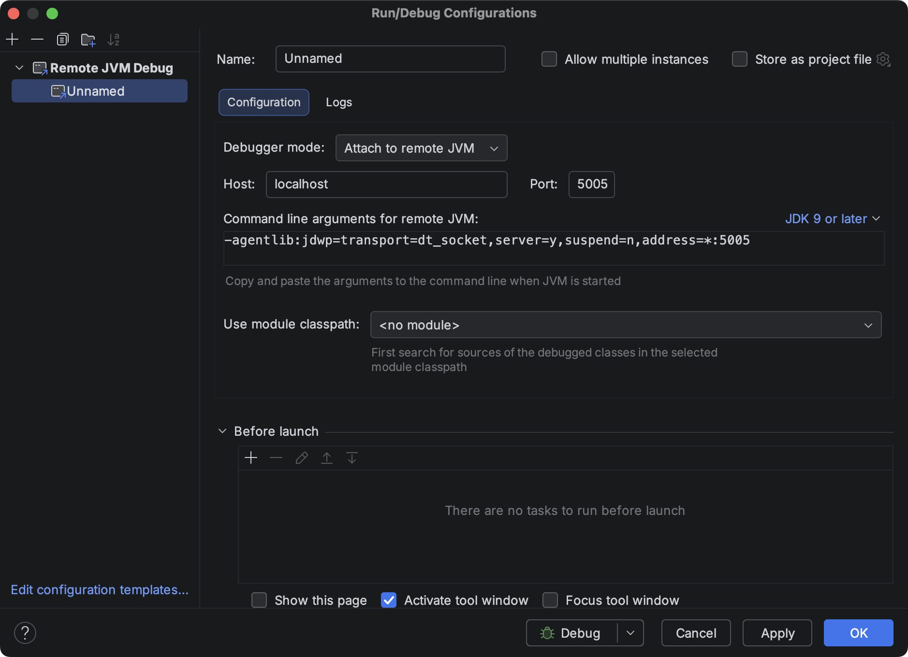
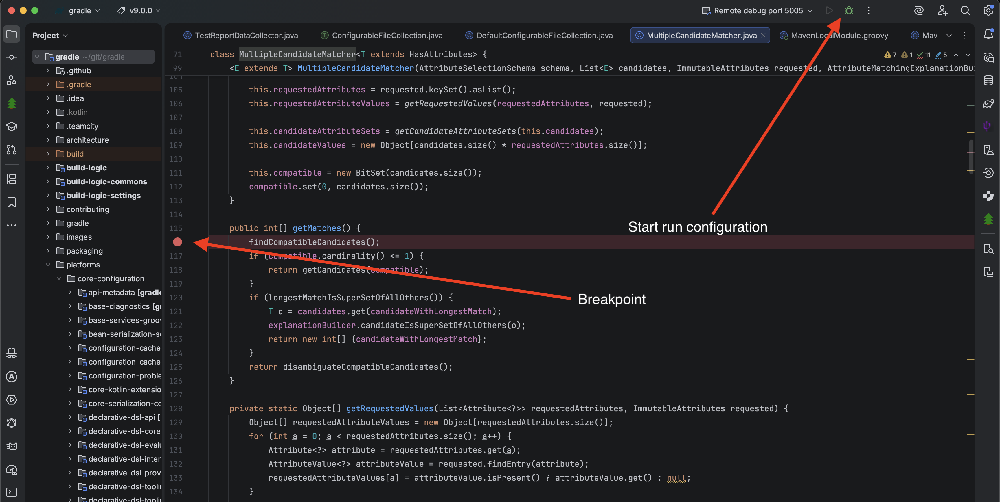
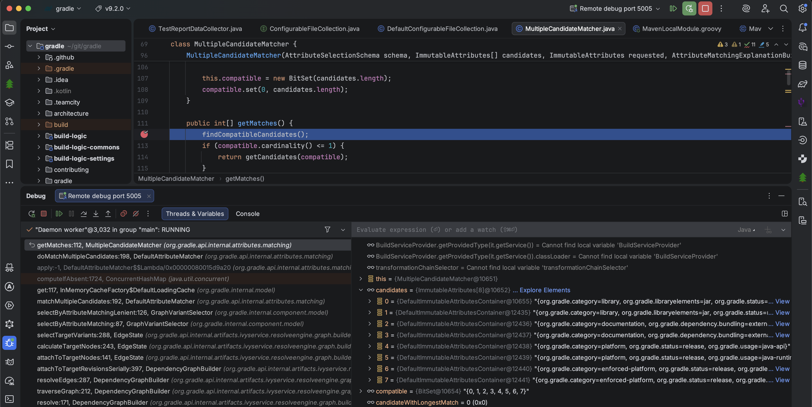
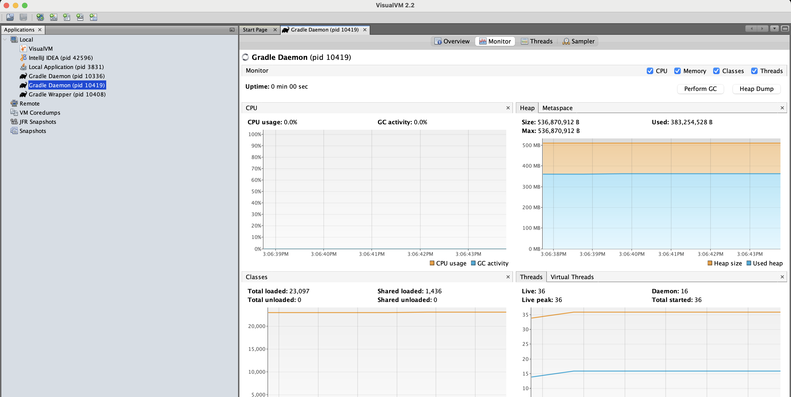
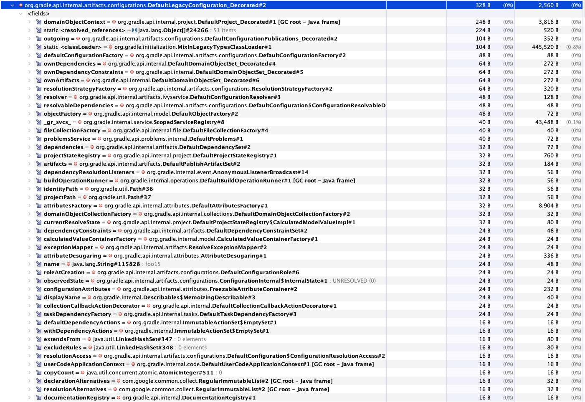
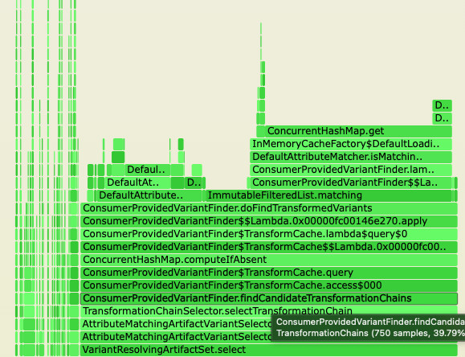

Gradle builds can be intimidating at first. But if you ever debugged a JVM or Android application, Gradle isn't that different.

Below is a collection of recipes for how I typically debug and profile my Gradle builds, from easiest to more advanced. I hope they can serve you well.

We'll learn how to set breakpoints, make a heap dump and a flame graph of a build, each time starting from a real life question. And even build your very own Gradle distribution!

Let's dive in!

## Investigating your build with breakpoints

I have used this extensively during my [multiple](https://github.com/adamko-dev/dokkatoo/issues/165) [journeys](https://github.com/GradleUp/shadow/issues/1540#issuecomment-3144686596) in the [Gradle variant aware dependency resolution algorithm](https://docs.gradle.org/current/userguide/variant_aware_resolution.html#sec:abm-algorithm) ([source code](https://github.com/gradle/gradle/blob/cb0c615fb8e3690971bb7f89ad80f58943360624/platforms/software/dependency-management/src/main/java/org/gradle/api/internal/attributes/matching/MultipleCandidateMatcher.java#L71)). Breakpoints allow you to inspect exactly what is happening in your build at runtime in the Gradle code.

Start by cloning the Gradle repository and checkout the version you want to debug:

```shell
git clone https://github.com/martinbonnin/gradle
cd gradle
# checkout the version of Gradle your main build is using
# At the time of writing, the latest version of Gradle is 9.2.0
git checkout v9.2.0
```

Open the Gradle project in IntelliJ. Wait for the IDE sync to happen (might take a bit of time) and create a "remote debug" run configuration with the default parameters:



Leave your IDE for a while and go to the build you want to debug. Run it with `-Dorg.gradle.debug=true`:

```shell
cd ../your_project
# run the task you want to debug with debugging enabled
./gradlew build -Dorg.gradle.debug=true
# the build starts and waits for a debugger to connect
```

Go back to the IDE where you have the Gradle sources open. Set your breakpoint and start your run configuration:



The debugger connects. Your main build starts executing. After a few seconds, your breakpoint is hit!



That's it!

In the debugger view, you can now take a look at all the variant candidates, together with their attributes. You can also step through the Gradle code and investigate why your dependencies are not resolved as expected.

This works for debugging any part of Gradle, not only dependency resolution and gives a lot of insights about what's happening inside your build.

## Monitoring memory usage with Visual VM

I recently [fell into the rabbit hole of `Configurations`](https://bsky.app/profile/mbonnin.net/post/3m3chkrse6c2i) and got curious why we needed lazy APIs for [Configurations](https://docs.gradle.org/current/javadoc/org/gradle/api/artifacts/Configuration.html). After all, a `Configuration` is mostly a collection of dependencies and creating them should be fast.

One possible explanation for the need of lazy API was that a configuration was expensive memory-wise.

So I decided to verify this.

I created a very simple build that created 1M configurations:

```kotlin
repeat(100_000) {
  configurations.create("configuration$it")
}

println("Start VisualVM and attach to process ${ProcessHandle.current().pid()}")
// Give us some time to attach VisualVM
Thread.sleep(60_000)
```

_Note: the above is the whole `build.gradle.kts` file. No need for plugins, repositories or anything else._

Start the build and once prompted for it, start VisualVM (download it [here](https://visualvm.github.io/download.html)) and attach to the Gradle daemon process.



From there you can do all kind of fun investigations such as monitoring the heap and [Metaspace](https://wiki.openjdk.org/display/HotSpot/Metaspace) (useful for debugging [classloader leaks](https://github.com/gradle/gradle/issues/18313#issuecomment-3289476588)).

You can also dump your heap by clicking "Heap Dump".



This shows that a `Configuration` instance has a retained size of ~2.5kB. That's a lot! And good enough reason to use lazy APIs. Could we take lower that number? Probably. A good topic for a future blog post...

## Monitoring CPU usage with gradle-profiler and async_profiler

When [Aurimas](https://androiddev.social/@Aurimas/) said [configuration time shouldn't be more that 100ms per project](https://bsky.app/profile/liutikas.net/post/3m4l26rdyys2t), I got curious. How come my configuration time was more like ~1s per project ?! That's not good. How do I improve this?

To benchmark performance, I needed more than breakpoints or heap dumps. I needed a profiler.

Like described in [Aurimas profiling blog post](https://www.liutikas.net/2022/06/01/Profiling-The-Good-Kind.html), I turned to [gradle-profiler](https://github.com/gradle/gradle-profiler/) for nice flame charts. Unlike Aurimas, I used  `async_profiler` instead of yourkit. I've read [things about it not being biased](https://psy-lob-saw.blogspot.com/2016/02/why-most-sampling-java-profilers-are.html), but to be honest, I'm not 100% sure why. If you have opinions there, please share!

In all cases, the setup is very similar.

Install gradle-profiler:

```kotlin
brew install gradle-profiler
```

Create a `build.scenarios` file with your profiling scenario:

```
default-scenarios = ["build"]
build {
    title = "build"
    tasks = ["build"]
    gradle-args = ["--dry-run"]
    clear-configuration-cache-state-before = BUILD
}
```

And run your build:

```
gradle-profiler --profile async-profiler --scenario-file build.scenarios build
```

After some time, profiling finished and produces nice flame charts in the `profile-out-${n}` directory. This is how I realized that [looking up the artifact transforms during dependency resolution was taking a lot of time in my build](https://bsky.app/profile/mbonnin.net/post/3m4sqnlpy3c2k):



That was surprising. The transform didn't really run. Just computing the transform chains was taking a lot of time. Thankfully, [Anze](https://www.linkedin.com/in/an%C5%BEe-sodja-00381019b/overlay/about-this-profile/), from the Gradle slack [recognized the pattern immediately](https://www.linen.dev/s/gradle-community/t/32683414/i-m-https-bsky-app-profile-mbonnin-net-post-3m4sm2pn5hc2l-pr#aa9557b4-e434-42b1-b0e4-23a1bf10a8cb). This issue was just [fixed in Gradle 9.2.0](https://github.com/gradle/gradle/pull/34836) a couple of months ago and I hadn't updated yet.

Once updated, my configuration time went down from ~1s per project to ~350ms per project. Much better! All thanks to flamegraphs.

There is still more to investigate. But again something for another blog post...

## Building your own Gradle distribution

Finally, if everything above doesn't work, you can always your own custom Gradle distribution in a few steps. This is all [very well explained in the repo](https://github.com/gradle/gradle/blob/master/CONTRIBUTING.md#building-a-distribution-from-source).

To save you one click, I'll copy/paste here:

```shell
cd gradle
./gradlew :distributions-full:binDistributionZip
cd ../my-project
./gradlew wrapper --gradle-distribution-url=file:/path/to/gradle/packaging/distributions-full/build/distributions/gradle-<version>-bin.zip
```

This is surprisingly fast. On my MacBook pro, it takes in the ~10min range to build a distribution! For a project that size, I find it quite reasonable.

From there, the possibilities are endless. You can change the code to your needs, add features, and obviously do as much `println()` debugging as needed!

## Conclusion

I hope those recipes can help you.

Gradle might look like a magical black box sometimes. But [it's all code](https://youtu.be/dxZnAaPpk4M?t=76) under the hood, and all of it is open source. We're lucky to have all those debugging tools available, let's use them!

Happy debugging!

---

Photo from [Andryck Lopez](https://unsplash.com/photos/people-sitting-and-standing-inside-building-with-numbers-on-floor-2f_2sGwchPI)
