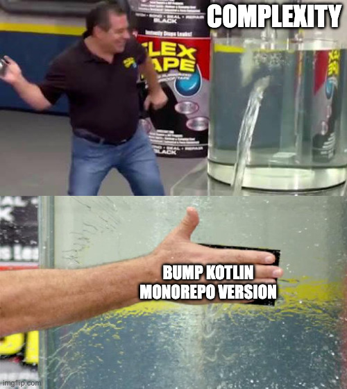

[I have a thing for compiler flags](https://www.youtube.com/watch?v=2Vp2QeBZkfo). 

A few months ago, I started using `kotlin-gradle-plugin` instead of `kotlin` [in my version catalogs](https://github.com/GradleUp/nmcp/blob/0bfe0a0c1a2003174dd24f28e2a920671ea9e7b3/gradle/libs.versions.toml#L2):

```diff
# libs.versions.toml
[versions]
- kotlin = "2.3.10"
# this is much clearer!
+ kotlin-gradle-plugin = "2.3.10"
```

And I like it!

This is a small change that carries a lot of meaning. It makes it explicit that the Kotlin ecosystem is made of several components. 

We like to think about Kotlin as a single, [monorepo-like](https://github.com/search?q=update+kotlin+monorepo&type=pullrequests) thing. But more often than not, your build will use several Kotlin versions.

Understanding this is important for library authors to make sure their libraries are as compatible as possible.

I believe this is also useful for app developers so that they can take action when [an error inevitably happens](https://github.com/search?q=%22was+compiled+with+an+incompatible+version+of+Kotlin%22&type=issues).

Let's take a look at the different Kotlin versions involved in a typical build and the differences between the `kotlin-gradle-plugin` one and the other ones.

## Kotlin Gradle Plugin

**[Maven Coordinates](https://repo.maven.apache.org/maven2/org/jetbrains/kotlin/kotlin-gradle-plugin/)**: `org.jetbrains.kotlin:kotlin-gradle-plugin`

This is the version that we usually call the **main** Kotlin version. 

KGP (Kotlin Gradle Plugin) is the glue that binds everything together. By default, KGP tries to align all the other component versions to its own version.

You configure KGP like so:

```kotlin
plugins {
  // Use latest KGP for best Gradle support
  id("org.jetbrains.kotlin.jvm").version("2.3.10")
}
```

You usually want the latest version of KGP to benefit from improvements such as [Gradle 9 support](https://kotlinlang.org/docs/whatsnew23.html#gradle), isolated projects, or new APIs to integrate better with other plugins. It's always a good idea to use [liberal tooling](https://blog.alllex.me/posts/2023-11-03-liberal-library-tooling/). 

By default, this also set the version for:

* [compiler](#kotlin-compiler)
* [standard library](#kotlin-standard-library)
* [languageVersion](#kotlin-languageversion)
* [apiVersion](#kotlin-apiversion)

But sometimes other components use other versions.

## Kotlin Standard Library

**[Maven Coordinates](https://repo.maven.apache.org/maven2/org/jetbrains/kotlin/kotlin-stdlib/)**: `org.jetbrains.kotlin:kotlin-stdlib`

The standard library (stdlib) provides the core functionality of Kotlin, including collections, strings, and other essential types.

Unlike in Java, the stdlib is a regular dependency and is not bundled in the execution environment. 

You can use a different stdlib version from KGP using `coreLibrariesVersion`:

```kotlin
kotlin {
  // Set the stdlib to 2.2.21, no matter what the KGP version is
  coreLibrariesVersion.set("2.2.21")
}
```

You usually want to use the lowest version of the stdlib that supports your use cases.

One case where it's important to downgrade the stdlib is if your code runs in environments that force a given version of the stdlib. [Gradle is a famous example](https://github.com/gradle/gradle/issues/16345) (and the only one I'm aware of).

One case where you **don't** want to downgrade your stdlib is KMP (Kotlin Multiplatform) because Kotlin/JS and Kotlin/Native require the stdlib to match your compiler version.

## Kotlin Compiler

**[Maven Coordinates](https://repo.maven.apache.org/maven2/org/jetbrains/kotlin/kotlin-compiler/)**: `org.jetbrains.kotlin:kotlin-compiler`

The compiler transforms your `.kt` source files into Java bytecode and KMP binaries. 

You can use a different version of the Kotlin Compiler using the Kotlin BTA ([Build Tools API](https://kotlinlang.org/docs/build-tools-api.html)):

```kotlin
kotlin {
  // Downgrade the compiler to support languageVersion 1.8, no matter what the KGP version is
  compilerVersion.set("2.2.21")
}
```

You usually want the latest version of the compiler to benefit from newest language features (context parameters, unused value checker, ...).

One case where you might want to downgrade the compiler is if you need to target an older [`languageVersion`](#kotlin-languageversion). The compiler only supports 3 previous major versions. If you need to target Kotlin 1.8 for example, you'll need to set your compiler version to 2.2. 

## Kotlin `languageVersion`

The language version is the version of the [Kotlin metadata](https://kotlinlang.org/docs/metadata-jvm.html) written by the compiler. It determines the language features and syntax supported in your code. 

You can set `languageVersion` using the Kotlin DSL:

```kotlin
kotlin {
  compilerOptions {
    // Set the language version to 1.8, no matter what the KGP version is
    languageVersion.set(KotlinVersion.KOTLIN_1_8)
  }
}
```

This setting is mostly irrelevant at runtime but has some importance at build time. If you have ever seen the `"Module was compiled with an incompatible version of Kotlin."` error, this is because of `languageVersion`.

You usually want to use the lowest version of `languageVersion` that supports your use cases.

## Kotlin `apiVersion`

The API version is the version of the stdlib that the compiler can use. It's very related but not exactly the same as the [stdlib version](#kotlin-standard-library).

You can set `apiVersion` using the Kotlin DSL:

```kotlin
kotlin {
  compilerOptions {
    // Set the API version, no matter what the KGP version is
    apiVersion.set(KotlinVersion.KOTLIN_1_8)
  }
}
```

Interestingly, this setting isn't very relevant as your stdlib version in your dependencies is the one that is ultimately going to be important to your consumers. It acts as a guard rail for the compiler to not call into unsupported APIs but there are [plans to marge it with the stdlib version](https://youtrack.jetbrains.com/issue/KT-58998). 

Until then, you usually want this to match your stdlib version.

## Kotlin Compiler Plugins

For the sake of completeness, I'll mention Kotlin compiler plugins. Those are a bit confusing because a typical Kotlin compiler plugin is made of:

* A Gradle plugin artifact that gets loaded in build logic.
* A Kotlin compiler plugin artifact that gets loaded alongside the Kotlin compiler.

At the time of writing, they share the same version. If you're using `org.jetbrains.kotlin.plugins.serialization:2.2.0`, you will load `org.jetbrains.kotlin:kotlin-serialization:2.2.0` in your Gradle classpath and `org.jetbrains.kotlin:kotlin-serialization-compiler-plugin:2.2.0` in your Kotlin compiler classpath.

There is no way to uncouple those at the moment (see [KT-81629](https://youtrack.jetbrains.com/issue/KT-81629/)).

Because the Kotlin compiler plugins APIs are not stable, you usually want to use the same version for your Kotlin Compiler Plugins as for your Kotlin compiler.

## A practical example

For a practical example of different Kotlin versions, you can check [this pull request in tiny-jib](https://github.com/pschichtel/tiny-jib/pull/6).

At the time of writing, Tiny Jib uses:

* Kotlin Gradle Plugin `2.3` for latest Gradle improvements.
* Kotlin Compiler `2.2` to support `languageVersion=1.8`
* Language Version `1.8` to support [Gradle 8](https://docs.gradle.org/current/userguide/compatibility.html#kotlin).

This way it uses [latest tooling while still widely compatible](https://blog.alllex.me/posts/2023-11-03-liberal-library-tooling/). 

## Wrapping it up

That's a lot of versions!

I know it can be overwhelming. But just slapping a big "Kotlin" version doesn't make it easier.



Sure, it holds — until you bump into a nasty error at the next Kotlin upgrade. 

When that moment comes, consider naming your version after what it really is, i.e. `kotlin-gradle-plugin`. 

```diff
# libs.versions.toml
[versions]
- kotlin = "2.3.10"
# much clearer! 😃
+ kotlin-gradle-plugin = "2.3.10"
```

---
[Photo](https://unsplash.com/photos/assorted-handheld-tools-in-tool-rack-t5YUoHW6zRo) by [Barn Images](https://unsplash.com/@barnimages)
